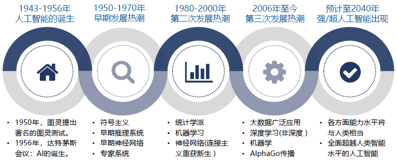
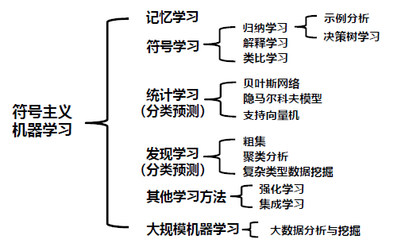
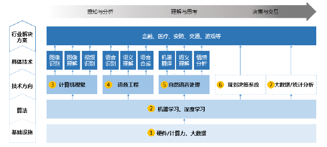

# 人工智能的基本概念

## 工业 1.0 到工业 4.0 : 迈向第四次工业革命

- 机械化
  - 蒸汽机 机械动力
- 电气化
  - 电力 内燃机 大规模生产 流水线提高效率
- 信息化自动化
  - 计算机技术广泛运用 制造业开始自动化
- 智能化
  - 物联网 大数据 人工智能 自动化技术 制造业进一步智能化

**Transformer** 是一种基于注意力机制的序列模型 , 由 Google 团队提出并应用于机器翻译任务

## 智能的概念

- 逻辑思维：智能是利用知识 (或常识) , 经过思维 (推理) 得到问题的解
- 形象思维：智能是利用头脑中已有模式 , 通过对外界环境信息的匹配 , 识别得到对客观事物的认识
- 神经心理学：智能是中枢神经系统的心智活动过程

### 智能的一般解释

智能指人类在认识客观世界中 , 由思维过程和脑力活动所表现出的综合能力

### 智能包含的能力

- 感知能力：通过感知器官感知外界的能力
- 记忆能力：对感知到的外界信息和由思维产生的内部知识的存储过程
- 思维能力：对已存储信息或知识的本质属性、内部知识的认知过程
- 学习能力：是一个具有特定目的的知识获取过程 , 学习是人的一种本能
- 自适应能力：是一种通过自我调节适应外界环境的过程，是人的一种本能
- 行为能力：是人们对感知到的外界信息做出动作反应的能力

## 人工智能的研究目标

- 远期目标：揭示人类智能的根本机理用智能机器去模拟、延伸和扩展人类的智能

- 近期目标：研究如何使现有的计算机系统更聪明即使它能够运用知识去处理问题能够模拟人类的智能行为

- 相互关系：远期目标位近期目标指明了方向，近期目标则为远期目标奠定了理论和技术基础

# 人工智能的产生与发展

## 发展初期

人工智能概念提出之后的最初几十年，发展极其缓慢，计算能力不足是人工智能发展缓慢的主要瓶颈

## 人工智能研究的三大学派 (20 世纪 80 年代中到 21 世纪初)

- 符号主义学派：是指**基于符号运算**的人工智能学派，他们认为**知识**可以用**符号**来表示，**认知**可以通过**符号运算**来实现。例如专家系统等
- 连接主义学派：是指神经网络学派
- 行为主义学派：是指进化主义学派，在行为模拟方面，研发出在未知环境中漫游的机器虫
- 三大学派综合集成：随着研究和应用的深入，人们又逐渐认识到，三个学派各有所长，各有缩短，应相互结合、取长补短，综合集成

## 21 世纪初至今

云计算为人工智能提供了强大的计算环境，大数据为人工智能提供了丰富的数据资源，深度学习为人工智能提供了有效的学习模型

# 人工智能研究的基本内容

## 智能的认知科学基础

- 基本模拟
  - 功能模拟
  - 结构模拟
  - 行为模拟
  - 计算模拟
- 类脑模拟方法
  - 类脑机理
  - 类脑模型
  - 类脑机器
- 其他模拟方法
  - 群集智能
  - 分布智能
  - 混合智能

## 不同学派

### 符号主义学派

- AI 起源于数学逻辑，人类认知的基元是符号，认知过程是符号表示上的一种运算
- 功能模拟，构造能够模拟大脑功能的智能系统

### 连接主义学派

- AI 起源于仿生学，特别是人脑模型，人类认识的基元是神经元。认知过程是神经元的联结活动过程
- 结构模拟，构造模拟大脑结构的神经网络系统

### 行为主义学派

- AI 起源于控制论，智能取决于感知和行为，取决于对外界复杂环境的适应，而不是推理
- 构造具有进化能力的智能系统

# 人工智能的研究和应用领域

## 机器思维

### 推理

- 概念：是指按照某种策略从已知事实出发利用知识退出所需结论的过程
- 推理方法：是指实现推理的具体方法 (归纳、演绎、确定性和不确定性推理等)

### 搜索

- 概念：依靠经验，利用已有知识，根据问题的实际情况，不断寻找可利用知识，从而构造一条代价最小的推理路线，使问题得以解决的过程称为搜索
- 智能搜索：是指利用搜索过程得到的中间信息来引导搜索向最优方向发展的算法

### 规划

- 概念：是指从某个特定问题状态出发，寻找并建立一个操作序列，直到求得目标状态为止的一个行动过程的描述

- 规划的特点：与一般问题求解技术相比，规划更侧重于问题求解过程，并且要解决的问题一般是真实世界的实际问题，而不是抽象的数学模型

## 机器学习

### 符号主义机器学习

符号主义机器学习泛指各种从功能上模拟人类学习能力的机器学习方法，是符号主义学派的机器学习观点

### 连接主义机器学习

连接主义机器学习简称连接学习或神经学习，是一种基于人工神经网络、从结构上模拟人类学习能力的方法。其生理基础是中枢神经系统，基本单位是单个神经元

- 感知器学习
- BP 网络学习
- CNN 学习

### 大数据分析挖掘

#### 大数据特性

- 规模性
- 多样性
- 实时性
- 价值性

## 机器感知

### 机器视觉

- 含义：用机器模拟人和生物的视觉系统功能
- 任务及流程：包括从图像获取到图像解释的全部过程

### 模式识别

- 概念：是指让计算机能够对给定的事务进行鉴别，并把它归入与其相同或相似的**模式**中。被鉴别的事物可以是无力的、化学的，也可以是文字、图像、声音
- 一般过程：
  - 采集待识别事物的模式信息
  - 对其进行各种变换和预处理，从中抽出有意义的特征或基元，得到待识别事物的模式
  - 与机器中原有的各种标准模式进行比较，完成对待识别事物的分类识别
  - 输出识别结果

### 自然语言处理

- 研究人类与计算机之间进行有效交流的各种理论和方法。

- 语音处理：让计算机能够听懂人类的语言
- 自然语言处理
  - 词法分析：按照词法，切成一个一个词
  - 句法分析：按照句法，把词组组成句子
  - 语义分析：上下文无关，分析句子的语义
  - 语用分析：上下文有关，分析句子在段落中的意思
- 机器翻译：用计算机将一种语言翻译成另外一种语言

## 机器行为

### 智能控制

- 智能控制：指无需或需要尽可能少的人工干预就能独立的驱动智能机器实现其目标的控制过程。它是人工智能技术与传统自动控制技术相结合的产物
- 智能控制系统：实现某种控制任务，具有自学习、自适应和自组织功能的智能系统
- 常用的智能控制方法
  - 模糊控制
  - 神经网络控制
  - 专家控制
  - 学习控制

### 智能制造

- 概念：以计算机为核心而集成有关技术，以取代、延申与强化有关专门人才在制造中的有关部分脑力活动所形成、发展、乃至创造新的创造。
- 需要的人工智能技术
  - 传统人工智能技术：机器学习、数据挖掘、知识发现
  - 软计算技术：具有在不确定、不精确环境中进行推理和学习的卓越能力
  - 计算智能
  - 智能 Agent 技术：能够在一定环境中自主运行和自主交互

## 计算智能

计算智能是借鉴仿生学的思想，基于人们对生物体智能机理的认识，采用数值计算的方法去模拟和实现人类的智能

分为：神经计算、进化计算、模糊计算

## 人工智能的研究和应用领域

研究领域有 5 层，最底层是基础设施建设 包括数据和计算能力。往上一层是算法 比如深度学习等算法。再上一层是主要的技术方向 如计算机视觉、语音工程、NLP 等。第二层是各个技术方向中的技术。最上层为人工智能的应用领域。

### 应用领域

- 计算机视觉：车牌识别、人脸识别、无人驾驶、行为识别
- 语音工程：翻译、语音识别
- 自然语言处理：问答系统、机器翻译
- 决策系统：国际象棋对弈
- 大数据应用：量化交易

# 国内外发展现状、挑战与未来趋势

## 国内外发展现状

- 国内：我国正处于人工智能的发展起步阶段，与世界上发达国家还有不小的差距，特别是在基础理论研究方面，需要投入大量的人力物力
- 国外：美国领跑人工智能的发展潮流，欧洲人工智能总体发展情况较好，加拿大、日本和韩国人工智能也发展迅速

## 发展面临的问题

- 通用人工智能实现问题：目前人工智能属于弱人工智能
- 稀缺数据资源条件下的学习：利用一些特定领域的稀缺数据资源学习
- 安全问题：信息问题、交通安全、人身安全等
- 法律法规的制定问题：健全有关人工智能的法律法规，规范人们的行为

- 道德伦理问题：如何与机器人公民、伴侣机器人相处等一系列问题

## 未来发展趋势

- 从专用智能向通用智能发展
- 从人工智能向人机共融智能发展
- 自动化 AI 技术
- 可解释性和鲁棒性将受到更多关注
- 人工智能将减少对数据的需求
- AI 药物的研发

# 矩阵及其运算

## 向量范数

- 矩阵范数
- 向量范数

## 梯度计算

求函数 $f(x, y)=e^x+2 x y$ 在点 $(0,1)$ 处沿从 $(1,2)$ 到 $(2,3)$的方向的方向导数。

由上个例题得 $\nabla f(0,1) = 3i$ ，其坐标形式为 $\nabla f(0,1) = (3, 0)$ 。

而从 $(1,2)$ 到 $(2,3)$ 的向量为 $(2,3) - (1,2) = (1,1)$ ，与之方向相同的单位向量为

 $e_1 = \frac{(1,1)}{\sqrt{1+1}} = \left(\frac{1}{\sqrt{2}}, \frac{1}{\sqrt{2}}\right)$ 。

那么，$f(x,y)$ 在点 $(0,1)$ 处沿从 $(1,2)$ 到 $(2,3)$ 的方向的方向导数为

 $\nabla f(0,1) \cdot e_1 = (3,0) \cdot \left(\frac{1}{\sqrt{2}}, \frac{1}{\sqrt{2}}\right) = \frac{3}{\sqrt{2}}$

设目标函数为 $J(\omega) = \omega^2$，用梯度下降法求 $J(\omega)$ 最小值点。

显然函数的微分为 $2\omega$。我们假定初始位置为 $\omega^0 = 0.5$，学习率我们在这里选取为 $\rho = 0.3$，那么根据梯度下降公式可得：

$\omega^0 = 0.5$；

$\omega^1 = \omega^0 - \rho \nabla J(\omega^0) = 0.5 - 0.3 \times (2 \times 0.5) = 0.2$；

$\omega^2 = \omega^1 - \rho \nabla J(\omega^1) = 0.2 - 0.3 \times (2 \times 0.2) = 0.08$；

$\omega^7 = \omega^6 - \rho \nabla J(\omega^6) = 0.002048 - 0.3 \times (2 \times 0002048) = 0.0008192$

由此可知，经过 7 次运算，基本上可以认为达到了目标函数最小值点 0
