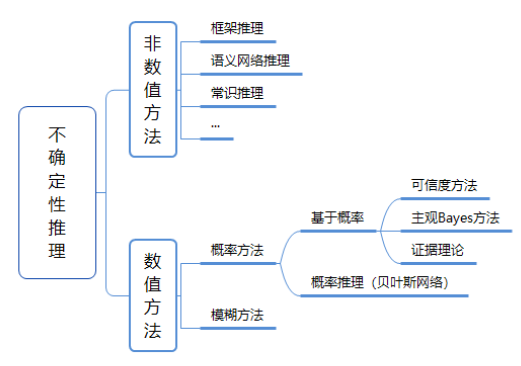

# 不确定性推理概述

不确定性知识系统的主要内容包括不确定性知识表示与不确定性推理

## 不确定性推理的含义

### 什么是不确定性推理

不确定性推理泛指除精确推理以外的其他各种推理问题。包括不完备、不精确知识的推理，模糊知识的推理，非单调性推理等

### 为什么要采用不确定性推理

- 所需知识不完备、不精确所需知识描述模糊
- 多种原因导致同一结论、解题方案不唯一

## 不确定性推理的基本问题

### 不确定性的表示

考虑因素：问题的描述能力，推理中不确定性的计算

含义：知识的确定性程度，或动态程度

表示：

- 用概率，在[0,1]区间取值，越接近于 0 越假，越接近于 1 越真
- 用可信度，在[-1,1]区间取值，大于 0 接近于真，小于 0 接近于假
- 用隶属度，在[0，1]区间取值，越接近于 0 隶属度越低，泛指越高

### 证据不确定性的表示

- 证据的类型：

1. 按证据组织：基本证据，组合证据
2. 按证据来源：初始证据，中间结论

- 表示方法：概率，可信度，隶属度等
- 基本证据：常与知识表示方法一致，如概率，可信度，隶属度等
- 组合证据：

1. 组合方式：析取的关系，合取的关系
2. 计算方法：基于基本证据，最大最小方法，概率方法，有界方法等

## 不确定性推理的类型

# 可信度推理

## 可信度的概念

可信度是指人们根据以往经验对某个事物或现象为真的程度的一个判断，或者说是人们对某个事物或现象为真的相信程度

可信度具有一定的主观性，较难把握。但对某一特定领域，让该领域专家给出的可信度是可行的

# 主观 Bayes 推理

- 全概率公式

$$P(B) = \sum_{i=1}^{n}P(A_i) \times P(B|A_i)$$

- 贝叶斯公式

$$P(A_i|B) = \frac{P(A_i) \times P(B|A_i)}{\sum_{j=1}^{n}P(A_j) \times P(B|A_j)}, \quad i = 1, 2, ..., n$$

# 概率推理

略，理解概念即可
