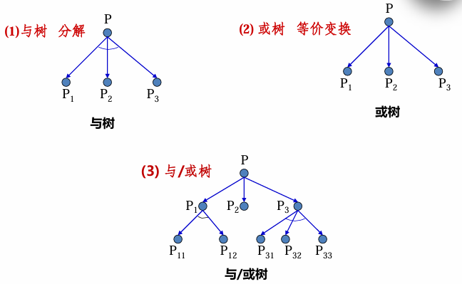
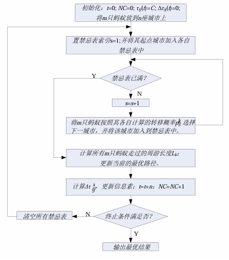

# 搜索概述

## 搜索的含义

### 搜索

依靠经验，利用已有知识，根据问题的实际情况，不断寻找可利用知识，从而构造一条代价最小的推理路线，使问题得以解决的过程称为搜索

### 智能搜索

是指可以利用搜索过程得到的中间信息来引导搜索项往最优方向发展的算法

<details>

<summary>智能搜索类型</summary>

- 基于搜索空间的类型
  - 状态空间 (A 算法、A-star 算法)
  - 与或树 (问题规约法)
  - 博弈树 (极大/极小算法、 $\alpha-\beta$ 剪枝)
- 基于随机算法的类型
  - 演化机制 (遗传算法)
  - 种群寻优 (蚁群算法、粒子群算法)

</details>

## 状态空间问题求解方法

### 状态空间问题表示

#### 状态 (State)

是表示问题求解过程中每一步问题状况的数据结构，它可形式地表示为

$$
S_{1}={S_{k0},S_{k1},\cdots}
$$

当对每一个分量都给以确定的值时，就得到了一个具体的状态

#### 操作 (Operator)

也称为算符，它是把问题从一种状态变为另一种状态的手段

操作可以是一个机械步骤，一个计算，一条规则或一个过程。操作可理解为状态集合上的一个函数，它描述了状态之间的关系

#### 状态空间 (State space)

用来描述一个问题的全部状态以及这些状态之间的相互关系，常用一个三元组表示为

$$
(S，F，G)
$$

其中 $S$ 为问题的所有初始状态集合；$F$ 为操作的集合；$G$ 为目标状态的集合

状态空间也可以用一个赋值的有向图来表示，该有向图称为状态空间图

### 状态空间问题求解

- 首先，为问题选择适当的 "状态" 及 "操作" 的形式化描述方法
- 然后，从某个初始状态出发，每次使用一个 "操作"，递增地建立起操作序列，直到达到目标状态为止
- 最后，由初始状态到目标状态所使用地**算符序列**就是该问题的一个解

## 问题规划求解方法

### 基本思想

当一问题较复杂时，可通过**分解**或**变换**，将其转化为一系列较简单的子问题，然后通过对这些子问题的求解来实现对原问题的求解

### 分解 ("与")

一个问题 $P$ 可以规约为一组子问题 $P_1,P_2,…P_n$

并且只有当所有子问题 $P_i$ 都有解时原问题才有解，任何一个子问题无解都会导致原问题$P$无解，则称此种规约为问题的分解

**分解**所得到的子问题的“与”与原问题 $P$ 等价

### 等价变换 ("或")

一个问题 $P$ 可以归约为一组子问题 $P_1,P_2,\cdots ,P_n$

并且子问题 $P_i$ 中只要有一个有解则原问题就有解，只有当所有子问题都无解时原问题才无解，称此种规约为问题的等价变换，简称变换

**变换**所得到的子问题的 "或" 与原问题等价

### 问题规约的与/或树表示

  

#### 本原问题

是指那种不能 (或不需要) 再进行分解或变换且可以直接解答的问题

#### 端节点与终止节点

端节点是在与/或树种没有子节点的节点；本原问题所对应的节点称为终止节点。

> [!NOTE]
>
> 终止节点一定是端节点，但段节点却不一定是终止节点
>
> 原因是，本原节点要做到的条件很难，所以其对应的终止节点更难达成
>
> 终止节点都是可解节点

#### 可解节点与不可解节点

**定义可解节点**：

满足以下三个条件之一的节点为可解节点

- 任何终止节点都是可解节点
- 对“或”节点，当其子节点至少有一个为可解节点时，则该或节点就是可解节点
- 对“与”节点，只有当其子节点全部为可解节点时，该与节点才是可解节点

**定义不可解节点：**(与上类似)

- 不为终止节点的端节点是不可解节点
- 对“或”节点，若其全部子节点都是不可解节点，则该或节点是不可解节点
- 对“与”节点，只要其子节点中有一个为不可解节点，则该与节点是不可解节点

#### 解树

由可解节点构成，并且由这些可解节点可以推出初始节点为可解节点的子树为解树。在解树中一定包含初始节点

问题规约求解过程就实际上就是生成解树，即证明原始节点是可解节点的过程

## 进化搜索法概述

### 什么是进化搜索

**进化搜索算法**也称为模拟进化优化算法或进化计算，是在达尔文进化论和孟德尔遗传变异理论的基础上产生的一种在基因和种群层次上模拟自然界生物进化过程与机制进行问题求解的自组织、自适应的随机搜索技术。主要包括：

- 遗传算法 (Genetic Algorithm , GA)
- 进化策略 (Evoluenettionary Sttategy , ES)
- 进化规划 (Evolutionaty Programming ,EP)
- 遗传规划 (Genetic Programming ,GP)

进化搜索以物竞天择，适者生存，作为算法的进化规则，并结合孟德尔的遗传变异理论，将生物进化过程中的

- 繁殖
- 变异
- 竞争
- 选择

引入到算法中

## 进化计算的生物学基础

### 遗传理论

遗传将自身基因信息遗传给下一代，由于遗传的作用，自然界才能有稳定的物种

- 细胞 (构成基本结构与功能的单位)
- 染色体 (包含所有遗传信息的复杂而又微小的丝状化合物)
- 基因 (组成遗传信息，决定生物性状，使遗传的基本单位)
- DNA (脱氧核糖核酸，构成染色体的主要物质)
- 基因组 (一个细胞中的所有染色体所携带的遗传信息的全体称为一个基因组)

细胞在分裂过程中，其遗传物质 DNA 通过复制转移到新生细胞中，从而实现了生物的遗传功能

### 变异理论

变异指子代和父代之间，以及子代的各个不同个体之间产生差异的现象。变异是一种随机、不可逆现象，是生物多样性的基础

引起变异的主要原因：

- 杂交：同源染色体之间交配重组，形成两个新的染色体
- 复制差错：细胞复制过程中因 DNA 上某些基因结构的随机改变而产生出新的染色体

### 进化论

进化是指生物延续生存过程中，逐渐适应其生存环境，使得其品质不断得到改良得这种生命现象。遗传和变异是生物进化得两种基本现象，优胜劣汰、适者生存是生物进化得基本规律

- 达尔文自然选择学说

### 进化搜索得基本过程

假设 $P$ 为种群， $t$ 为进化代数， $P(t)$ 为第 $t$ 代种群，则进化计算的基本结构可粗略描述如下：

```markdown
{
 确定编码形式并生成搜索空间;
 初始化各个进化参数，并设置进化代数 t=0;
 初始化种群 P(0);
 对初始种群进行评价 (即适应度计算);
 while (不满足终止条件) do
 {
  t=t+1;
  利用选择操作从 P(t-1) 代中选出 P(t) 代群体;
  对 P(t) 代种群执行进化操作;
  对执行完进化操作后的种群进行评价 (即适应度计算);
 }
}
```

# 状态空间的启发式搜索

## 启发性信息与估价函数

### 启发性信息

启发性信息是指那种与具体信息求解过程有关的，并可指导搜索过程朝着最有希望方向前进的控制信息。

启发信息的启发能力越强，扩展的无用节点越少。包括以下三种：

- 有效地帮助确定扩展节点的信息
- 有效的帮助决定哪些后继节点应被生成的信息
- 能决定在扩展一个节点时哪些节点应从搜索树上删除的信息

### 估价函数

用来估计节点重要性，定义为从初始节点 $S_0$ 出发，约束经过节点 $n$ 到达目标节点 $S_g$ 的所有路径中最小路径代价的估计值

$$
f(n)=g(n)+h(n)
$$

其中， $g(n)$ 是从初始节点 $S_0$ 到节点 $n$ 的实际代价； $h(n)$ 是从节点 $n$ 到目标节点 $S_g$ 的最优路径的估计代价

> [!NOTE]
>
> 八数码难题
>
> 计算值 = 深度 + 异位数
>
> S3 节点，深度为 3，异位数为 1(跟 $S_g$ 比较不一样节点的个数)；S1 节点红线处，深度为 1，异位数位 3 (PPT 上的例题)

## A 算法

## 概念和算法描述

在状态空间搜索中。如果每一步都利用估价函数 $f(n)=g(n)+h(n)$ 对 Open 表中的节点进行排序，则称 A 算法。它是一种启发式搜索算法

### 类型

- 全局择优：从 Open 表的所有节点中选择一个估价函数值最小的进行扩展
- 局部择优：仅从刚生成的子节点中选择一个估价函数值最小的进行扩展

### 全局择优搜索 A 算法描述

1. 把初始节点 $S_0$ 放入 Open 表中， $f(S_0)=g(S_0)+h(S_0)$
2. 如果 Open 表为空，则问题无解，失败退出
3. 把 Open 表的第一个节点取出放入 Closed 表，并记该节点为 $n$
4. 考察节点 $n$ 是否为目标节点。若是，则找到了问题的解，成功退出
5. 若节点 $n$ 不可扩展，则转第 (2) 步
6. 扩展节点 $n$ ，生成其子节点 $n_i(i=1,2,\cdots)$ ，计算每一个子节点的估价值 $f(n_i)(i=1,2,\cdots)$ ，并为每一个子节点设置指向父节点的指针，然后将这些子节点放入 Open 表中
7. 根据各节点的估价函数值，对 Open 表中的全部节点按从小到大的顺序重新进行排序
8. 转第 (2) 步

# 与/或树的启发式搜索

与/或树的启发式搜索过程实际上是一种利用搜索过程所得到的启发性信息**寻找最优解树**的过程

算法的每一步都试图找到一个最有希望成为**最优解树的子树**

最优解树是指代价最小的那颗解树。它涉及到**解树的代价与希望树**

## 解树的代价与希望树

### 解树的代价计算

- 若 $n$ 为终止节点，则其代价 $h(n)=0$
- 若 $n$ 为或节点，且子节点为 $n_1,n_2,\cdots,n_k$ ，则 $n$ 的代价为

$$
h(n)=\min_{1\le i\le k} \left(c(n,n_i)+h(n_i) \right)
$$

其中 $c(n,n_i)$ 是节点 $n$ 到其子节点 $n_i$ 的边代价

- 若 $n$ 为与节点，且子节点为 $n_1,n_2, \cdots ,n_k$ ，则 $n$ 的代价可用和代价法或最大代价法
  - 和代价法： $h(n)=\sum_{i=1}^{k}c(n,n_{i})+h(n_{i})$
  - 最大代价法： $h(n)=\max_{1\leq i\leq k}c(n,n_{i})+h(n_{i})$

- 若 $n$ 是端节点，但又不是终止节点，则 $n$ 不可扩展，其代价定义为 $h(n)=\infty$
- 根节点的代价即为解树的代价

# 博弈树的启发式搜索

## 博弈概述

### 博弈

是一类具有智能行为的竞争活动，如下棋、战争等

#### 类型

**双人完备信息博弈**：两位选手 (MAX、MIN) 对垒，轮流走步，每一方不仅知道对方已经走过的棋步，而且还能估计出对方未来的走步

**机遇性博弈**：存在不可预测性的博弈

#### 博弈树

把双人完备信息博弈过程用图表示出来，就得到一颗与/或树，这种与/或树被称为博弈树。在博弈树中，那些下一步该 MAX 走步的节点称为 MAX 节点，下一步该 MIN 走步的节点称为 MIN 节点

### 博弈的特点

- 博弈的初始状态是初始节点
- 博弈树中的 "或" 节点 "和" 与节点是逐层交替出现的
- 整个博弈过程始终站在某一方的立场上，例如 MAX 方。所有能使自己一方获胜的终局都是本原问题，相应的节点是可解节点；所有使对方获胜的终局都是不可解节点

## 极大极小过程

对于复杂的博弈问题，可以用当前正在考察的节点生成一棵部分博弈树，并用估价函数 $f(n)$ 对叶节点进行静态估值

### 对叶节点的估值方法

对 MAX 有利的节点，其估价函数取正值；那些对 MIN 有利的节点，其估价函数取负值；那些使双方均等的节点，其估价函数取接近于 0 的值

### 非叶节点的值

必须从叶节点开始向上倒推
- 对于 MAX 节点，由于 MAX 方总是选择估值最大的走步，因此 MAX 节点的倒退值应该取其后继节点估值的最大值
- 对于 MIN 节点，由于 MIN 方总是选择估值最小的走步，因此 MIN 节点的倒退值应该取其后继节点估值的最小值
- 这样一步一步的计算倒推值，直至求出初始节点的倒推值为止。这一过程称为极大极小过程

# 进化搜索

### 群智能

人们把群居昆虫的集体行为称作“群智能” (“群体智能”、 “群集智能”、“集群智能”等)

#### 特点

个体的行为很简单，但当他们一起协同工作时，**却能够突现出非常复杂的行为特征**

#### 描述

群智能作为一种新兴的演化计算技术已称为研究焦点，它与人工生命，特别是进化策略以及遗传算法有着极为特殊的关系

#### 特性

无智能的主题通过合作表现出智能行为的特性，在没有集中控制且不提供全局模型的前提下，为寻找复杂的分布式问题求解方案提供了基础

#### 优点

- 灵活性：群体可以适应随时改变的环境
- 稳健性：即使个体失败，整个群体仍能完成任务
- 自我组织：活动既不受中央控制，也不受局部监管

#### 典型算法

- 蚁群算法
- 粒子群优化算法
- 人工蜂群算法

## 蚁群算法

### 蚁群优化算法原理

- 蚁群的自组织行为
- 通过遗留在来往路径上的信息素的挥发性化学物质来进行通信和协调

### 蚁群优化算法

> [!NOTE]
>
> 正反馈过程

#### 人工蚂蚁与真实蚂蚁的异同

相同点：

- 两个群体中都存在个体相互交流的通信机制
- 都要完成寻找最短路径的任务
- 都采用根据当前信息进行路径选择的随机选择策略

不同点：

- 人工蚂蚁具有记忆能力
- 人工蚂蚁选择路径并非完全盲目，受问题空间特征的启发，按一定算法规律有意识地寻找最短路径
- 人工蚂蚁生活在离散空间，而真实蚂蚁生活在连续时间的环境中

### 基本蚁群优化算法

#### 解决 TSP 问题思想

假设蚁群算法中的每只蚂蚁都是具有下列特征的简单智能体

1. 每次周游，每只蚂蚁在其经过地支路 $(i,j)$ 上都留下信息素
2. 蚂蚁选择城市的概率与城市之间的距离和当前连接支路上所包含的信息素余量有关
3. 为了加强蚂蚁进行合法的周游，直到一次周游完成后，才允许蚂蚁游走已访问的城市，可以用禁忌表来控制

#### 解决 TSP 问题算法步骤

- 在算法的初始时刻，将 $m$ 只蚂蚁随机放到 $n$ 座城市
- 将每只蚂蚁 $k$ 的禁忌表 $tabu_k(s)$ 的第一个元素 $tabu_k(1)$ 设置为它当前所在城市；
- s 设各路径上的信息素 $\tau_{ij}(0)=C$ ( $C$ 为一较小的常数) ；
- 每只蚂蚁根据路径上的信息素和启发式信息 (两城市间的距离) 独立地选择下一座城市，在时刻 $t$ ，蚂蚁 $k$ 从城市 $i$ 转移到城市 $j$ 的概率为

$$
p_{ij}^k(t)=
\begin{cases}
\frac{[\tau_{ij}(t)]^\alpha*[n_{ij}(t)]^\beta}{\sum[\tau_{ij}(t)]^\alpha*[n_{ij}(t)]^\beta}, & j\in J_k(i) \\
0, & j\notin J_k(i)
\end{cases}
$$

$\alpha$ 、 $\beta$ 分别表示信息素和启发式因子的相对重要程度

$$
J_k(i)=\set{1,2,\cdots,n}-tabu_k
$$

- 当所有蚂蚁完成一次周游后，各路径上的信息素将进行更新

$$
\tau_{ij}(t+n)=(1-\rho)\tau_{ij}(t)+\Delta\tau_{ij}
$$

$$
\Delta\tau_{ij}=
\sum_{k=1}^m\Delta\tau_{ij}^k,\Delta\tau_{ij}^k=
\begin{cases}
\frac{Q}{L_k}, & \text{若蚂蚁} k \text{在本次周游中经过边} ij \\
0, & \text{否则}
\end{cases}
$$

其中 $\rho$ 代表路径上信息素的蒸发系数；Q 为正常数，表示蚂蚁循环一周或一个过程在经过的路径上所释放的信息素总量，影响算法的收敛速度； $L_k$ 表示第 $k$ 只蚂蚁在本次周游中所走过的路径长度

<details>

<summary>蚁群算法流程图</summary>



</details>

#### 三种模型 (信息素)

- 蚁周，全局信息，所有蚂蚁都完成了自己的行程后才对信息素进行更新
- 蚁量，局部信息，两个位置节点间每移动一次就更新信息素
- 蚁密，局部信息，两个位置节点间每移动一次就更新信息素

$$
\Delta \tau_{ij}^k =
\begin{cases}
\frac{Q}{L_{k}}, & \text{蚂蚁 } k \text{ 在本次周游中经过 } ij \\
0, & \text{否则}
\end{cases}
$$

$L_k$ 表示第 $k$ 只蚂蚁在本次周游中所走过的路径长度

$$
\Delta \tau_{ij}^k =
\begin{cases}
\frac{Q_{2}}{d}, & \text{蚂蚁 } k \text{ 在时刻 } t + 1 \text{ 经过 } ij \\
0, & \text{否则}
\end{cases}
$$

$d$ 表示第 $k$ 只蚂蚁在两个位置节点间所走过的路径长度

$$
\Delta \tau_{ij}^k =
\begin{cases}
Q, & \text{蚂蚁 } k \text{ 在时刻 } t \text{ 经过 } ij \\
0, & \text{否则}
\end{cases}
$$

### 蚁群优化算法的参数设置和基本属性

#### 参数 $\alpha,\beta$ 对算法性能的影响

停滞现象 ( $\alpha$ )：所有蚂蚁都选择相同的路径，即系统不再搜索更好的解。原因在于较好路径上的信息素远大于其他边上的，从而使所有蚂蚁都选择该路径

- $\alpha$ 取较大值时，意味着在选择路径时，路径上的信息素非常重要
- $\alpha$ 取较小值时，变成随机的贪婪算法
- $\alpha$ 取 0 时，蚂蚁之间无协同作用
- $\alpha$ 取 1 时，有协同作用

#### 蚂蚁数 $m$ 对算法的影响

- 当 $n=1m-1.5m$ 时，蚂周可以有较好的全局收敛性和收敛速度

#### 蚂蚁的初始分布

蚂蚁分布在不同城市中，可以获得较高性能

在不同城市分布时，随机分布与统一分布的差别不大

### 蚁群算法优点与不足

#### 优点

- 较强的鲁棒性
- 分布式计算
- 易于与其他方式结合

#### 缺点

- 计算量大、搜索时间较长
- 容易出现停止现象
- 基本蚁群算法本质上是离散的，不适用于连续优化问题

## 遗传算法

### 遗传算法的思路与特点

遗传算法的一般步骤：
1. 随机产生种群
2. 根据策略判断个体的适应度，是否符合优化准则，若符合，输出最佳个体及其最
优解，结束。否则，进行下一步
3. 依据适应度选择父母，适应度高的个体被选中的概率高，适应度低的个体被淘汰
4. 用父母的染色体按照一定的方法进行交叉，生成子代
5. 对子代染色体进行变异
6. 由交叉和变异产生新一代种群，返回步骤 2，直到最优解产生

### 遗传算法的基本操作

- 产生初始种群
- 计算适应度
- 选择，在 $[0,1]$ 之中产生随机数，将其用轮盘赌的方式选择，适应度高的个体选择的概率高
  - 采用累积概率和选择概率的方式实现
  - 没选到的个体进行淘汰
- 交叉
  - 随机把其中几个位于同一位置的编码进行交换，产生新的个体
- 变异
  - 将个体染色体编码串中的某些基因座上的基因值用该基因座上的其它等位基因来替换，从而形成新的个体
- 至下一代，适应度计算 $\rightarrow$ 选择 $\rightarrow$ 交叉 $\rightarrow$ 变异，直至满足终止条件

> [!NOTE]
> 适应度依据特定条件得出
>
> 选择概率=该个体的适应度值/总的适应度值
>
> 累计误差=上一个个体的累计概率 + 该个体的选择概率

## 遗传算法优化函数应用

简单的函数优化 (函数求最大值)

数学方法：求微分，导数为 0

### 编码

表现型：x

基因型：二进制编码 (串长取决于求解精度)

串长与精度之间的关系：区间分成的等份，由等份数向上取最小的二进制位串长

<details>

<summary>例题</summary>

若要求求解精度到 6 位小数， $10^6$ ，区间长度为 3

分成了 3000000 份，小于二的二十二次方，大于二的二十一次方

二进制位串长为 22

</details>

### 产生初始种群

产生的方式：随机

产生的结果：长度为 22 的二进制串

产生的数量：种群的大小 (规模)

### 计算适应度

不同的问题有不同的适应度计算方法

本例：直接用目标函数作为适应度函数
- 某个体转化为 $[-1,2]$ 区间的实数
- 计算 x 的函数值 (适应度)
- 二进制与十进制之间的转换
  - 二进制串转化为 10 进制数
  - 对应的区间 $[-1,2]$ 内的实数

### 遗传操作

选择：轮盘赌选择法

交叉：单点交叉

变异：小概率变异

### 模拟结果

- 设置的参数
  - 种群大小 50；交叉概率 0.75；变异概率 0.05；最大代数 200
- 得到的最佳个体

## 遗传操作——选择

### 轮盘赌选择法 (roulette wheel selection)

首先将个体适应度值映射到轮盘中，个体的适应度值越大，其在轮盘中分配
到的角度就越大，因此被选中的概率就越大

### 随机遍历抽样法 (stochastic universal sampling)

如果需要选择 N 个个体，则只需一次生成 N 个等间距的标记指针位置，即可
选择出 N 个个体

- 截断选择法 (truncation selection)
  - 个体按适应度排列，只有优秀个体能够成为父个体，参数为截断阈值（被选作父个体的百分比）

- 锦标赛选择法 (tournament selection)
  - 随机从种群中挑选一定数目个体（竞赛规模），其中最好的个体作为父个体，此过程重复进行完成个体的选择

## 遗传操作——交叉/基因重组

- 实值重组
  - 离散重组
    - 子个体的每个变量可以按等概率随机地挑选父个体
  - 中间重组
    - 子个体＝父个体 1＋ $\alpha$ ×（父个体 2−父个体 1）
    - $\alpha$ 是比例因子，由 $[-d,1+d]$ 上均匀分布地随机数产生
    - $d=0$ 时为中间重组，一般取 $d=0.25$
    - 子代的每个变量均产生一个 $\alpha$
    - 首先生成每一个子代个体的 $\alpha$ ,再根据上面的公式进行子代的个体
  - 线性重组
    - 用一个个体用同一组 $\alpha$
    - 首先生成每一个子代个体的 $\alpha$ ,再根据上面的公式进行子代的个体
- 二进制交叉
  - 单点交叉
    - 单点交叉也称简单交叉，它是先在两个父代个体的编码串中随机设定一个交叉点，然后对这两个父代个体交叉点前面或后面部分的基因进行交换，并生成子代中的两个新的个体
  - 多点交叉
    - 多点交叉是指先在两个父代个体的编码串中随机设定多个交叉点，然后再按这些交叉点进行部分基因交换，生成子代中的两个新的个体
  - 均匀交叉
    - 均匀 (一致) 交叉，随机产生 ${0,1}$ 位串，长度与个体的相等，称屏蔽模板
    - 在其“1”的基因座上，将父代 1、2 的基因分别传到子个体 1、2
    - 在其“0”的基因座上，将父代 1、2 的基因分别交叉传到子代 2、1

## 遗传操作——变异

一般采用：

$$
X' = X ± 0.5L\Delta
$$

其中
$$
\Delta = \sum_{i=0}^{m} \frac{a(i)}{2^i}
$$

$a(i)$ 以概率 $\frac{1}{m}$ 取值 1，以概率 $1 - \frac{1}{m}$ 取值 0，通常 m = 20; $L$ 为变量的取值范围

# 粒子群优化算法

## 基本粒子群优化算法

### 粒子速度和位置的更新

假设在 $D$ 维搜索空间中，有 $m$ 个粒子；

- 其中第 $i$ 个粒子的位置为矢量 $\vec{X_i} = (X_{i1}, X_{i2}, \dots, X_{iD})$
- 其飞翔速度也是一个矢量，记为 $\vec{V_i} = (V_{i1}, V_{i2}, \dots, V_{iD})$
- 第 $i$ 个粒子搜索到的最优位置为 $\vec{p_i} = (p_{i1}, p_{i2}, \dots, p_{iD})$
- 整个粒子群搜索到的最优位置为 $\vec{p_{gbest}} = (p_{gbest1}, p_{gbest2}, \dots, p_{gbestD})$

第 $i$ 个粒子的位置和速度更新为：

$$
V_{id}^{k+1} = wV_{id}^{k} + c_1 rand() (p_{id} - X_{id}^{k}) + c_2 rand() (p_{gbest} - X_{id}^{k})
$$

$$
X_{id}^{k+1} = X_{id}^{k} + V_{id}^{k+1}
$$

$$
i = 1, 2, \dots, m; \quad d = 1, 2, \dots, D
$$

其中，

$w$ 称为惯性权重， $c1$  和 $c2$ 为两个正常数，称为加速因子
将 $v_{id}^k$ 限制在一个最大速度 $v_{max}$ 内

解释，

$wV_{id}^{k}$ ,“惯性部分”，对其自身运动状态的信任

$c_1 rand() (p_{id} - X_{id}^{k})$ ,“认知部分”，对微粒本身的思考，即来源于自己经验的部分

$c_2 rand() (p_{gbest} - X_{id}^{k})$ ,“社会部分”，微粒间的信息共享，来源于群体中的其它优秀微粒的经验

算法流程

开始
1. 用随机位置和速度向量初始化粒子
2. 循环直到所有粒子耗尽
3. 对每个粒子的位置 (xi) 评估适应度
4. 如果 fitness(xi) 比 fitness(p) 好，则 p = xi
5. 将 ps 中的最佳值设为 $gBest$
6. 更新粒子的速度和位置
循环直到最大迭代次数

停止：给出 $gBest$，即最优解

### 求解 TSP 问题

#### 符号的定义

若干个交换序可以合并成一个新的交换序，定义 $\oplus$ 为两个交换序的合并算子

设两个交换序 $SS1$ 和 $SS2$ 按先后顺序作用于解 $S$ 上，得到新解 $S’$ 。假设另外有一个交换序 $SS’$ 作用于同一解 $S$ 上，能够得到相同的解 $S’$ ，可定义

$$
SS' = SS1 \oplus SS2
$$

$SS'$ 和 $SS1 \oplus SS2$ 属于同一等价集，在交换序等价集中，拥有最少交换子的交换序称为该等价集的基本交换序

#### 解决 TSP 问题的速度算式定义

$$
\begin{cases}
V_{id}' = V_{id} \oplus \alpha (p_{id} - x_{id}) \oplus \beta (p_{gd} - x_{id}) \\
X_{id}' = X_{id} + V_{id}'
\end{cases}
$$

$\alpha, \beta$ 为 $[0,1]$ 上的随机数。$V_{id}$ 表示交换算符，$X_{id}$ 表示路径序列 (解)

#### 算法流程

1. 初始化粒子群，给每个粒子一个初始解 ( $x_{id}$ ) 和随机的交换序 ( $v_{id}$ )
2. 如果满足结束条件，转步骤 5
3. 根据粒子当前位置 $x_{id}$ 计算下一新解 $x_{id'}$
4. 如果整个群体找到一个更好的解，更新 $P_{gd}$ ，转步骤 2
5. 显示结果

- 根据粒子当前位置 $x_{id}$ 计算下一新解 $x'_{id}$
  - 计算 $A = P_{id} - X_{id}$ ， $A$ 是一个基本交换序，表示 $A$ 作用于 $X_{id}$ 得到 $P_{id}$
  - 计算 $B = P_{gd} - X_{id}$ ， $B$ 也是一个基本交换序
  - 更新速度 $V'_{id} = V_{id} \oplus \alpha (P_{id} - X_{id}) \oplus \beta (P_{gd} - X_{id})$ 并将其转换成一个基本交换序
  - 更新解 $X'_{id} = X_{id} + V'_{id}$
  - 如果找到一个更优解，更新 $P_{id}$

#### 与遗传算法比较

- 共性
  - 都属于仿生算法
  - 都属于全局优化方法
  - 都属于随机搜索算法
  - 都隐含并行性
  - 根据个体的适配信息进行搜索，因此不受函数约束条件的限制，如连续性、可导性等
  - 对高维复杂问题，往往会遇到早熟收敛和收敛性能差的缺点，都无法保证收敛到最优点
- 差异
  - PSO 有记忆，所有粒子都保存较优解的知识，而 GA，以前的知识随着种群的改变被改变
  - PSO 中的粒子是一种单向共享信息机制。而 GA 中的染色体之间相互共享信息，使得整个种群都向最优区域移动
  - GA 需要编码和遗传操作，而 PSO 没有交叉和变异操作，粒子只是通过内部速度进行更新，因此原理更简单、参数更少、实现更容易

> [!NOTE]
> 遗传算法 (Genetic Algorithm , GA)
>
> 粒子群优化算法 (Particle Swarm optimization,PSO)
