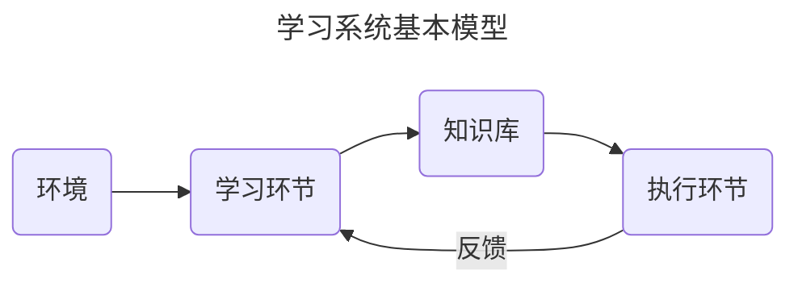
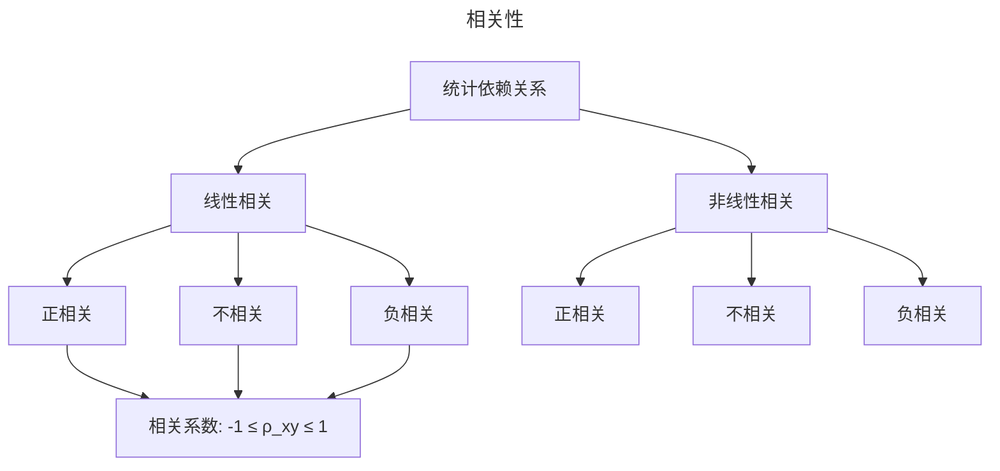
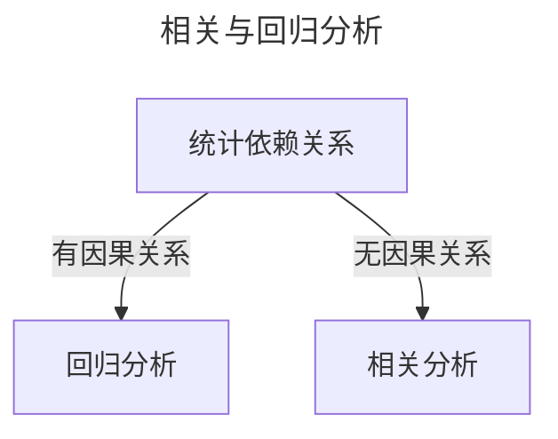

# 机器学习

## 机器学习概述

### 学习系统基本模型

- 环境
  - 学习系统所感知到的外界信息集合, 也是学习系统的外界来源. 信息的水平 (一般化程度) 和质量 (正确性) 对学习系统影响较大
- 学习环节
  - 对环境提供的信息进行整理, 分析归纳或类比, 形成知识, 并将其放入知识库
- 知识库
  - 存储经过加工后的信息 (即知识). 其表示形式是否合适非常重要
- 执行环节
  - 根据知识库去执行一系列任务, 并将执行结果或执行过程中获得的信息反馈给学习环节. 学习环节再利用反馈信息对知识进行评价, 进一步改善执行环节的行为

## 示例学习

### 示例学习的模型

- 示例空间
  - 是我们向系统提供的示教例子的集合
  - **研究问题**: 例子质量, 搜索方法, 学习算法
- 归纳过程
  - 是从搜索到的示例中抽象出一般性的知识的归纳过程
  - **归纳方法**: 常量转换为变量, 去掉无关子条件, 增加选择, 曲线拟合等
- 规则空间
  - 是事务所具有的各种规律的集合
  - **研究问题**: 对空间的要求, 搜索方法
- 验证过程
  - 是要从示例空间中选择新的示例, 对刚刚归纳出的规则做进一步的验证和修改

## 决策树学习

### 信息熵

$$
H(X)=\sum\limits p(x_i)I(x_i)=-\sum\limits p(x_i)logp(x_i)
$$

### 信息增益

设数据集为 $D$, 样本容量为 $|D|$, 设有 $K$ 个类 $C_k$, 则 $\sum\limits_{k=1}^{K}|C_k|=|D|$, $|C_k|$ 为特定类的数量. 设特征 $A$ 有 $n$ 个不同的取值, 对应分为 $n$ 个 $D$ 的子集 $D_i$, 因此经验熵为

$$
H(D)=-\sum\limits_{k=1}^K\frac{|C_k|}{|D|}log_2\frac{|C_k|}{|D|}
$$

特征 $A$ 对数据集 $D$ 的经验条件熵为

$$
H(D|A)=\sum\limits_{i=1}^{n}\frac{|D_i|}{|D|}H(D_i)=-\sum\limits_{i=1}^n\frac{|D_i|}{|D|}\sum\limits_{k=1}^K\frac{|D_{ik}|}{|D_i|}log_2\frac{|D_{ik}|}{|D_i|}
$$

最后计算 $g (D, A)$ 信息增益

$$
g(D,A)=H(D)-H(D|A)
$$

### ID3 算法

- 输入: 训练数据集 $D$, 特征值 $A$, 阈值 $\epsilon$ (若最大特征的信息增益小于阈值, 则 $T$ 为单节点树)
- 从根节点开始, 对节点计算所有可能的特征的信息增益, 选择信息增益最大的特征作为节点的特征, 由该特征的不同取值建立子节点
- 再对子节点递归地调用以上方法, 构建决策树
- 直到满足终止条件结束
  - $D$ 所有实例属于同一类
  - $A$ 为空集, 则单节点处理, 类别为 $D$ 中实例最大类
  - $A_g$ 小于阈值, 单节点处理, 类别为 $D$ 中实例最大类
- 输出: 决策树 $T$

## 集成学习

### 集成学习的基本概念

集成学习是指为解决同一问题, 先训练出一系列个体学习器 (或称弱学习器), 然后再根据某种规则把这些个体学习器的学习结果整合到一起, 得到比单个个体学习器更好的学习效果

集成学习包括两大基本问题, 一个是个体学习器的构造, 另一个是个体学习器的合成

### 集成学习的两种方式

- 同质集成
  - 要求构造个体学习器时使用相同类型的学习方法, 构造出来的多个个体
  - 这种采用相同学习方法构造个体学习器的集成学习称为**狭义集成学习**, 其个体学习器称为基学习器, 所用的学习算法称为基学习算法
- 异质集成
  - 不要求构造个体学习器时使用同一类型的学习方法, 而是可以异质. 所谓异质, 是指不同类型, 例如可以同时使用决策树和神经网络去构造个体学习器
  - 这种集成学习又称为**广义集成学习**, 构造个体学习器所用学习算法不再称基学习算法, 构造出来的个体学习器也不再称基学习器, 而直接称其为个体学习器

### Boosting

- 从初始训练集开始, 先为每个训练样本平均分配初始权重, 并训练出弱学习器 1
- 然后通过提高错误率高的训练样本的权重, 降低错误率低的训练样本的权重, 得到训练样本的新的权重分布, 并在在该权重分布上训练出弱学习器 2
- 依此逐轮迭代, 直至达到最大迭代轮数, 最后再将训练出来的这些弱学习器合成到一起, 形成最终的强学习器

其典型代表是 AdaBoost 算法和提升树 (boosting tree) 算法

### Bagging

- 在给定初始训练集和弱学习算法的前提下, 每轮迭代都使用可重采样的随机抽样方法式从初始训练集产生出本轮的训练子集
- 然后利用选定的弱学习算法训练出本轮迭代的弱学习器, 依此逐轮迭代, 直至达到最大迭代轮数
- 最后再按照某种合成方式将这这些训练出来的弱学习器合成到一起, 形成最终的强学习器

其典型代表包括 bagging 算法和随机森林 (Random Forest) 算法等

## 线性回归

### 回归的定义

回归指研究一组随机变量 $Y_1, Y_2, ..., Y_i$ 和另一组 $X_1, X_2, ..., X_k$ 变量之间关系的统计分析方法, 又称多重回归分析. 通常 $Y_1, Y_2, ..., Y_i$ 是因变量, $X_1, X_2, ..., X_k$ 是自变量

### 相关, 回归与因果的关系

- 不线性相关并不意味着不相关
- 有相关关系并不意味着一定有因果关系
- **回归分析/相关分析**研究一个变量对另一个 (些) 变量的统计依赖关系, 但它们并不意味着一定有因果关系
- **相关分析**对称地对待任何 (两个) 变量, 两个变量都被看作是随机的
- **回归分析**对变量的处理方法存在不对称性, 即区分应变量 (被解释变量) 和自变量 (解释变量) : 前者是随机变量, 后者不是

### 回归分析的概念

- 回归分析 (regression analysis) 是研究一个变量关于另一个 (些) 变量的具体依赖关系的计算方法和理论
- 通过后者的已知或设定值, 去估计和 (或) 预测前者的 (总体) 均值
- 被解释变量 (Explained Variable) 或应 (因) 量 (Dependent Variable) (前者)
- 解释变量 (Explanatory Variable) 或自变量 (Independent Variable) (后者)

### 回归分析的目的

- 根据样本观察值对经济计量模型参数进行估计, 求得回归方程
- 对回归方程, 参数估计值进行显著性检验
- 利用回归方程进行分析, 评价及预测

### 总体回归函数 (PRF)

在给定解释变量 $X_i$ 条件下被解释变量 $Y_i$ 的期望轨迹称为总体回归线 (population regression line), 或更一般地称为总体回归曲线 (population regression curve)

函数表示如下, 它也称被为 (双变量) 总体回归函数 (population regression function, PRF)

$$
E(Y|X_i)=f(X_i)
$$

### 样本回归函数 (SRF)

画一条直线以尽好地拟合该散点图, 由于样本取自总体, 可以该直线近似地代表总体回归线. 该直线称为样本回归线 (sample regression lines)

在线性回归中, $\widehat{Y_i} = f(X_i) = b_0 + b_1 X$

### 参数估计 (OLS)

回归分析的主要目的是要通过样本回归函数 (模型)SRF 尽可能准确地估计总体回归函数 (模型) PRF, 常用方法有**最小二乘法**

$$
\min \sum\limits_{i=1}^n(Y_i-\widehat{Y_i})^2
$$

得到参数估计

$$
\begin{cases}
b_0=\overline{Y}-b_1\overline{X} \\
b_1=\frac{\sum\limits_{i=1}^n(X_i-\overline{X})(Y_i-\overline{Y})}{\sum\limits_{i=1}^n(X_i-\overline{X})^2}
\end{cases}
$$

也可写成

$$
b_1=\frac{\sum\limits_{i=1}^{n}X_iY_i-n\overline{X}\bar{Y}}{\sum\limits_{i=1}^{n}X_i^2-n\overline{X}^2}
$$
