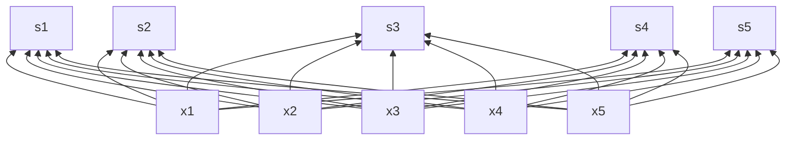
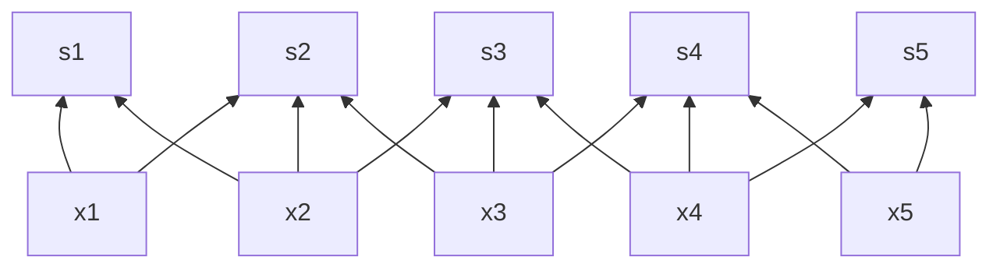

# 人工神经元的结构及模型

## 人工神经元的结构及模型

### 人工神经网络的分类

- 按拓扑结构
  - 前馈网络 反馈网络
- 按学习方法
  - 有导师指导 无导师指导
- 按网络性能
  - 连续型网络 离散型网络
- 按网络层级
  - 浅层网络 深层网络

# 人工神经网络的互联结构

## 人工神经元的互联结构

概念: 人工神经网络的互联结构 (或称拓扑结构) 是指单个神经元之间的连接模式, 它是构造神经网络的基础, 也是神经网络诱发偏差的主要来源

分类
- 前馈网络 (只包含前向联结)
  - 单层前馈网络: 仅含输入层和输出层, 且只有输出层的神经元是可计算节点
  - 多层前馈网络: 除拥有输入和输出层外, 还至少含有一个或更多个隐含层的前向网络
  
$$
y_{j} = f\left(\sum_{i=1}^{n} w_{ij} x_{i} - \theta_{j}\right) \quad j=1,2,\ldots, m
$$

- 反馈网络 (可含有反馈联结)
  - 单层反馈网络: 指不拥有隐含层的反馈网络
  - 多层反馈网络: 指拥有隐含层的反馈网络

## 人工神经元的结构及模型

### 反馈神经网络

概念: 反馈网络是指允许采用反馈联结方式所形成的神经网络. 所谓反馈联结方式是指一个神经元的输出可以被反馈至同层或前层的神经元

反馈网络和前向网络区别
- 前向网络属于非循环连接模式, 它的每个神经元的输入都没有包含该神经元先前的输出, 因此不具有“短期记忆”的性质
- 反馈网络则不同, 它的每个神经元的输入都有可能包含有该神经元先前输出的反馈信息, 即一个神经元的输出是由该神经元当前的输入和先前的输出这两者来决定的, 这就有点类似于人类的短期记忆的性质

# 感知器模型

## 单层感知器

概念
- 使用感知器的主要目的是为了对外部输入进行分类
- 单层感知器可以很好地实现“与”、“或”、“非”运算, 但却不能解决“异或”问题

如果外部输入是线性可分的 (指存在一个超平面可以将它们分开), 则单层感知器一定能够把它划分为两类. 其判别超平面由如下判别式确定

$$
\sum_{i=1}^{n} w_{ij} x_{i} - \theta_{j}=0, \quad j=1,2,\ldots, m
$$

## 单层感知器 (与)

| 输入 $x_1$ | 输入 $x_2$ | 输出 $x_1 \land x_2$ | 超平面 $w_{1} x_{1} + w_{2} x_{2} - \theta = 0$ | 阈值条件                    |
| ---------- | ---------- | -------------------- | ----------------------------------------------- | --------------------------- |
| 0          | 0          | 0                    | $w_{1} \cdot 0 + w_{2} \cdot 0 - \theta < 0$    | $\theta > 0$                |
| 0          | 1          | 0                    | $w_{1} \cdot 0 + w_{2} \cdot 1 - \theta < 0$    | $\theta > w_{2}$            |
| 1          | 0          | 0                    | $w_{1} \cdot 1 + w_{2} \cdot 0 - \theta < 0$    | $\theta > w_{1}$            |
| 1          | 1          | 1                    | $w_{1} \cdot 1 + w_{2} \cdot 1 - \theta \geq 0$ | $\theta \leq w_{1} + w_{2}$ |

可以证明此表有解, 例如取 $w_{1}=1,w_{2}=1,\theta=1.5$

## 单层感知器 (或)

| 输入 $x_1$ | 输入 $x_2$ | 输出 $x_1 \vee x_2$ | 超平面 $w_{1} x_{1} + w_{2} x_{2} - \theta = 0$ | 阈值条件                |
| ---------- | ---------- | ------------------- | ----------------------------------------------- | ----------------------- |
| 0          | 0          | 0                   | $w_1 \cdot 0 + w_2 \cdot 0 - \theta < 0$        | $\theta > 0$            |
| 0          | 1          | 1                   | $w_1 \cdot 0 + w_2 \cdot 1 - \theta \geq 0$     | $\theta \leq w_2$       |
| 1          | 0          | 1                   | $w_1 \cdot 1 + w_2 \cdot 0 - \theta \geq 0$     | $\theta \leq w_1$       |
| 1          | 1          | 1                   | $w_1 \cdot 1 + w_2 \cdot 1 - \theta \geq 0$     | $\theta \leq w_1 + w_2$ |

此表也有解, 例如取 $w_1=1,w_2=1,\theta=0.5$

## 单层感知器 (非)

| 输入 $x_1$ | 输出 $\neg x_1$ | 超平面 $w_1 x_1 - \theta =0$  | 阈值条件        |
| ---------- | --------------- | ----------------------------- | --------------- |
| 0          | 1               | $w_1 \cdot 0 - \theta \geq 0$ | $\theta \leq 0$ |
| 1          | 0               | $w_1 \cdot 1 - \theta < 0$    | $\theta > w_1$  |

此表也有解, 例如取 $w_1 = -1,\theta = -0.5$

## 单层感知器 (异或)

| 输入 $x_1$ | 输入 $x_2$ | 输出  $x_1 \oplus x_2$ | 超平面 $w_{1} x_{1} + w_{2} x_{2} - \theta = 0$ | 阈值条件             |
| ---------- | ---------- | ---------------------- | ----------------------------------------------- | -------------------- |
| 0          | 0          | 0                      | $w_1 \cdot 0 + w_2 \cdot 0 - \theta < 0$        | $\theta > 0$         |
| 0          | 1          | 1                      | $w_1 \cdot 0 + w_2 \cdot 1 - \theta \geq 0$     | $\theta \leq w_2$    |
| 1          | 0          | 1                      | $w_1 \cdot 1 + w_2 \cdot 0 - \theta \geq 0$     | $\theta \leq w_1$    |
| 1          | 1          | 0                      | $w_1 \cdot 1 + w_2 \cdot 1 - \theta < 0$        | $\theta > w_1 + w_2$ |

此表无解, 即无法找到满足条件的 $w_1, w_2, \theta$

因为异或问题是一个非线性可分问题, 需要用多层感知器来解决

# 深度卷积神经网络

深度卷积神经网络包含

- **Convolution** 和 **Pooling**, 分别表示卷积操作和池化操作
- 中间层展示了三大特性
  - **Sparse Connectivity** (稀疏连接)
  - **Parameter Sharing** (参数共享)
  - **Equivariant Representation** (等变表示)

## 深度卷积神经网络的基本结构

CNN 的一个重要操作卷积是 CNN 的核心思想, 就是这个卷积有效的提取了图像特征用于后面的图像识别

### 卷积概念

可以直接把卷积理解为矩阵相乘, 即两个矩阵相乘, 一个是输入矩阵, 一个是卷积核矩阵. 输入矩阵一般都表示二维的输入图像, 而卷积核其实可以理解为图像处理里面的算子, 比如这些算子可以实现一些边缘检测或者高斯模糊的效果, 那么其实卷积操作可以理解为对图像进行一些特征处理

一个卷积操作就是指卷积核和同样大小的一个图像矩阵相乘, 然后再向下或者向右滑动卷积核, 执行下一个卷积操作. 这样用卷积核在整个图像上面滑动一遍便生成了一个卷积层

### 稀疏连接

- 由于卷积核的存在, 而且卷积核的大小比整幅图像小, 所以才产生了稀疏连接这样的思想
- 全连接如下所示, 把卷积核就想成连接权, 这时卷积核和图像大小相同, 相当于全连接, 所以输出层中的 $s_3$ 收到输入层所有神经元的影响

- 稀疏连接如下所示, 可以把图像想象成二维的, 这里只展示出了一维信息, 而卷积核是 $3 \times 3$ 大小的, 所以就产生了连接权的稀疏性, 即最终 $s_3$ 只受到了三个神经元的影响

根据一些生物学的研究视觉感知细胞其实是局部感知的比如用很小的卷积核来提取整幅图像的布局边缘信息, 这时候采用全连接的意义并不大, 不能学到很好的图像特征信息, 而且模型复杂度还很高

### 权值共享

第一部分降到的卷积核在整幅图像上滑动其实就是一种权值共享, 因为这里的卷积核代表的其实就是权值, 而这个权值用于了整幅图像从而产生了下一层网络, 也就是说对于图像的每个局部位置, 它们连接到下一层的权值都是一样的

### 池化操作

是指在生成卷积层以后, 图像某块区域的值被这个区域内所有值得统计量所取代, 例如 max pooling 操作就是把一个矩形局域内最大的输出当做这块区域的输出. 当然还有其他的 pooling function, 比如 average pooling, weighted average pooling 等

# 连接学习规则

概念: 连接学习规则可简单地理解为学习过程中神经元之间联结权值及神经元自身阈值的调整规则. 按照学习规则, 神经学习可分为 Hebb 学习、纠错学习、竞争学习及随机学习等

## Hebb 学习规则

基本思想: 如果神经网络中某一神经元同另一直接与它连接的神经元同时处于兴奋状态, 那么这两个神经元之间的连接强度将得到加强, 反之应该减弱

其对连接权值的调整可表示为

$$
w_{ij}(t+1)= w_{ij}(t)+\eta[x_i(t) x_j(t)]
$$

- 表示时刻 $t$ 的权值修正一次后所得到的新的权值
- $\eta$ 是一正常量, 也称为学习因子, 它取决于每次权值的修正量
- $x_i(t), x_j(t)$ 分别表示 $t$ 时刻第 $i$ 个和第 $j$ 个神经元的状态

作用: Hebb 学习是联结学习中影响较大的一种学习方法, 认为对神经元重复同以刺激就可以产生性质相同、程度增强的反应

## 纠错学习规则

纠错学习也叫误差修正学习, 是一种有导师的学习过程

基本思想: 利用神经网络的期望输出与实际输出之间的偏差作为连接权值调整的参考, 并最终减少这种偏差

误差修正规则: 连接权值的变化与神经元希望输出和实际输出之差成正比, 其联结权值的计算公式为

$$
w_{ij}(t+1)= w_{ij}(t)+\eta[d_j(t)- y_j(t)]x_i(t)
$$

- $w_{ij}(t)$ 表示时刻 $t$ 的权值
- $w_{ij}(t+1)$ 表示对时刻 $t$ 的权值修正一次后所得到的新的权值
- $\eta$ 是一正常量, 也称为学习因子
- $y_j$ 为神经元 $j$ 的实际输出
- $d_j$ 为神经元 $j$ 的希望输出
- $d_j(t)- y_j(t)$ 表示神经元 $j$ 的输出误差
- $x_i(t)$ 为第 $i$ 个神经元的输入

学习过程
- 选择一组初始 $w_{ij}(0)$
- 计算某一输入模式对应的实际输出与期望输出的误差
- 按上述公式更新权值
- 返回第二步, 直到误差满足要求为止

## 竞争学习规则

基本思想: 竞争中获胜神经元的连接权会向着对其刺激相应模式更为有利的方向发展; 而竞争失败神经元的刺激响应模式受到抑制

学习过程: 竞争型学习的简单形式是任一时刻只允许一个神经元被激活

- 将一个输入模式送给输入层 LA
- 将 LA 层神经元的激活值送到下一层 LB
- LB 层神经元对 LA 层送来的刺激模式进行竞争, 每个神经元将一个正信号送给自己 (自兴奋反馈), 同时将一个负信号送给该层其它神经元 (横向邻域抑制)
- LB 层中输出值最大的神经元为竞争获胜神经元, 该神经元被激活, 连接权值增强; 其它神经元为竞争失败神经元, 受到抑制, 连接权则不变

## 随机学习规则

基本思想: 结合随机过程、概率和能量 (函数) 等概念来调整网络的变量, 从而使网络的目标函数达到最大 (或最小)

网络变化规则

- 如果网络变量的变化能使能量函数有更低的值, 那么就接受这种变化
- 如果网络变量变化后能量函数没有更低的值, 那么就按某一预先选取的概率分布接受这一变化

分析: 随机型学习不仅可以接受能量函数减少 (性能改善) 的变化, 而且还可以以某种概率分布接受使能量函数增大 (性能变差) 的变化. 模拟退火算法就是一种典型的随机学习算法

# 感知器学习

## 单层感知器学习算法

> [!IMPORTANT]
> 由于以下算法描述讲得完全不是人话, 建议查看《模式识别》线性感知机原始形式求解 (随机梯度下降法)

不建议阅读

假设 $X(k)$ 和 $W(k)$ 分别表示学习算法在第 $k$ 次迭代时输入向量和权值向量, 为方便, 把阈值 $\theta$ 作为权值向量 $W(k)$ 中的第一个分量, 对应地把 $-1$ 固定地作为输入向量 $X(k)$ 中的第一个分量. 即 $W(k)$ 和 $X(k)$ 可分别表示如下

$$
X(k) = [−1, x_1(k), x_2(k), …, x_n(k) ]
$$

$$
W(k) = [\theta(k), w_1(k),  w_2(k), …,  w_n(k) ]
$$

即 $x_0(k)=-1,w_0(k)=\theta(k)$

单层感知器学习是一种有导师学习, 它需要给出输入样本的期望输出. 假设一个样本空间可以被划分为 A、B 两类, 定义

- 功能函数: 若输入样本属于 A 类, 输出为 +1, 否则其输出为 -1
- 期望输出: 若输入样本属于 A 类, 期望输出为 +1, 否则为 -1 (0)

单层感知器学习算法可描述如下
- 设 $t = 0$, 初始化连接权和阈值. 即给 $w_i(0), i=1, 2, …,n$ 及 $\theta(0)$ 分别赋予一个较小的非零随机数, 作为初值. 其中,  $w_i(0)$ 是第 0 次迭代时输入向量中第 $i$ 个输入的连接权值;  $\theta(0)$ 是第 0 次迭代时输出节点的阈值
- 提供新的样本输入 $x_i(0), i=1, 2, …, n$ 和期望输出 $d(t)$
- 计算网络的实际输出

$$
y(t) = f\left(\sum_{i=1}^n w_i(t) x_i(t) - \theta(t)\right) \quad i=1,2,\ldots, n
$$

- 若 $y(t) = d(t)$, 不需要调整连接权值, 转第六步. 否则, 需要调整权值
- 调整连接权值

$$
w_i(t+1) = w_i(t) + \eta [d(t) - y(t)] x_i(t) \quad i=1,2,\ldots, n
$$

其中 $\eta$ 是一个增益因子, 用于控制修改速度, 其值如果太大, 会影响 $w_i(t)$ 的收敛性; 如果太小, 又会使 $w_i(t)$ 的收敛速度太慢
- 判断是否满足结束条件, 若满足, 算法结束; 否则, 将 $t$ 值加 1, 转第二步重新执行. 这里的结束条件一般是指 $w_i(t)$ 对一切样本均稳定不变

若输入的两类样本是线性可分的, 则该算法就一定会收敛. 否则, 不收敛

