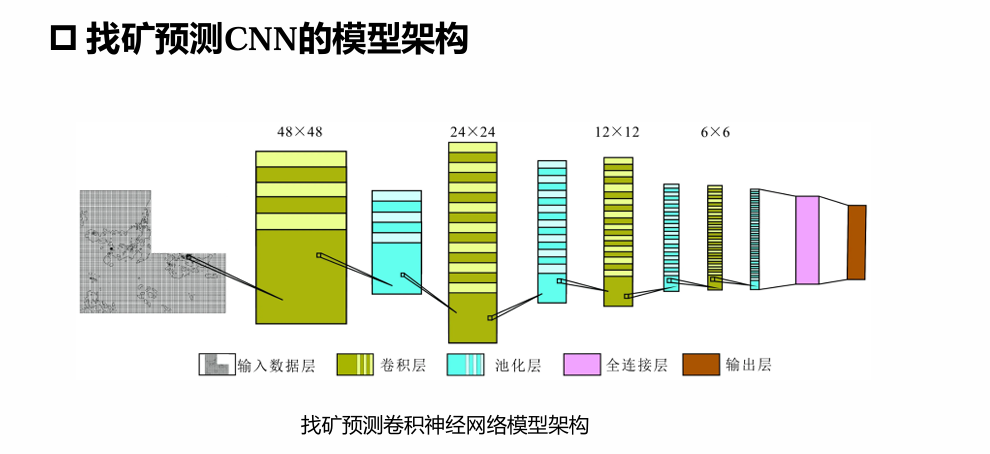

# 卷积神经网络

## 概述

- 卷积神经网络是一种**前馈神经网络**
- 受生物学上**感受野** (Receptive Field) 的机制而提出
- 卷积神经网络络有三个结构上的特性
  - 局部连接
  - 权重共享
  - 空间/时间上的次采样

> [!NOTE]
> 感受野: 在视觉神经系统中, 一个神经元的感受野是指视网膜上的特定区域, 只有这个区域内的刺激才能够激活该神经元

## 卷积神经网络常用的损失函数

### 平均绝对误差损失函数

平均绝对误差损失函数 (Mean Absolute Error) 也简称为损失函数, 用于计算神经网络输出值与真实值之间误差的平均绝对值大小, 常用于处理回归问题

$$
\text{MAE} = \frac{1}{N} \sum_{i=1}^{n} |y_i - \hat{y}_i|
$$

公式中的 $y_i$ 是神经网络预测值, $\hat{y}_i$ 是真实值

### 均方差损失函数

均方差损失函数 (Mean Squared Error) 用于度量神经网络输出值与实际值差的平方期望值, 均方差损失函数可以很好用于度量数据的变化程度

$$
\text{MSE} = \frac{1}{N} \sum_{i=1}^{n} (y_i - \hat{y}_i)^2
$$

其中, $N$ 表示样本的总量, 均方差损失函数是常用于**回归问题**的损失函数

## 卷积神经网络模型实现

**卷积神经网络**: 采用卷积层代替全连接层

### 卷积网络结构

- 卷积网络是由**卷积层**, **子采样层**, **全连接层**交叉堆叠而成
- 典型结构
  - 一个卷积块为连续 M 个卷积层和 b 个汇聚/池化层
  - 一个卷积网络中可以堆叠 N 个连续的卷积块, 然后在接着 K 个全连接层

> [!NOTE]
> M 通常设置为 2 ~ 5
>
> b 为 0 或 1
>
> K 一般为 0 ~ 2
>
> N 的取值区间比较大, 比如 1 ~ 100 或者更大

### 汇聚/池化层

卷积层虽然可以显著减少连接的个数, 但是每一个特征映射的神经元个数并没有显著减少

采样的本质是把图用合理的方式“以偏概全”

### 全连接层

- 全连接层目的: 在于分类/回归等
- 前面若干层 (卷积, 激活, 池化等) 目的: 实现从**数据变换**中**提取特征**, 作为全连接层的**输入**为全连接层服务

## 卷积神经网络的应用

- 目标检测
  - 对输入图像进行分类的同时, 检测图像中是否包含某些目标, 并对他们准确定位并标识
- 光学文字识别 OCR
  - 对文本资料的图像文件进行分析识别处理, 获取文字及版面信息
- 图像生成
  - 生成准确和流畅的图像描述, 而且能够通过可视化展示出它在生成
每个词时关注的图片区域
- 画风迁移
  - 使用 CNN 将输入的内容图像与风格图像的目标特征提取, 在此基础上输入噪声图像来组合之前提取的目标特征, 并结合特征集来生成损失函数, 之后在反复的参数迭代中完成对目标迁移图像的调整, 最终把内容图像与风格图像二者的特征图结合起来

## 卷积神经网络的应用案例————找矿预测

### CNN 的结构

- 卷积神经网络的找矿预测模型主要由**数据输入层**, **卷积层**, **池化层**, **全连接层**和**输出层** 5 种网络层
- 数据输入层是将网格化的化探和航磁数据作为输入数据写入神经单元, 卷积层与池化层分别选择合适的激活函数完成对数据特征的提取和下采样, 全连接层则是在网络末端实现特征的映射和分类, 而输出层可用于结果输出或特征可视化
- 找矿预测采用的卷积神经网络模型由 **4 个卷积层**, **4 个池化层**和 **1 个全连接层**组成

### 找矿预测 CNN 的模型架构

