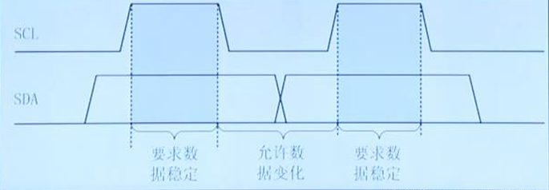

# I2C通信
- 理解和掌握 I2C 通信协议基本原理
- 理解通信协议的时序分析方法
- 熟悉使用 HAL 库中 GPIO 软件控制实现I2C通信方法

## I2C总线基本概念
- I2C 总线是推出的一种串行、半双工的总线，主要用于近距离、低速芯片之间的通信
- I2C 总线有两根双向的信号线
  - SDA：用于收发数据
  - SCL：用于通信双方时钟的同步
  - 结构简单，简化PCB布线，降低系统成本，提高系统可靠性
- I2C 总线是一种多主机总线，连接在 I2C 总线上的器件分为主机和从机
  - 主机有权发起和结束一次通信，从机只能被动呼叫
  - 当总线上有多个主机同时启用总线时，I2C 具有冲突检测和仲裁的功能来防止错误
- 每个连接到 I2C 总线上的器件都有一个唯一的地址 (7 bit)，且每个器件都可作为主机也可作为从机 (但同一时刻只能有一个主机)
  - 总线上的器件增加和删除不影响其他器件正常工作
  - I2C 总线在通信时总线上发送数据的器件为发送器，接收数据的器件为接收器
- 串行的8位双向数据传输速率在标准模式下可达 100 Kbit/s，快速模式下可达 400 Kbit/s，高速模式下可达 3.4 Mbit/s
- 总线具有极低的电流消耗，抗噪声干扰能力强，增加总线驱动器可使总线电容扩大 10 倍，传输距离达到 15 m，兼容不同电压等级的器件，工作温度范围宽

### I2C通信过程
- step1：主机发送起始信号启用总线
- step2：主机发送一个字节数据指明从机地址和后续字节的传送方向
- step3：被寻址的从机发送应答信号回应主机
- step4：发送器发送一个字节数据
- step5：接收器发送应答信号回应发送器
- step6：(循环步骤4、5)
- step7：通信完成后主机发送停止信号释放总线

### I2C寻址方式
- I2C总线上传送的数据是广义的，既包括地址，又包括真正的数据
- 主机在发送起始信号后必须先发送一个字节的数据，该数据的高 7 位为从机地址，最低位表示后续字节的传送方向
  - ‘0’表示主机发送数据给从机
  - ‘1’表示从机发送数据给主机
- 总线上所有的从机接收到该字节数据后都将这7位地址与自己的地址进行比较，如果相同，则认为自己被主机寻址，然后再根据第 8 位将自己定为发送器或接收器

### I2C起始信号与停止信号
- 起始信号
  - SCL 为高电平时，SDA 由高变低
- 停止信号
  - SCL 为高电平时，SDA 由低变高
- 起始信号和停止信号都是由主机发出，起始信号产生后总线处于占用状态，停止信号产生后总线被释放，处于空闲状态
- 空闲时，SCL与SDA都是高电平
- 两种停止情况
  - 主机不想发了，就发送停止信号
  - 从机不想接了，不应答，主机就发送停止信号结束此次通信

### 字节传送与应答
- I2C 总线通信时每个字节为 8 位长度，数据传送时，先传送最高位，后传送低位，发送器发送完一个字节数据后接收器必须发送 1 位应答位来回应发送器，即一帧共有 9 位
- I2C 每次发送数据必须是 8 位
- MSB 固定，先发高位，再发低位

### 同步数据信号
- I2C 总线在进行数据传送时，时钟线 SCL 为低电平期间发送器向数据线上发送一位数据，在此期间数据线上的信号允许发生变化
- 时钟线 SCL 为高电平期间接收器从数据线上读取一位数据，在此期间数据线上的信号不允许发生变化，必须保持稳定

### 时钟同步与仲裁
- 时钟同步
  - 时钟同步是通过 I2C 总线上的 SCL 之间的线“与” (wire-AND) 来完成的，即如果有多个主机同时产生时钟，那么只有所有 master 都发送高电平时，SCL 上才表现为高电平，否则 SCL 都表现为低电平。
- 仲裁
  - 总线仲裁与时钟同步类似，当所有主机在 SDA 上都写 1 时，SDA 的数据才是 1，只要有一个主机写 0，那此时 SDA 上的数据就是 0
  - 一个主机每发送一个 bit 数据，在 SCL 为高电平时，就检查 SDA 的电平是否和发送的数据一致，如果不一致，这个主机便知道自己输掉了仲裁，然后停止向 SDA 写数据

## 典型I2C时序

## 基于HAL的I2C开发
### 设计总体开发
- 新建 STM32CubeMX 工程，选择 MCU
- STM32CubeMX 功能参数配置
  - 配置 RCC
  - 配置 GPIO
  - 设置 STM32 时钟系统和 GPIO 的时钟
- 生成工程代码
- 编写应用程序

### 24C02 存储器
24C02 是一个 2 Kbit 的串行 EEPROM 存储器，内部含有 256 个字节。在 24C02 里面还有一个 8 字节的页写缓冲器。该设备的通信方式 I2C ，通过其 SCL 和 SDA 与其他设备通信，A0-A2 为地址选择引脚，用于多颗芯片同时使用时的片选，WP 的写保护引脚。

### 剩余略

