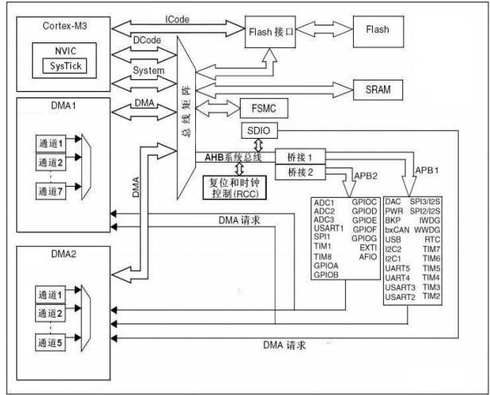

# STM32 基础

## 系统结构

STM32F10x 系列是基于 ARM Cortex-M3 内核设计的 32 位精简指令集微控制器，最高工作频率为 72 MHz

## 总线结构

总线是各种信号线的集合，是嵌入式系统中各部件之间传送数据、地址和控制信息的公共通路

- 总线宽度
  - 总线能同时传送的数据位数 (bit)，如 32 位
- 总线频率
  - 总线的工作速度，频率越高，速度越快
$$
总线带宽 (MBps)= 总线宽度 (bit)\times 总线频率 (MHz)/8
$$

嵌入式系统中常用的总线

| 名称     | 带宽      |
| -------- | --------- |
| CAN 总线 | 1 MBps    |
| SPI 总线 | 5.9 MBps  |
| PCI 总线 | 1000 MBps |
| ISA 总线 | 8 MBps    |
| I2C 总线 | 0.5 MBps  |

## 存储结构

- 通过存储器地址访问外设
- STM32 的外设可以通过指针来实现访问和操作
- 每个外设寄存器都占用特定的存储器地址，对外设的操作和对存储器的操作是一样的
- STM32 总的地址空间大小为 4 GB，用 0x0000 0000~0x1FFF FFFF 来表示
- 将 4 GB 大小的空间划分为
  - Flash 程序存储器区
  - SRAM 静态数据存储器区
  - 片上外设区

### FSMC

STM32 可将具有 FSMC 复用功能的引脚与 SRAM、ROM、PSRAM、Nor Flash 和 NandFlash 存储器的引脚相连，从而进行数据的交换

> [!NOTE]
> FSMC: Flexible static memory controller, 灵活的静态存储器控制器

## 中断

STM32 中断优先级分为两级
- 抢占优先级
  - 决定一个中断能否被其他中断打断，抢占优先级高的中断可以打断抢占优先级低的中断
- 响应优先级
  - 则是在抢占优先级相同时，根据响应优先级的大小再进行中断处理的排序

## 系统时钟

- 由于 STM32 的外设时钟复杂，因此需要有一套完整的时钟系统来进行时钟管理，这就是 STM32 的时钟系统
- STM32 的时钟系统由 RCC（Reset and Clock Control，复位与时钟控制器）产生，用来为系统和各种外设提供所需的时钟频率，以确定各外设的工作速度

### STM32 有 5 个时钟源

- HSI: High Speed Internal，高速内部时钟，由内部 8 MHz 的 RC 振荡器生成，可作为系统时钟或 2 分频后作为 PLL 输入
  - 特点：时钟频率精度差，不稳定
- HSE: High Speed External，高速外部时钟，可外接一个外部时钟源，或者通过 OSC_IN 和 OSC_OUT 引脚外接晶振，允许外接的晶振频率范围为 4～16 MHz，通常使用 8 MHz
  - 特点：精度高，稳定
- LSI: Low Speed Internal，低速内部时钟，由内部 RC 振荡器产生，频率约 40 KHz，主要为独立看门狗（IWDG）和自动唤醒单元提供时钟
- LSE: Low Speed External，低速外部时钟，通过 OSC32_IN 和 OSC32_OUT 引脚外接频率为 32.768 KHz 的晶振，主要为 RTC（RealTime Clock，实时时钟部件）提供低速高精度的时钟源
- PLL: Phase Locked Loop，锁相环，保证外部输入时钟信号与内部振荡信号同步（频率和相位相同），以保证输出频的稳定。另一方面，也可用于倍频 HSI 或 HSE

# STM32 开发基础及环境配置

STM32 的三种开发方式
- 寄存器方式
- 标准外设库方式
  - 将底层寄存器的操作进行了统一封装，包括所有标准器件外设的驱动器，采用 C 语言实现，开发人员只需要熟悉并调用相应的应用程序编程接口函数，即可实现对相关外设的驱动操作
- HAL 库方式
  - 与 STM32CubeMX 软件 (配置 STM32 代码的工具) 配套使用的，它把底层硬件相关的内容封装起来并进行抽象，通过图形化的操作方式自动生成相关外设的驱动代码，简单易用

# 标准外设库的 STM32 开发

STM32 标准外设库 (固件函数库) 简称固件库、标准库
- 程序
- 数据结构
- 宏
- 外设的驱动描述
- 应用实例

# HAL 库的 STM32 开发

HAL (硬件抽象层) 是位于内核与硬件电路之间的接口层，其目的是将硬件抽象化
