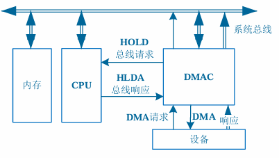
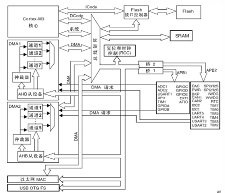
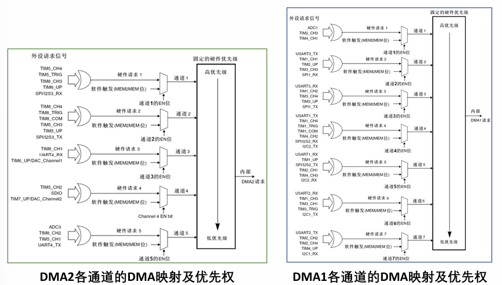
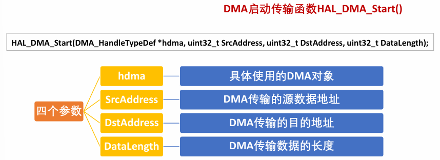

# DMA 控制器

### 本章要求

- 理解和掌握 DMA 的基本概念, 适用场景
- 理解 STM32 的 DMA 结构及其工作原理
- 基于 STM32CubeMX 进行 DMA 开发的方法

## DMA 基础理论知识

一般的数据处理流程中, 即在外设和存储器传输数据的过程中, CPU 全程参与

由于不需要处理数据时, 外设和存储器速度较低, 导致 CPU 大量时间和资源被浪费, CPU 效率低下

### DMA (Direct Memory Access) 直接内存访问

DMA 的传输方式是利用 DMA 控制器直接控制总线, 在外设和存储器之间建立一条直接的通道, 不需要 CPU 的中转

如上图所示, 在涉及到总线控制权问题时, 即在 DMA 传输前, CPU 需要把控制权交给 DMAC (控制器), DMA 传输结束之后, 再把总线控制权交还给 CPU

## STM32 的 DMA 模块

### DMA 内部结构

### STM32 最多有 2 个 DMA 控制器

- DMA1 有 7 个通道
- DMA2 有 5 个通道

### 每一个通道专门用来管理一个或多个外设对存储器放问的请求

- 中小容量的 STM32F103 系列只有 DMA1
- STM32F103ZET6 属于大容量芯片, 有 DMA1 和 DMA2 两个 DMA 控制器

### DMA1

外设产生的 7 个通道的 DMA1 请求, 传送到 DMA1 控制器, 同一时刻该 DMA 控制器只能有一个请求有效

外设包括 TIMx (x=1,2,3,4), ADC1, SPI1, IICx (x=1,2), USARTx (x=1,2,3)

DMA1 外设和对应通道一览

| 外设    | 通道 1   | 通道 2    | 通道 3               | 通道 4                                | 通道 5     | 通道 6                | 通道 7                 |
| ------- | -------- | --------- | -------------------- | ------------------------------------- | ---------- | --------------------- | ---------------------- |
| ADC1    | ADC1     |           |                      |                                       |            |                       |                        |
| SPI/I2S |          | SPI1_RX   | SPI1_TX              | SPI/I2S_RX                            | SPI/I2S_TX |                       |                        |
| USART   |          | USART3_TX | USART3_RX            | USART1_TX                             | USART1_RX  | USART2_RX             | USART2_TX              |
| IIC     |          |           |                      | IIC2_TX                               | IIC2_RX    | IIC1_TX               | IIC1_RX                |
| TIM1    | TIM1_CH1 | TIM1_CH2  |                      | TIM1_TX4   TIM1_TRIG   TIM1_COM | TIM1_UP    | TIM1_CH3              |                        |
| TIM2    | TIM2_CH3 | TIM2_UP   |                      |                                       | TIM2_CH1   |                       | TIM2_CH2   TIM2_CH4 |
| TIM3    |          | TIM3_CH3  | TIM3_CH4  TIM3_UP |                                       |            | TIM3_CH1 TIM3_TRIG |                        |
| TIM4    | TIM4_CH1 |           |                      | TIM4_CH2                              | TIM4_CH3   |                       | TIM4_UP                |

### DMA2

外设产生的 5 个通道的 DMA2 请求, 传送到 DMA2 控制器, 同一时刻该 DMA 控制器只能有一个请求有效

外设包括 TIMx (x=5,6,7,8), ADC3, SPI/I2S3, USART4, DAC1, DAC2, SDIO

DMA2 外设和对应通道一览

| 外设          | 通道 1                  | 通道 2                               | 通道 3           | 通道 4           | 通道 5    |
| ------------- | ----------------------- | ------------------------------------ | ---------------- | ---------------- | --------- |
| ADC3          |                         |                                      |                  |                  | ADC3      |
| SPI/I2S3      | SPI/I2S3_RX             | SPI/I2S3_TX                          |                  |                  |           |
| USART4        |                         |                                      | USART4_RX        |                  | USART4_TX |
| SDIO          |                         |                                      |                  | SDIO             |           |
| TIM5          | TIM5_CH4   TIM5_TRIG | TIM5_CH3   TIM5_UP                |                  | TIM5_CH2         | TIM5_CH1  |
| TIM6/DAC通道1 |                         |                                      | TIM6_UP/DMA通道1 |                  |           |
| TIM7/DAC通道2 |                         |                                      |                  | TIM7_UP/DMA通道2 |           |
| TIM8          | TIM8_CH3    TIM8_UP  | TIM8_CH4   TIM8_TRIG  TIM8_COM | TIM8_CH1         |                  | TIM8_CH2  |

### DMA 优先权

通道优先权分为 4 个等级
- 最高优先级 (Very High)
- 高优先级 (High)
- 中等优先级 (Medium)
- 低优先级 (Low)

当有多个 DMA 请求时, DMA 控制器通过内部的仲裁器进行优先级管理
- 如果两个请求有相同的软件优先级, 则较低编号的通道有较高的优先权
- DMA1 控制器拥有高于 DMA2 控制器的优先级

DMA 优先权等级

<!-- autocorrect: false -->

<!-- autocorrect: true -->

### DMA 中断请求

DMA 的每个通道都可以在 DMA 传输过程中触发中断, 可通过设置相应寄存器的不同位来打开这些中断

DMA 中断事件主要有
- HT (Half Transfer, 传输一半)
- TC (Transfer Complete, 传输完成)
- TE (Transfer Error, 传输错误)

分别对应三个中断标志: HTIF, TCIF, TEIF, 每个中断标志都有允许控制位 (IE)

| 中断事件标志位 | 中断使能控制位 | 中断事件 |
| -------------- | -------------- | -------- |
| HTIF           | HTIE           | 传输过半 |
| TCIF           | TCIE           | 传输完成 |
| TEIF           | TEIE           | 传输错误 |

## DMA 模块的 HAL 库接口函数及应用

### 接口函数

DMA 串口发送数据传输函数 HAL_UART_Transmit_DMA()

### 应用实例

功能: 基于 HAL 库采用 DMA 方式实现 USAR T 串口收发数据, 用于需要大批量数据的通信与信息交换的场合

硬件设计: 通过 STM32F103 目标板上的串口 1 (USART1) 采用 DMA 方式实现与上位机 PC 的数据传输, 可在 PC 机的串口助手查看测试结果

软件设计流程
- 新建 STM32CubeMX 工程, 选择 MCU
- STM32CubeMX 功能参数配
  - RCC 和时钟配置
  - USART1 配置
  - DMA 配置
  - 开启串口的中断
- 生成工程代码
- 编写应用程序
- 下载调试验证
