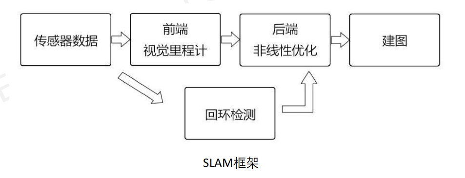

# 无人驾驶系统的定位方法以及传感器的应用

## 实现定位的原理

### 两大基本问题

- 定位
  - 需要依赖精确的地图
- 建图
  - 需要依赖准确的定位

### SLAM (同步定位与地图构建)

机器人在未知环境中从一个未知位置开始移动, 在移动过程中根据位置估计和地图进行自身定位, 同时在自身定位的基础上构建**增量式地图**, 实现机器人的自主定位和导航

- 应用: 机器人、无人机、无人驾驶、AR、VR 等领域
- SLAM 技术
  - 激光 SLAM (Lidar SLAM)
  - 视觉 SLAM (Visual SLAM)

> [!NOTE]
> SLAM: 同步定位与地图构建 (Simultaneous Localization and Mapping)

### 定位技术

- 基于激光雷达点云数据的定位
- 基于 GPS + INS 信息的定位
- 基于 SLAM 技术的定位
- 基于高精度地图的定位技术
  - 融合了激光雷达点云数据、GPS 信号、语义矢量地图 (车道线、道路标志标线、红绿灯、交通信号标志等) 综合信息

> [!NOTE]
> INS: 惯性导航系统 (Inertial Navigation System)

### 激光雷达

- 优点: 测距精准、测距远、分辨率高、隐蔽性好、抗有源干扰能力强
- 缺点: 成本太高, 并且在暴雨、大雪、大雾等天气下易受影响

### 激光 SLAM

- 起源与发展: 激光 SLAM 起源于早期的基于测距的定位方法。激光雷达的出现和普及使得距离测量更快更准, 信息更丰富
- 点云: 3D 激光雷达采集到的物体信息呈现出一系列分散的、具有准确角度和距离信息的点, 因此被称为**点云**

#### 定位原理

- 对**不同时刻**两片点云的匹配与比对来计算激光雷达相对运动的距离和姿态的改变, 从而完成对机器人自身的定位
- 计算两点云姿态的方法: 寻找当前点云对先前全局点云的最小均方误差
  - 具体过程: 使用 ICP 就可以让第一组点云的每个点在第二组点云里找到一个最近的匹配, 之后通过所有的匹配来计算均方误差, 匹配的过程实际上就是寻找最小均方误差的过程。通过最小化误差来计算无人车与当前地图环境最匹配的位置坐标

> [!NOTE]
> ICP: 迭代最近点 (IterativeClosest Point)

## ICP

### 算法基本思想

迭代最近点 (Iterative Closest Point, ICP) 算法是一种点集对点集配准方法

ICP 是一种启发式方法, 对于每个点云中的点来说, 其定义的点云是欧式距离最近的点

把数据点集平移旋转, 使两个点集尽量重叠

### 算法原理

- 让数据点云的每个点在参考点云里找到一个最近的匹配
- 之后通过所有的匹配来计算均方误差, **匹配的过程实际上就是寻找最小均方误差的过程**
- 通过最小化误差来计算逐步优化刚体变换参数 (如平移向量和旋转矩阵)
- 计算无人车与当前地图环境最匹配的位置坐标

### 算法步骤

ICP 的求解分为两种方式: 利用线性代数的求解 (主要是 SVD), 及利用非线性优化方式的求解

这里主要介绍 SVD 方法

- $P, Q$ : 初始点集
- $R$ : 初始旋转矩阵
- $t$ : 初始平移向量

1. 计算 Q 中的每一个点在 P 点集中的对应近点, 得到一组 $\set{p_i, q_i}$
2. 配对完后, 得到 $error=min\sum_{i=1}^{N}\sqrt{(p_{i}-q_{i})^2}$, 利用 SVD 求出新的 $R$ 和 $t$
3. 对 Q 使用上一步求得的平移和旋转参数, 得到新的变换点集
4. 如果新的变换点集考点集满足两点集的平均距离小于某一给定阈值, 则停止迭代计算, 否则新的变换点集作为新的 Q 继续迭代, 直到达到目标函数的要求

#### SVD 过程

计算两点集质心

$$
\begin{cases}
\mu_P=\frac{1}{n}\sum_{i=1}^{n}p_i \\
\mu_Q=\frac{1}{n}\sum_{i=1}^{n}q_i
\end{cases}
$$

$$
\begin{cases}
P^{\prime}=\{p_i-\mu_{p}\} \\
Q^{\prime}=\{q_i-\mu_{Q}\}
\end{cases}
$$

求去掉中心两点集的协方差矩阵

$$
W=\sum_{i=1}^{n}q^{\prime}_i(p^{\prime}_i)^T
$$

计算旋转矩阵 $R$

$$
W=U\Sigma V^T
$$

当 $W$ 满秩的时候, 有唯一解
$$
R=UV^T
$$

计算平移向量

$$
t=\mu_{q}-R\mu_{p}
$$

### 算法优缺点

#### 优点

- 可以获得非常精准的配准效果
- 不必对处理的点集进行分割和特征提取
- 在较好的初值条件下, 可以获得很好的算法收敛性

#### 缺点

- 要剔除噪声点 (点对距离过大或者包含边界点的点对)
- 基于点对的配准没有包含局部形状的信息
- 每次迭代都要搜索最近点, 耗时大
- 可能陷入局部最优

## NDT

### 算法原理

基于标准正态分布的配准算法, 它应用于三维点的统计模型, 使用标准最优化技术来确定两个点云间的最优匹配, 因为其在配准过程中不利用对应点的特征计算和匹配, 所以计算速度比其他方法快

> [!NOTE]
> NDT: 正态分布变换 (Normal Distribution Transform)

### 算法思想

先根据参考数据来构建多维变量的正态分布, 如果变换参数能使得两幅激光数据匹配得很好, 那么变换点在参考系中的概率密度将会很大。因此, 可以考虑用优化的方法求出使得概率密度之和最大的变换参数, 此时两幅激光点云数据匹配得最好

### 算法步骤

1. 将参考点云网格化, 并计算每个网格的多维正态分布参数
2. 初始化变换参数和求最大似然
3. 用 [牛顿法](https://zh.wikipedia.org/wiki/%E6%87%89%E7%94%A8%E6%96%BC%E6%9C%80%E5%84%AA%E5%8C%96%E7%9A%84%E7%89%9B%E9%A0%93%E6%B3%95) 优化变换参数 $\vec{p}$

### NDT 算法优点

使用正态分布来表示原本离散的点云有诸多好处, 这种通过一个个网格划分出来的光滑表面的表示是**连续可导**的, 每一个概率密度函数可以被认为是一个局部表面的近似

## 基于 GPS+ 惯性组合导航的定位系统

### IMU

- 测量频率高, 不易受干扰
- 在捷联惯性导航解算过程中, 需要通过积分来确定导航信息, 因此**定位误差会累加**

> [!NOTE]
> IMU: 惯性测量单元 (Inertial Measurement Unit)

### 惯性导航系统

惯性导航系统 (INS, 简称惯导) 是一种基于陀螺仪和加速度计的信号组合的自主式导航系统, 它可以运行在水、陆、空等多种环境中

基本原理
- 以牛顿力学定律为基础, 测量载体在惯性参考系的加速度和角速度信息
- 将测量值对时间进行积分, 把它变换到导航坐标系中
- 得到导航坐标系中的速度 v、偏航角 yaw 和位置 x/y 等信息

优点
- 不依赖于任何外部信息, 也不向外部辐射能量, 故隐蔽性好, 且不受外界电磁干扰的影响
- 可全天候工作于空中、地面及水下
- 能提供位置、速度、航向和姿态角数据, 所产生的导航信息连续性好而且噪声低
- 数据更新率高, 短期精度、稳定性好

缺点
- 由于导航信息经过积分而产生, 定位误差随时间增加而增大, 长期精度差, 容易产生温漂、零漂等问题
- 需要初始信息, 成本高, 笨重

### 加速度计

定义: 一种用于测量相对于惯性参考系的加速度计 (称之为比力) 的传感器 (非刚体运动加速度)

加计输出读数是比力, 惯导比力方程为

$$
f=a-g
$$

- f =加速度输出 (比力, Specific Force)
- a =相对于惯性空间的运动加速度
- g =万有引力加速度

### 了解几种坐标系以及对应关系

- 地心惯性坐标系 (ECI) : 不参与地球自转
- 地心地固坐标系 (ECEF) : 与地球保持同步旋转
- 导航坐标系: 指北导航坐标系
- 车体坐标系: 与车辆固连的坐标系

### GNSS

> [!NOTE]
> GNSS: 全球卫星导航系统 (Global Navigation Satellite System)

标准模式精度 10m 以内, 因天气原因或超大城市下也可在 10m~100m 之间

#### 三部分

1. 空间段由卫星或航天器 (SV) 组成, 用于传输包含卫星轨道、位置、传输时间的导航电文
2. 控制段指地面监测站和主控中心, 用于跟踪卫星信号、收集伪距测量数据和大气层模型数据、提供导航信息更新、大气信息和校正信息以及进行卫星控制
3. 用户段是指 GNSS 接收机

#### 三角定位法

三个卫星组成一个三角形, 另外一个卫星提供对时校准, 通过计算三个卫星位置几何数据, 并融合同步计算结果, 从而计算出当前车辆的卫星坐标位置

#### 影响 GPS 定位准确度的因素

1. 大气层影响
2. 卫星星历误差: 无法测定卫星运动规律
3. 卫星钟差: 卫星时钟和 GPS 时钟偏差
4. 多路径效应: 不同障碍物反射

#### 差分 GPS 定位的原理

通过与**基准站**的比较, 根据误差修正结果, 提高定位精度。位置差分、距离差分

### 距离差分

#### 伪距差分

伪距法定位, 以伪距作为基本观测量的定位方法

测定伪距的方法
1. 将测量码和数据码调制到载波上
2. 由卫星发射机将调制信号发出
3. 接收机收到测量码 (接收器产生复制码)
4. 测量码和复制码作相关处理

由时延器测定出两信号间的**时间延迟**

理想条件下
- 时间延迟 = 卫星信号的传播时间
- 时间延迟乘以光速就可以求得卫星与接收机的距离

但是卫星钟与接收器钟不完全同步, 自相关系数最大条件下, 这个时延乘以光速中含有误差, 称为伪距

#### 载波相位差分

RTK 定位技术, 实时动态载波相位差分技术, 是实时处理两个基站载波相位观测量的差分方法

#### GPS 定位误差

| 误差类别                       | 误差来源                                     | 消除方法                     |
| ------------------------------ | -------------------------------------------- | ---------------------------- |
| 接收机的公有误差               | 卫星钟误差、星历误差、电离层误差、对流层误差 | 可以通过差分技术完全予以消除 |
| 接收机自身存在的误差           | 内部噪声、通道延迟、多路径效应               | 硬件设备的内在误差, 无法消除 |
| 基准站接收机与流动站接收机之间 | 传播延迟误差                                 | 取决于移动站与基站之间的距离 |

## 基于 SLAM 的定位系统

| 分类      | 算法框架                                     | 优缺点                                                 |
| :-------- | :------------------------------------------- | :----------------------------------------------------- |
| 激光 SLAM | Gmapping、Hector SLAM 等                     | 建图测量精度较高, 但激光雷达成本太高, 量产商用可行性低 |
| 视觉 SLAM | ORB-SLAM2、Mono-SLAM、PTAM、LSD-SLAM、DSO 等 | 传感器成本低, 但建图精度略低, 受光线、环境干扰较大     |

### 视觉 SLAM

- 单目 SLAM: 成本低, 无法测量深度、尺度
- 双目 SLAM: 通过系统标定计算得出深度信息

### SLAM 框架 (视觉 SLAM)

- **传感器数据**: 对图像信息的读取和预处理
- **前端 (视觉里程计)** : 从读取的图像信息中, 根据相邻时间的图像信息计算相机的运动, 以及构建局部地图
  - 方法: 特征点法, 直接法
- **后端 (非线性优化)**: 接受不同时刻前端测量的相机位姿, 以及回环检测信息, 因为图像信息具有噪声或匹配过程中的误差, 所以需要对它们进行优化, 得到全局一致的轨迹和地图
- **回环检测**: 判断机器人是否到达过先前的位置。步骤、意义 (关系到估计的轨迹和地图在长时间下的正确性；由于回环检测提供了当前数据与所有历史数据的关联, 可以进行重定位)
- **建图**: 根据轨迹信息, 建立地图

#### 如何计算同一个向量在不同坐标系里的坐标？

旋转加平移

$$
\alpha^{\prime}=R\alpha+t
$$

### 视觉里程计

#### 点云预处理

去除地面点

#### 特征点法

特征点

- 图像当中具有代表性的部分 (角点、区块、边缘；可重复性、可区别性、高效性、本地性)
- 特征点由**关键点**和**描述子**组成
  - 关键点: 特征点在图像中的位置、大小、方向等
  - 描述子: 特征点周围的图像信息
- SIFT 特征和 FAST 关键点的特点
- ORB 特征: 关键点 Oriented FAST 和描述子 BRIEF

> [!NOTE]
> SIFT: 尺度不变特征变换 (Scale-Invariant FeatureTransform)
>
> ORB: 一种计算机视觉中常用的特征检测和描述算法 (Oriented FAST and Rotated BRIEF)

- SIFT 特征
  - 充分考虑光照、尺度、旋转等变化
  - 精确
  - 计算量大
- FAST 特征
  - 没有描述子, 不具有方向性
  - 降低精度和鲁棒性
  - 提升计算速度
- ORB 特征
  - FAST 特征点计算仅仅是比较像素之间的亮度差异, 所以它不具有方向信息, 也存在尺度问题。所以 ORB 增添了尺度和旋转的描述
  - 尺度不变性由构建**图像金字塔**, 并在金字塔的每一层上检测角点来实现
    - 底层为原始图像, 对图像进行一个固定倍率的放缩
  - 而特征的旋转是由**灰度质心法**实现的, 几何中心与质心的方向向量, 具有了方向性
  - Oriented FAST 关键点
    - 增加了尺度和旋转信息后的 FAST 角点
  - BRIEF 描述子, 是由二进制数据来表现的
    - 随机选点的比较, 速度快
    - 使用二进制表达, 储存方便, 适用于实时图像匹配

##### 特征匹配

特征点数目很大时, **暴力匹配法**的运算量很大, **快速近似最近邻** FLANN 算法更适合匹配点数量极多的情况

#### 光流法

本质是将一张图的每个像素视为一个函数 $I(x,y,t)$,然后计算物体运动过程

- 稀疏光流 (计算部分像素运动)、稠密光流 (计算全部像素运动)
- 灰度不变假设: 同一个空间点的像素灰度值, 在各个图像中是固定不变的
- 时间持续性假设: 像素的运动在短时间内是平滑的, 也就是说, 运动速度和方向不会发生剧烈变化
- 空间一致性假设: 相邻像素的运动通常是一致的
- LK 光流的结果依赖于图像梯度, 有哪些缺点
  - 缺点
    - 梯度不够平滑, 可能剧烈变化
    - 局部的梯度不能用于预测长期图像走向
    - 若相机运动较快, 两张图像差异明显, 单层图像光流法容易达到一个局部极小值
  - 解决方式: 多层光流, 引入图像金字塔来改善, 这个过程称作**由粗到精的光流**
  - 优点: 当原始图像的像素运动较大时, 在金字塔顶层的图像看来, 运动仍然在一个很小范围内

### 回环检测

前端给出的只是局部的位姿间约束, 误差会累积

回环检测模块能给出时刻更加久远的约束, 有效检测出相机经过同一个地方, 为后端的位姿图提供更多的有效数据, 使之得到更好的估计

- 主流方法: 基于外观的几何关系
  - 基于外观的方法和前端、后端的估计都无关, 仅根据两幅图像的相似性确定回环检测关系。这种做法摆脱了累积误差, 使回环检测模块成为 SLAM 系统中一个相对独立的模块
- 核心问题: 如何计算图像间的相似性
  - 灰度方法:  $s(A,B) = \|A-B\|$, A,B 为灰度矩阵
- 词袋模型: 单词、字典
- 相似度计算: TF-IDF (频率 - 逆文档频率) 单词在图像中频率越高, 则区分度越高；在字典中出现频率越低, 则区分度越高
- 于词袋的回环检测完全依赖于外观, 导致外观相似的图像容易被误认为回环, 通常需进行时间上的一致性检测和空间上的一致性检测
  - **时间上的一致性检测**: 设立回环的缓存机制, 在一段时间中一直检测到的回环, 才是正确的回环
  - **空间上的一致性检测**: 对回环检测到的两个帧进行特征匹配, 计算运动关系。根据重投影关系验证回环是否成立

#### 回环检测的意义

- 关系到估计的轨迹和地图在长时间下的正确性
- 由于回环检测提供了当前数据与所有历史数据的关联, 可以进行重定位
- 仅有前端和局部后端的系统称为视觉里程计, 而带有回环检测和全局后端的系统才称为 SLAM

#### 回环检测的步骤

- 检测到回环的发生
- 计算回环修选帧与当前帧的运动
- 验证回环是否成立
- 闭环

#### 灰度计算的问题

- 像素灰度是一种不稳定的测量值, 它严重地受环境光照和相机曝光的影响
- 当相机视角发生少量变化时, 即使每个物体的光度不变, 它们的像素也会在图像中发生位移, 造成了一个很大的差异值

#### 词袋模型

用“图像上的哪几种特征”来描述一幅图像, 通过特征 $w_1,w_2,w_3,...$ 的取值将图像向量化, 无视特征顺序, 只关注特征的出现情况

1. 确定图像上“人”“狗”“车”等概念, 对应于词袋中的视觉“单词”, 许多单词组成了一本视觉“字典”
2. 确定一幅图像中出现了哪些在字典中定义的概念, 我们用单词出现的情况 (或直方图) 描述整幅图像。这就把一幅图像转换成了一个向量的描述
3. 比较上一步中的描述的相似程度

#### 词袋模型相似性计算

$s(a,b) = 1-\frac{1}{W}\|a-b\|_1$, 其中范数取 L1 范数, 即各元素绝对值的和
- 两个向量完全一样时, 我们将得到 1 (相似度最高)
- 完全相反时 (a 为 0 的地方 b 为 1) 得到 0 (完全不相似)

#### 单词的形成

- 聚类
- 经典的 k-means 聚类: N 个特征点 $\rightarrow$ k 类

#### 字典的结构

- 遍历比较
- k 叉树

#### TF-IDF (频率 - 逆文档频率)

- 词频 (TF): 某个词在文档中出现的频率,  $TF_i=log\frac{n_i}{n}$
- 逆文档频率 (IDF): 某个词在所有文档中出现的频率,  $IDF_i=log\frac{n}{n_i}$

## 状态估计和传感器融合

### 卡尔曼滤波

基本思想: 利用前一时刻的估计值和现时刻的观测值来更新对状态变量的估计, 求出现在时刻的估计值。通过卡尔曼增益比较预测和观测的不确定性程度, 来判断是更相信经验还是更相信传感器。 (预测——实测——修正)

普通卡尔曼滤波的使用条件 (线性系统、观测噪声和过程噪声服从高斯分布)

五个基本步骤

1. 状态预测:  $x^{\prime}_ k=\alpha \widehat{x}_{k-1}+w_k$
2. 计算预测误差:  $P^{\prime}_ k=\alpha P_{k-1}\alpha^T$
3. 计算卡尔曼增益:  $K_k=\frac{P^{\prime}_k}{P^{\prime}_k+r}$
4. 计算最优估计值:  $\widehat{x}_k=(1-K_k)x^{\prime}_k + K_k z_k$
5. 计算最优估计值误差:  $P_{k}=(1-K_k)P^{\prime}_{k}$

> $\alpha$ : 状态转移矩阵
>
> $r$ : 观测噪声的均值
>
> $z_k$ : 测量值

#### 问题

已经算出最优估计值, 为什么还要计算最优估计值的误差
- 权重分配: 在卡尔曼滤波器的更新步骤中, 需要将估计值与新的观测值结合起来
- 误差量化: 误差协方差提供了估计值的不确定性的量化度量

协方差是用来描述什么的, 在我们之前的例子中, 预测噪声是由什么引起的
- 预测误差协方差
  - 表示预测状态估计的不确定性
  - 它反映了状态估计值与真实状态值之间可能的差异程度
- 观测噪声协方差: 表示观测值与其真实值之间的不确定性
  - 这通常是由传感器噪声引起的 (观测噪声)
- 过程噪声协方差: 在状态转移模型中, 表示系统动态或过程模型本身的不确定性
  - 由于系统状态在运动过程中产生的随机干扰 (过程噪声)

### 扩展卡尔曼滤波

基本思想: 扩展卡尔曼滤波的本质是使用线性变换来近似非线性变换

五个基本步骤

1. 状态预测:  $x^{\prime}_ k=g(x_{k-1}, u)$
2. 计算预测误差:  $P^{\prime}_ k=J_AP_{k-1}J_A^T+Q$
3. 计算卡尔曼增益:  $K_k=P^{\prime}_kJ_H^T (J_HP^{\prime}_k J_H^T+R)^{-1}$
4. 计算最优估计值:  $\widehat{x}_k=x^{\prime}_k+K_k(z_k-J_H(x^{\prime}_k))$
5. 计算最优估计值的误差:  $P_{k}=(I-K_kJ_H)P^{\prime}_k$

> $J_A$ 与 $J_H$ : 代替线性系统中的状态转移矩阵和观测矩阵  
> $Q$ : 过程噪声的协方差矩阵  
> $R$ : 观测噪声的协方差矩阵

### 无损卡尔曼滤波

基本思想
- 近似概率分布要比近似非线性函数更容易
