# 迁移学习学习和端到端无人驾驶

## 迁移学习

### 目的

用于**解决标记数据难获取**这一基础问题的重要手段

### 什么是迁移学习

通过减小源域 (辅助领域) 到目标域的分布差异, 进行知识迁移, 从而实现数据标定

- 源域 $\rightarrow$ 目标域 (减少差异, 知识迁移)

> [!NOTE]
> 从别人数据学习自己的特征, 要减少差异
>
> - 背景, 原数据量中目标域的数据很少, 但源域 (辅助领域) 的数据量多
> - 源域 (辅助领域), 即为给出的数据中不是目标类别的数据, 但是为其相似的类别的数据
> - 目标域, 即为真正属于该类别的数据

### 核心思想 (关键)

- 找到不同任务之间的相关性
- 举一反三、找猫画虎、不要东施效颦 (负迁移)

### 意义

- 解决大数据与少标签之间的矛盾
- 解决大数据与弱计算之间的矛盾
- 解决普适化模型与个性化需求之间的矛盾 (云 + 端的模型)
- 满足特定应用的需求

| 矛盾                   | 传统机器学习                     | 迁移学习       |
| ---------------------- | -------------------------------- | -------------- |
| 大数据与少标注         | 增加人工标注, 但是昂贵且耗时     | 数据的迁移标注 |
| 大数据与弱计算         | 只能依赖强大计算能力, 但是受众少 | 模型迁移       |
| 普适化模型与个性化需求 | 通用模型无法满足个性化需求       | 模型自适应调整 |
| 特定应用               | 冷启动问题无法解决               | 数据迁移       |

### 迁移学习与传统机器学习的对比

| 比较项目 | 传统机器学习                 | 迁移学习                     |
| -------- | ---------------------------- | ---------------------------- |
| 数据分布 | 训练和测试数据服从相同的分布 | 训练和测试数据服从不同的分布 |
| 数据标注 | 需要足够的标注来训练模型     | 不需要足够的标注             |
| 模型     | 每个任务分别建模             | 模型可以在不同任务之间迁移   |

### 迁移学习方法研究领域

#### 迁移学习研究领域与方法分类

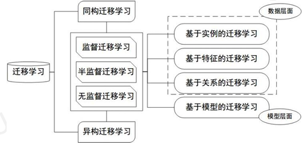

#### 迁移学习方法分类

- 基于实例的迁移 (instance based TL)
  - 通过权重重新利用源域和目标域的样例进行迁移
- 基于特征的迁移 (feature based TL)
  - 将源域和目标域的特征变换到相同空间
- 基于模型的迁移 (parameter based TL)
  - 利用源域和目标域的参数共享模型
- 基于关系的迁移 (relation based TL)
  - 利用源域中的逻辑网络关系进行迁移

#### 迁移学习应用场景

在开发深度学习模型时, 并不一定需要从头开始训练模型. 迁移学习可以方便将这些经典模型移植到新的应用场景中

如何移植取决于两个因素
- 新应用数据量大小
- 新应用和原始模型的相似度

| 数据集数量 | 应用相似度 | 模型训练方法               |
| ---------- | ---------- | -------------------------- |
| 较大       | 较高       | 微调模型                   |
| 较大       | 较低       | 微调或者重新训练           |
| 较小       | 较高       | 对全连接分类层进行修改训练 |
| 较小       | 较低       | 重新设计、重新训练模型     |

## 端到端无人驾驶

### 基本思路

- 采集数据
  - 人为操作车辆 (模拟器) 行驶来采集控制数据
- 网络训练
  - 训练深层神经网络模型
  - 采集到的路况图像数据作为模型的输入参数
  - 汽车的控制参数作为模型的输出数据
- 测试
  - 基于这些路况图像和控制参数训练完神经网络模型, 具有对路况的预测能力
  - 给出车辆的控制参数, 输入汽车线控单元, 从而达到控制车辆自动行驶的目的

#### 模型框架

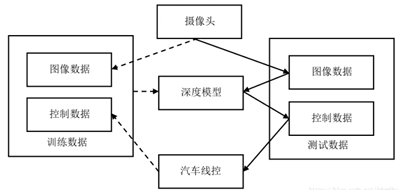

## 端到端无人驾驶模拟

略

# 强化学习和端到端无人驾驶

## 强化学习概述

- 来源于心理学中的**行为主义**理论
- 强化学习没有监督者, 只有一个**奖励信号**, 而且反馈不是立即生成的, 而是**延迟**的, 因此时间在强化学习中具有非常重要的意义
- 强化学习并不需要带标签的数据, 有**可交互的环境**即可

## 强化学习原理及过程

- 个体 (Agent), 学习器角色, 也称为智能体
- 环境 (Environment), Agent 之外一切组成的、与之交互的事物
- 动作 (Action), Agent 的行为
- 状态 (State), Agent 从环境获取的信息
- 奖励 (Reward), 环境对于动作的反馈

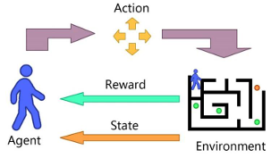

智能体首先从环境中获取一个状态 $O_t$, 然后根据 $O_t$ 调整自身的策略做出行为 $A_t$ 并反馈给环境, 环境根据智能体的动作给予智能体一个奖励 R, 智能体和环境之间通过不断地交互学习, 得到一个  $\set{O_t,A_t,R}$  的交互历史序列

### 马尔可夫决策过程

强化学习的本质是一个序列决策过程, 通过不断地学习每个状态, 最终得到一个最佳的序列 (策略), 这与马尔可夫决策过程解决的问题相似

#### 马尔可夫性

指系统的下一个状态 $S_{t+1}$ 仅与当前状态 $S_t$ 有关, 表示为

$$
P(S_{t+1}|S_t) = P(S_{t+1}|S_1, S_2, ..., S_t)
$$

#### 马尔可夫过程

它是一个二元组 $(S, P)$, 其中 $S$ 为有限状态机,  $P$ 为状态转移概率矩阵, 该矩阵为

$$
P =
\begin{pmatrix}
P_{11} & \dots & P_{1n} \\
\vdots & \ddots & \vdots \\
P_{n1} & \dots & P_{nn}
\end{pmatrix}
$$

在强化学习中, 问题被描述为一个马尔可夫决策过程 (Markov Decision Process, MDP)
- 由一个元组 $<S, A, P, R>$ 表示
  - $S$ 为有限状态空间集合,  $s_t \in S$ 表示 t 时刻状态
  - $A$ 为有限动作空间集合,  $a_t \in A$ 表示 t 时刻动作
  - $P$ 为状态转移概率,  $P(s'|s, a)$ 表示在状态 s 下执行动作 a 后, 转移至下一状态 s'的概率
  - $R$ 为奖赏函数, 执行完动作转移至下一状态时, 奖励记作 $R = r(s'|s, a)$

    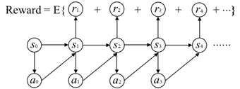

例题

给定状态转移概率矩阵 P, 从 Start 到 End 是一个序列决策问题, 从 Start 出发到 End 结束存在多条马尔可夫链 (路径), 其中每条链上就是马尔可夫过程的描述

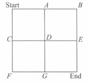

但马尔可夫过程中并不存在行为和奖励. 因此, 从 Start 到 End 是一个序列决策问题, 需要不断地选择路线以取得最大收益 (马尔可夫决策过程)

Start-A-B-E-End

{(Start, East, P, R1),(A, East, P, R2),(B, South, P, R3),(E, South, P, R4),(End, South, P, R5)}

### 非确定性策略与确定性策略

带来最大收益需要一个策略, 定义为**从状态到行为的一个映射**, 即为每个状态下指定一个动作概率

#### 非确定性策略

对于相同的状态, 其输出的状态**并不唯一**, 而是满足一定的概率分布, 从而导致即使处于相同的状态, 也可能输出不同的动作, 表示为

$$
\pi(a|s) = P[A_t = a | S_t = s]
$$

#### 确定性策略

在相同的状态下, 其输出的动作是**确定的**, 实际上, 只需要建立一个神经网络, 输入状态, 输出一个确定的动作就行. 表示为

$$
a = \mu(s)
$$

### 及时奖励与累计期望奖励

给定一个策略, 就可以计算最大化累计期望奖励

#### 及时奖励

即时反馈给智能体的奖励, 如当玩家直接根据当前的状态做出一个飞行控制决策时, 会立即得到一个奖励

#### 累积期望奖励

指一个过程的总奖励期望, 例如直升机从起飞落地的过程. 一般情况下, 累积期望奖励被定义为

$$
G_t = R_1 + \gamma R_2 + \gamma^2 R_3 + \ldots + \gamma^{k-1} R_k = \sum_{k=0}^{\infty} \gamma^k R_{t+k+1}
$$

其中,  $\gamma$ 为折扣因子

假如在策略 $\pi$ 下, 从前文的 Start 出发, 则有不同的路径. 每个路径的累积回报 $G_t$ 不同, 因此随机变量 $G_t$ 是随机变量, 但它们的期望是一个确定值, 因此需要对值函数进行估计

#### 值函数

- 每一个动作都要以最终的目标——**最大化长期回报**为目标
- 量化某一时刻的回报 (奖励) 值, 可以利用它, 将其扩展为值函数
- 累计回报并不简单, 主要反映在计算的时间跨度
  - 有限时间, 计算复杂但可计算
  - 无限时间, 计算累积回报没有意义
- 为了解决该问题, 需要降低未来回报对当前时刻状态的影响, 即对未来回报乘以一个 $[0,1]$ 的系数

将状态 $s$ 的期望值视为状态 - 值函数, 数学表达为

$$
V_{\pi}(s) = E_{\pi}[R_1 + \gamma R_2 + \gamma^2 R_3 + \ldots + \gamma^{k-1} R_k | S_t = s]
$$

我们还需要知道在某一个状态下采取某行为会带来的期望回报

用状态 - 行为值函数衡量当前行为的好坏, 其数学表达式为

$$
q_{\pi}(s, a) = E_{\pi}\left[\sum_{k=0}^{\infty} \gamma^{k} R_{t+k+1} | S_t = s, A_t = a\right]
$$

在一般情况下, 状态 - 值函数和状态 - 行为值函数之间的关系表示为

$$
V_{\pi}(s) = \sum_{a \in A} \pi(a|s) q_{\pi}(s, a)
$$

### 状态 - 值函数和状态 - 行为值函数之间的关系图及其解释

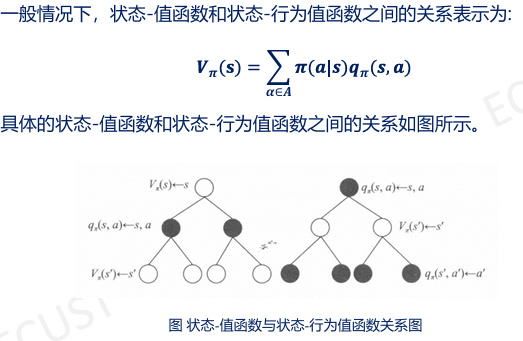

> 详细公式推导查看 [此处](https://blog.csdn.net/Mocode/article/details/130383093)

解释

为了能够计算在某个状态 $S_t$ 下的值函数或在状态 $S_t$ 下**采取**行为的状态 - 动作值函数的累积期望奖励, 根据图推导得到 $V_{\pi}$ 和 $q_{\pi}$ 的关系如下

$$
q_{\pi}(s, a) = R^a_s + \gamma \sum_{s' \in S} P^a_{ss'} V_{\pi}(s')
$$

$$
V_{\pi}(s) = \sum_{a \in A} \pi(a|s) q_{\pi}(s, a)
$$

将上述公式互相代入得到

$$
V_{\pi}(s) = \sum_{a \in A} \pi(a|s) \left( R^a_s + \gamma \sum_{s' \in S} P^a_{ss'} V_{\pi}(s') \right)
$$

$$
q_{\pi}(s, a) = R^a_s + \gamma \sum_{s' \in S} P^a_{ss'} \sum_{a' \in A} \pi(a'|s') q_{\pi}(s', a')
$$

公式互相代入得到**Bellman 期望方程**

$$
V_{\pi}(s) = E_{\pi}[R_{t+1} + \gamma V_{\pi}(S_{t+1}) | S_t = s]
$$

$$
q_{\pi}(s_t, a_t) = E[R_{t+1} + \gamma q_{\pi}(s_{t+1}, a_{t+1})]
$$

计算值函数的目的是为了从数据中学到最优策略, 每个策略对应一个值函数, 最优策略对应最优值函数

$$
V_\pi(s) = \max_\pi R_s^a + \gamma \sum_{s' \in S}P_{ss'}^aV^*(s')
$$

$$
q_\pi(s, a) = R_s^a + \gamma \sum_{s' \in S}P_{ss'}^a\max_a q^*(s', a)
$$

如果已知最优状态 - 行为值函数, 最优策略可以直接通过最大化 $q^*(s,a)$ 得到

$$
\pi^\star(a|s) = I [a = \arg \max_{a'} q^\star(s, a')]
$$

#### 要点回顾

状态、动作、奖励、策略、延迟奖励 (引入状态价值函数) 、奖励衰减因子、状态转化模型、探索率

### 请解释贝尔曼方程, 并说明其在强化学习中的作用

贝尔曼方程用于寻找马尔科夫决策过程的最优策略

贝尔曼方程给出了关于值函数的方程, 通过解这个方程我们就能得到对应状态的值函数的值, 从而进行策略评估或者策略选择

它描述了
- 状态值函数表示在状态 s 下, 遵循某一策略 $\pi$ 的期望回报

$$
V_{\pi}(s) = E_{\pi}[R_{t+1} + \gamma V_{\pi}(S_{t+1})]
$$

- 动作值函数, 表示在状态 s 下采取动作 a 的期望回报

$$
q_{\pi}(s_t, a_t) = E[R_{t+1} + \gamma q_{\pi}(s_{t+1}, a_{t+1})]
$$

- 在强化学习中的作用
  - 贝尔曼期望方程
    - 为策略迭代算法提供理论支撑
  - 模型自由学习
    - 在强化学习的在线学习场景中, 可以使用贝尔曼方程的无模型版本, 如 Q-learning 中, 来在没有明确模型的情况下学习最优策略

## Q-learning

Q-Learning 算法就是一种 value-based 的强化学习算法
- 初始化 Q-table (刚开始, 完全随机产生)
- 算法利用贝尔曼方程来迭代更新 Q(s,a), 每一轮结束后就生成了一个新的 Q-table
- agent 不断与环境进行交互, 不断更新这个表格, 使其最终能收敛
- 最终 agent 就能通过表格判断在某个转态 s 下采取什么动作, 才能获得最大的 Q 值

更新过程

$$
Q(s_t, a_t) \leftarrow Q(s_t, a_t) + \alpha [r_{t+1} + \gamma \max_a Q(s_{t+1}, a) - Q(s_t, a_t)]
$$

- $Q(s_t, a_t)$ 是在状态 $s_t$ 下采取动作 $a_t$ 的长期回报, 是一个估计 Q 值
- $r_{t+1}$ 是在状态 $s_t$ 下采取动作 $a_t$ 得到的回报 reward
- $\max_a Q(s_{t+1}, a)$ 指的是在状态 $s_{t+1}$ 下所获得的最大 Q 值, 直接查看 Q-table 取它的最大化的值.  $\gamma$ 是折扣因子, 含义是看重近期收益, 弱化远期收益, 同时也保证 Q 函数收敛
- $r_{t+1} + \gamma \max_a Q(s_{t+1}, a)$ 即为目标值, 也就是**时序差分目标**, 是 $Q(s_t, a_t)$ 想要逼近的目标.  $\alpha$ 是学习率, 衡量更新的幅度
- $\max_a Q(s_{t+1}, a)$ 所对应的动作不一定是下一步会执行的实际动作

这里引出 $\epsilon-greedy$, 即 $\epsilon$-贪心算法
- exploration 探索环境, 收敛速度慢
- exploitation 不尝试新动作, 局部最优

### Q-Learing 伪代码

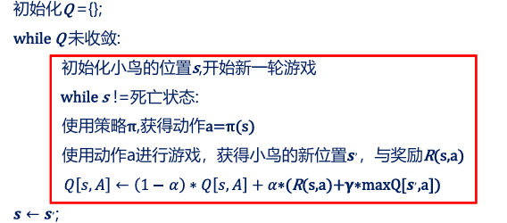

## 近似价值函数

近似价值函数就是无限逼近真实价值函数状态 - 值函数 V(s)、状态 - 行为值函数 Q(s, a)

$$
\hat{v}(s, w) \approx v^{\pi}(s)
$$

$$
\hat{q}(s, a, w) \approx q^{\pi}(s, a)
$$

$$
\hat{\pi}(a, s, w) \approx \pi(a|s)
$$

函数近似的目的就是找到一个合适的参量 $w$ 来近似值函数

几种常见的近似函数形式
- 线性特征组合 (Linear Combination of Features)
- 神经网络 (Neural Network)
- 决策树 (Decision Tree)
- 最近邻 (Nearest Neighbor)

其中, 前两种近似函数属于可微函数, 利用此性质可以很好地进行优化

近似价值函数的类别

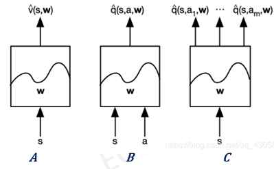

- 根据状态本身, 输出这个状态的近似价值
- q 函数, 将 state 和 action 作为输入, 然后输出是给定状态和 action 的价值是多少
- q 函数, 输入是状态, 输出是对于所有 action 可能的 q 值, 然后再输出后取 argmax, 把最可能的 action 选出来

## 深度 Q 值网络算法

DQN, 即深度 Q 网络 (Deep Q-network), 是指基于深度学习的 Q-Learing 算法
- 强化学习任务所面临的状态空间是**连续的**, 不能再使用表格的方式存储价值函数
- 用一个函数 Q(s,a,w) 来近似动作价值 Q(s,a)
- 用神经网络来生成这个函数 Q(s,a,w), 称为 Q 网络, w 是神经网络训练的参数

### DQN 和 Q-Learing 算法的区别

- Q-learning: 状态空间是**离散的**, 算法维护一个 Q-table, Q-table 记录了不同状态下 $s \in S$, 采取不同动作 $a \in A$ 的所获得的 Q 值
- DQN: 是基于深度学习的 Q-learning 算法, 状态空间是**连续的**, 不能用表格描述, **使用神经网络生成函数 Q(s,a,w) 近似动作价值函数**

### 推导过程

目标: 更新当前状态 $S_t$ 下采取动作 $A$ 的 Q 值:  $Q(S, A)$

1. 执行动作 $A$, 往前一步, 到达 $S_{t+1}$
2. 把 $S_{t+1}$ 输入 Q 网络, 计算 $S_{t+1}$ 下所有动作的 Q 值
3. 获得最大的 Q 值加上奖励 $R$ 作为更新目标
4. 计算损失 $r_t + \gamma \max_a Q(S_{t+1}, a) - Q(S_t, A)$
5. 用 loss 更新 Q 网络

DQN 推导图解

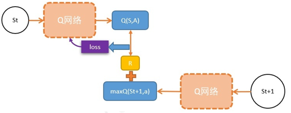

### 奖励函数

- “奖励 & 收益”其实是智能体目标的一种**形式化、数值化**的表征
- 奖励函数的本质是向智能体传达目标

### 目标函数

采用梯度下降最小化目标函数来不断地更新网络权重 $\theta$

定义

$$
L_i(\theta_i) = E_{(s, a, r, s')\sim U(D)}[(r + \gamma \max_{a'} Q(s', a'; \theta_i^-) - Q(s, a; \theta_i))^2]
$$

其中 $\theta_i^{-}$ 是第 i 次迭代的目标网络参数

$\theta_i$ 是 Q-network 网络参数, 通过梯度下降法对损失函数求梯度得到

$$
\frac{\partial L_i(\theta_i)}{\partial \theta_i} = L_i(\theta_i) = E_{(s, a, r, s')\sim U(D)}[(r + \gamma \max_{a'} \hat{Q}(s', a'; \theta_i^-) - Q(s, a; \theta_i))\nabla_{\theta_i}Q(s, a; \theta_i)]
$$

### 经验回放和目标网络

- 经验回放
  - 基本思想
    - 将智能体的交互经验存储在一个经验池中, 并在智能体进行更新时从经验池中随机采样一小批经验来进行训练
  - 作用
    - 智能体可以**更好地利用过去的经验, 提高学习效率, 降低了采样成本**
    - 通过随机采样, 经验回放可以**减少训练数据之间的相关性, 提高算法收敛速度**

- 目标网络
  - 使用的第二个网络, 用来计算 $TDtarget: y_t = r_t + \gamma \max_\pi Q(S_{t+1}, a_t)$
  - 目标网络是提供一个稳定的目标 Q 值, 以减少训练中的估计偏差

自举问题 (Bootstrapping), 在强化学习中, 自举是指用后继的估算值, 来更新现在状态的估算值

$$
TDtarget: y_{t} = r_{t} + \gamma\max_\pi Q(S_{t+1}, a_{t})
$$

- $r_t$ 是根据实际观测得到的值
- $\max_\pi Q(S_{t+1}, a_t)$ 是根据 Q 网络在 $S_{t+1}$ 的做出的估计值
- 因此 $y_t$ 有部分是来自 Q 网络的估算, 而我们用 $y_t$ 来更新 Q 网络本身, 这源于自举

### DQN 的目标网络和评估网络有何区别及联系

- 目标网络和评估网络 $Q(s, a, \theta)$ 结构一样, 只是参数不同 $\theta^- \neq \theta$, 参数更新频率也不同
  - 评估网络 $Q(s, a, \theta)$ 的权重 $\theta$ 会随着训练而不断更新, 逼近最优 Q 值函数
  - 目标网络的参数 $\theta^-$ 在一定时间内保持固定, 降低当前 Q 值和目标 Q 值的相关性
- 两个网络的作用不同
  - 评估网络用于估计 Q 值函数, 收集经验, 并决定智能体的动作选择
  - 目标网络则用于提供一个稳定的目标 Q 值, 以减少训练中的估计偏差, 从而使学习过程更加稳定

目标网络和评估网络的流程

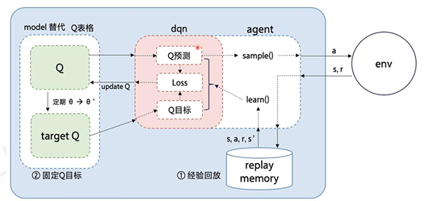

在更新过程中, 评估网络 $Q(s, a, \theta)$ 的权重 $\theta$ 会随着训练而不断更新, 以逼近最优 Q 值函数. 而目标网络的参数 $\theta^-$  则在一定时间内保持固定, 然后周期性地用评估网络的参数更新, 例如 $\theta^- \leftarrow \theta$. 这在一定程度上降低了当前 Q 值和目标 Q 值的相关性, 提高了算法稳定性

## 策略梯度

策略梯度不计算奖励, 而是输出选择所有动作的概率分布, 然后基于概率选择动作

为了防止**相同的可感知的状态**下总是**做出固定的判断**而导致进入死循环

通过最大似然和蒙卡洛法计算梯度得到最终公式

$$
\nabla_\theta J(\theta) = \frac{1}{N} \sum_{i=1}^T \left[\sum_{t=0}^T \nabla_\theta \log \pi_\theta(a_i, t|s_i, t) (\sum_{t=0}^T r(s_i, t, a_i, t))\right]
$$

- $\pi_\theta(a_{i,t}|s_{i,t})$ 表示在策略 $\pi_\theta$  下, 给定状态  $s_{i,t}$ 时, 智能体采取动作 $a_{i,t}$ 的概率
- $\sum_{t=0}^T r(s_i, t, a_i, t)$ 箭 n 回环游戏**总的奖励**
- 到此就可以计算策略梯度 $\nabla_\theta J(\theta)$和更新策略梯度为

$$
\theta = \theta + \alpha \nabla_\theta J(\theta)
$$

在以上基础上, 以及保持独立同分布的前提下就可以使用神经网络通过策略梯度

### 如果换成 t 时刻的奖励会发生什么后果

- 会导致只注重当前做的动作的回报, 而不会注重整个游戏的过程中的奖励
- 容易陷入局部最优, 无法更新到最优解
- 比如在射击游戏里, 只有开火能得到奖励, 那么就会导致机器只会开火

## 深度确定性策略梯度算法

DDPG 算法是对 DQN 的一种改进, 是一种无模型的深度强化学习算法

- DDPG 算法使用演员 - 评论家 (Actor-Critic) 算法作为其基本框架
- 采用深度神经网络作为策略网络和动作值函数的近似
- 使用随机梯度法训练策略网络和价值网络模型中的参数

### DDPG 算法结构

- 使用双重神经网络架构
- 策略函数和价值函数均使用双重神经网络模型架构
  - 学习过程更加稳定, 收敛的速度加快时引入经验回放机制
  - 去除样本的相关性和依赖性

深度确定性算法结构图解

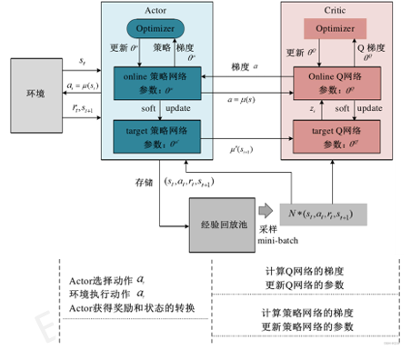

#### 解释 Critic 目标网络和训练网络、Actor 目标网络和训练网络分别的作用

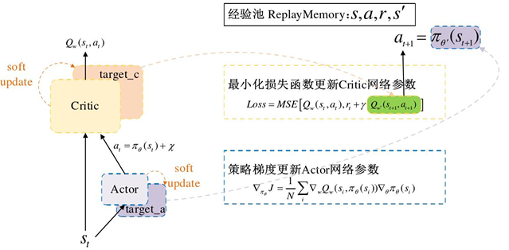

DDPG 共包含 4 个神经网络, 用于对 Q 值函数和策略的近似表示
- Critic (评论家), 用于对当前策略评价
  - 目标网络用于近似估计下一时刻的状态 - 动作的 Q 值函数
  - 训练网络输出当前时刻状态 - 动作的 Q 值函数
- Actor (演员), 结合 Critic 训练网络的 Q 值函数可以得到 Actor 在参数更新时的策略梯度
  - 目标网络用于提供下一个状态的策略
  - 训练网络则是提供当前状态的策略

#### 伪代码

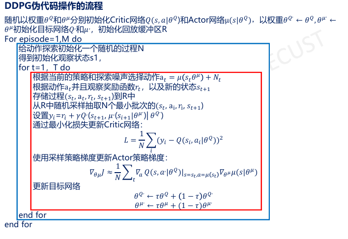

## 深度强化学习在自动驾驶中的应用

略
