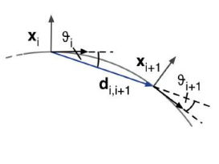
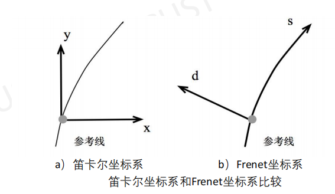

# 无人驾驶的规划

## 无人车路径规划和 A*算法

### 深度优先搜索和广度优先搜索

两者不同之处
- 深度优先搜索沿着一条路径不断往下搜索直到不能再继续为止, 然后再折返, 开始搜索下一条路径. 在深度优先搜索中, 保存候补节点是栈, 栈的性质就是先进后出
- 广度优先搜索根据离起点的距离, 按照从近到远的顺序对各节点进行搜索, 因此能够找到最短路径. 在广度优先搜索中, 有一个保存候补节点的队列, 队列的性质就是先进先出

### Dijkstra 算法

- 基本思想: 由近到远把所有点的最短路径算出来
- 实现步骤

```plaintext
获取起点坐标, 目标点坐标, 把起点放进 openlist
while (openlist 不为空列表)
{
    取 openlist 中路径最小的点为中心点, 从 openlist 列除, 放入 closelist
    if (中心点是目标点)
    {
        从目标点开始通过父节点反推, 提取出路径, break 跳出循环
    }
    else
    {
        遍历相邻的八个点
        {
            if (点已存在 closelist 中 or 遇到障碍物)
            {
                跳过, 不计算这个点
            }
            else
            {
                累计路径
                if (点已存在 openlist 中)
                {
                    if (累计路径 < 原来记录的路径)
                    {
                        替换数据
                    }
                }
                else
                {
                    加入 openlist
                }
            }
        }
        openlist 从小到大排序
    }
}
```

- 缺点: 搜索最短路径时需要遍历整个离散空间, 搜索的效率相对较低, 计算开销也较大

### A-star 算法

- 基本思想: 起点到该点的距离加上该点到终点的估计距离之和作为该点的优先级
- 公式

$$
F^\star = G + H^\star
$$

其中
- $F^\star$ 表示从起点到终点的估算路程
- $G$ 表示从起点到当前节点的实际路程
- $H^\star$ 表示从当前节点到终点的最小估算路径程 (使用曼哈顿距离或欧几里得距离)

#### 实现步骤

```plaintext
获取起点坐标, 目标点坐标, 算出起点的 F 值 (F=0+H) 把起点放进 openlist
while (openlist 不为空列表)
{
    取 openlist 中 F 值最小的点为中心点, 从 openlist 删除, 放入 closelist

    if (中心点是目标点)
    {
        从目标点开始通过父节点反推, 提取出路径, break 跳出循环
    }
    else
    {
        遍历相邻的八个点
        if (点已存在于 closelist 中 or 遇到障碍物 )
        {
            跳过, 不计算这个点
        }
        else
        {
            累计实际路径 G, 估算 H, F = G + H

            if (点已存在于 openlist 中)
            {
                if (实际路径 G < 原来记录的 G )
                {
                    替换数据
                }
            }
            else
            {
                加入 openlist
            }
        }
    }
    openlist 从小到大排序
}

```

### 混合 A-star 算法

比较 A-star 和混合 A-star 算法在节点字段定义, 节点扩展方式, 碰撞检测方式及距离定义方面的异同点
- 节点字段定义
  - 经典 A-star 包含的字段包括: $F, G, H$, 父节点
  - 混合 A-star 新增的字段包括
    - 对应的位姿 $[x, y, θ]$
    - 节点是由何种 $v, \phi$ 扩展而来
    - 由父节点到本节点的轨迹 (一般用等时间间隔的密集有序散点集表示)
- 节点扩展方式
  - 经典 A-star 扩展节点要找相邻节点
  - 混合 A-star 的扩展需要考虑车辆动力学. 要求车辆在单位时间内, 以恒定的速度和转角做匀速运动的, 轨迹末端落入的三维网格就是要扩展的子节点
- 碰撞检测方式
  - 经典 A-star 算法中, 检查对应网格是否被占据
  - 混合 A-star 需要将整条轨迹均匀采样, 检测各采样时刻车辆位姿是否与障碍物碰撞
- 丰富了距离的含义
  - 混合 A-star 算法从当前节点扩展到子节点的距离可以直接由 $v^\star$ 单位时间得到, 此外, 加入了对控制量 $v, \phi$ 频繁切换的惩罚. 从当前节点到终点的估算距离综合考虑了车辆动力学和碰撞检测距离

## 无人车路径规划

### 局部路径规划——TEB 算法

#### 算法基本原理

每个目标函数只与 elastic band 中的某几个连续状态有关, 而非整条 band

> [!NOTE]
> Elastic Band (橡皮筋): 起始点, 目标点状态由用户/全局规划器指定, 中间插入 N 个控制橡皮筋形状, 是对二维路径的描述, 连接起始, 目标点, 并让这个路径可以变形, 变形的条件就是将所有约束当做橡皮筋的外力的控制点 (机器人姿态)

#### 四个方面的约束目标

- 跟随路径和避障: 跟随已知的全局规划路径和避障. 两个目标函数均十分相似, 算是一类问题. 跟随路径施力将 elastic bands 拉向全局路径, 而避障约束施力使得 elastic bands 远离障碍物
- 速度/加速度约束: 橡皮筋只定义了姿态 $(x,y,\theta)$ 与两两状态直接的时间, 直接用差分近似计算

$$
v_{\text{min}} \leq f_v(\mathbf{B}) \leq v_{\text{max}}
$$

$$
a_{\text{min}} \leq f_a(\mathbf{B}) \leq a_{\text{max}}
$$

- 运动学限制: 若干弧段组成的平滑的轨迹, 不希望车漂移起来我们的控制量只有车速 (油门) 与转角 (方向盘) 阿克曼结构有最小转弯半径, 麦轮/差速/全向轮车为 $0$

  
- 最快路径约束: 目标函数使得机器人获得最快路径, 路径上的各位姿点在时间上均匀分开, 而非传统的空间上求最短路径

#### 优化

- 局部优化: TEB 被表述为一个多目标优化问题, 大多数目标都是局部的, 只与一小部分参数相关, 因为它们只依赖于几个连续的机器人状态
- 优化算法: 使用开源框架“g2o”: 点 (node) & 边 (edge)
- 全局路径——加入约束——g2o 优化——速度指令

> [!NOTE]
> g2o (General Graph Optimization, 通用图优化法): TEB 生成的局部轨迹由一系列带有时间信息的离散位姿 (pose) 组成, g2o 算法优化的目标即这些离散的位姿, 使最终由这些离散位姿组成的轨迹能达到时间最短, 距离最短, 远离障碍物等目标, 同时限制速度与加速度使轨迹满足机器人的运动学

## 无人车行为规划

### 有限状态机 (FSM)

- 基本原理: 只对特定的外界输入产生数量有限的响应
- 分类
  - 确定型自动机: 每个状态对每个可能输入只有精确的一个转移
  - 非确定型自动机: 给定状态对给定可能输入可以没有或有多于一个转移
- 存在问题: 当状态很多, 有限状态机就有可能变得非常庞大

#### 有限状态机存在的问题

| 问题类型   | 描述                                                                                             |
| ---------- | ------------------------------------------------------------------------------------------------ |
| 可维护性差 | 当新增或者删除一个状态的时候, 需要改变所有与之相关联的状态, 所以对状态机的大幅度的修改很容易出错 |
| 可扩展性差 | 当 FSM 包含大量状态时, 有向图可读性很差, 不方便扩展                                              |
| 复用性差   | 几乎不可能在多个项目中使用相同的 FSM                                                             |

### 分层有限状态机 (HFSM)

- 基本原理: 相比于 FSM, HFSM 新增了一个超级状态, 将同一类型的一组状态合为一个集合, 超级状态之间也有转移逻辑
- 斯坦福大学 Junior: 将顶层的驾驶行为分成了 13 个超级状态. 在无人车正常行驶中, 状态机几乎处在普通驾驶模式 (即 FORWARD DRIVE 和 PARKING NAVIGATE 这两个状态)
- 优点
  - 分层结构: 将状态机分为不同的层次, 每个层次可以包含多个子状态, 子状态之间可以共享父状态的行为和事件, 从而减少状态的数量和复杂度
  - 分层继承: 子状态可以继承父状态的属性和方法, 同时也可以覆盖和扩展父状态的功能, 从而提高状态机的可复用性和灵活性
  - 分层封装: 每个层次的状态机可以作为一个独立的模块, 对外提供统一接口, 提高可读性和可测试性

> [!NOTE]
> FORWARD DRIVE: 这个超级状态实际上包含了直行, 车道保持和障碍物规避, 当不是在停车场 (即无道路开放区域) 时, 这是状态机首选的状态
>
> PARKING NAVIGATE: 停车场内的普通驾驶模式

## 无人车路径生成

### 使用三次样条插值算法

三次曲线和三次样条插值生成路径的区别: 三次样条插值拟合出来的曲线更加符合车辆运动学规律, 汽车尽量走直线, 只是在转变方向的地方形成一个符合汽车转弯特性的曲线路径

三次样条插值算法的性质
- 三次样条曲线在衔接点处是连续, 光滑的
- 三次样条的一阶导数和二阶导数是连续可导的
- 自由边界三次样条 (Nature Cubic Spline) 的边界二阶导数也是连续的

### 动作规划

目的: 将上游行为决策 (behavior) 的宏观指令解释成一条带有时间信息的轨迹曲线 (trajectory), 最后给底层的反馈控制

拆分为两个问题
- 轨迹规划: 二维平面上的优化轨迹问题
- 速度规划: 选定轨迹后, 用什么样的速度行驶这条轨迹

### 最优的动作序列

横向控制的最优轨迹 (最优动作序列): 假定车辆因为要躲避障碍物而变道等导致偏离了期望的车道线, 此时在车辆动力学条件的约束下, 实现一个相对安全, 舒适, 简单和高效的轨迹序列. 纵向控制的最优轨迹也可以这么定义

如果车辆此时过快或者太接近前方车辆, 那么就必须做减速操作. Jerk (“舒适”的减速) 即加速度的变化率, 也即加加速度. 过高的加加速度会引起乘坐者的不适, 要解决的问题是研究如何优化 Jerk

### Frenet 坐标系

#### 什么是 Frenet 坐标系

使用道路的中心线作为参考线, 使用参考线的切线向量和法线向量建立一个坐标系, 如图 b 所示, 以起始道路中心线为原点, 坐标轴相互垂直, 分为 s 方向 (即沿着参考线的方向, 称为纵向) 和 d 方向 (即参考线当前的法向量方向, 称为横向)

#### 相对比笛卡尔坐标系的优势

Frenet 坐标系明显地简化了道路曲线拟合的问题. 因为在公路环境下, 总是能够简单找到道路的参考线 (即道路中心线), 那么基于参考线的车辆位置表示就可以简单地使用纵向距离和横向距离来描述, 同样, 两个方向的速度 ( $\dot{s}$ 和 $\dot{d}$ ) 的计算也相对简单



### 横向, 纵向轨迹优化

| 轨迹     | 损失函数设计                                                  | 包含哪些惩罚项                                                                                                                                             | 惩罚项前的权重系数                                                     |
| -------- | ------------------------------------------------------------- | ---------------------------------------------------------------------------------------------------------------------------------------------------------- | ---------------------------------------------------------------------- |
| 横向轨迹 | $C_d = k_j J_t(d(t)) + k_t T + k_d d_1^2$                     | $k_j J_t(d(t))$: 惩罚 Jerk 较大的备选轨迹 <br/> $k_t T$: 制动应当迅速, 时间短 <br/> $k_d d_1^2$: 目标状态不应偏离道路中心线太远                            | $k_j, k_t, k_d$ 是惩罚项的权重值, 决定了损失函数更加偏向哪一方面的优化 |
| 纵向轨迹 | $C_s = k_j J_t(s(t)) + k_t T + k_s (\dot{s}_1 - \dot{s}_c)^2$ | $k_j J_t(s(t))$: 惩罚 Jerk 较大的备选轨迹<br/> $k_t T$: 制动应当迅速, 时间短 <br/> $k_s (\dot{s}_1 - \dot{s}_c)^2$: 目标配置中的纵向速度尽可能接近设定速度 | $k_j, k_t, k_s$ 是惩罚项的权重值, 决定了损失函数更加偏向哪一方面的优化 |

### 碰撞避免

在完成所有备选轨迹的损失计算后进行一次轨迹检查, 检查内容包括
- 检查 s 方向上的速度是否超过设定的最大限速
- 检查 s 方向的加速度是否超过设定的最大加速度
- 检查轨迹的曲率是否超过最大曲率
- 检查轨迹是否会引起碰撞 (事故)
