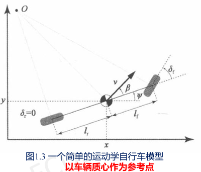

# 运动学自行车模型和动力学自行车模型

控制无人车，即是通过**车辆的参考动作序列**来控制

模型预测控制技术，该方法包括
- 一系列的可行的控制输入
- 基于算法调整控制输入，使得损失函数最小化
- 损失函数的求解依赖于**车辆运动学或者动力学模型**的输出和参考路径、速度的差值

## 自行车模型

### 自行车模型假设

- 假定车辆是在二维平面上运动的，不考虑车辆在垂直方向的运动
- 假设车辆的结构就像自行车一样，前后轮胎各用一个轮胎描述
  - 前两个车轮拥有一致的角度和速度
  - 后两个车轮也是如此
- 假设车辆运动与自行车一样，前面的轮胎控制车辆的转角

### 自行车基本模型

- $\theta$ ：偏航角 (相对于 $x$ 轴的逆时针方向的角度)
- $v$ ： $\theta$ 方向的速度
- $L$ ：车辆的轴距 (前后轮胎的距离)
- $(x,y)$ ：车辆的坐标

自行车假设下车辆的信息

车辆的坐标指车辆后轮的中心坐标，车辆的速度指车辆后轮中心的速度

## 运动学自行车模型

- 控制输入 $(a, \delta_f)$
  - $a$ 表示车辆的加速度，踩油门意味着正的加速度，踩刹车意味着负的加速度
  - $\delta_f$ 表示方向盘的转角，假定方向盘转角就是前轮当前的转角
- 四个状态量描述当前状态
  - $x$ : 车辆当前的 $x$ 坐标
  - $y$ : 车辆当前的 $y$ 坐标
  - $\psi$ : 车辆当前的偏航角 (用弧度来描述，逆时针方向为正)
  - $v$ : 车辆的速度
  - 两个补充
    - $l_f$ : 前轮到车辆重心的距离
    - $l_r$ : 后轮到车辆重心的距离

根据运动学定理，运动学自行车模型中各个状态量的更新公式如下

$$
x_{t+1} = x_t + v_t \cos(\psi_t + \beta) \times dt
$$

$$
y_{t+1} = y_t + v_t \sin(\psi_t + \beta) \times dt
$$

$$
\psi_{t+1} = \psi_t + \frac{v_t}{l_r} \sin(\beta) \times dt
$$

$$
v_{t+1} = v_t + a \times dt
$$

其中， $dt$ 表示间隔时间， $\beta$ 又如下公式计算可得

$$
\beta = \tan^{-1}(\frac{l_r}{l_f + l_r} \tan(\delta_f))
$$

自行车模型假定后轮的转角控制输入 $\delta_r = 0$

## 动力学自行车模型

- 车辆运动学自行车模型假设
  - 车前轮的方向是车辆当前的速度方向
  - 当车辆以相对高的速度行驶时，车轮的方向并不一定是车辆当前的速度方向
- 力的作用，轮胎起着决定性作用
  - 纵向力 (Longitudinal force)：使车辆前后移动的力量
  - 侧向力 (Lateral force)：促使车辆横向移动
- 模型的状态量为： $(x^{\prime}, y^{\prime}, \psi^{\prime}, X, Y)$
  - $x^{\prime}$ : 车身的纵向速度
  - $y^{\prime}$ : 车身的侧向速度
  - $\psi^{\prime}$ : 偏航角速度
  - $(X, Y)$ : 车身的当前坐标

$$
\dot{x} = \psi\dot{y} + a_x
$$

$$
\ddot{y} = -\psi\dot{x} + \frac{2}{m} (F_{c,f}\cos{\delta_f} + F_{c,r})
$$

$$
\ddot{\psi} = \frac{2}{I_z} (l_f F_{c,f} - l_r F_{c,r})
$$

$$
\dot{X} = \dot{x}\cos{\psi} - \dot{y}\sin{\psi}
$$

$$
\dot{Y} = \dot{x}\sin{\psi} + \dot{y}\cos{\psi}
$$

$m$ 表示车辆的质量

$I_z$ 表示车辆的偏航惯性

$F_{c,f}$ 和 $F_{c,r}$ 表示前后轮胎受到的侧向力

$$
F_{c,i} = -C_{\alpha} \alpha_i
$$

其中， $\alpha_i$ 表示轮胎的偏转角，指轮胎当前的朝向和当前速度的夹角， $C_{\alpha}$ 表示轮胎偏转刚度

# 无人车控制入门

让无人车能够按照规划好的路径行驶，需要将环境当前的反馈和规划的参考量进行比较，得到当前偏离参考量的误差，并基于这个设计一定的算法来产生输出信号，使得误差不断变小，直到为 0

## PID 控制

### 比例、积分、微分项各项的作用

| 控制环节 | 作用                                                                     | 副作用                                                                                          |
| -------- | ------------------------------------------------------------------------ | ----------------------------------------------------------------------------------------------- |
| 比例环节 | 调整系统的开环比例系数，提高系统的稳态精度，减低系统的惰性，加快响应速度 | 仅用 P 控制器，过大的开环比例系数不仅会使系统的超调量增大，而且会使系统稳定裕度变小，甚至不稳定 |
| 积分环节 | 消除稳态误差                                                             | 积分控制器的加入会影响系统的稳定性，使系统的稳定裕度减小                                        |
| 微分环节 | 使系统的响应速度变快，超调减小，振荡减轻，对动态过程有“预测”作用         |                                                                                                 |

### 设置过大或过小对系统的影响

- 增大 $P$ 系数会增大无人车向着参考线方向运动的倾向
- 增大 $D$ 系数会增大无人车转角快速变化的阻力，从而使得转向更加平缓
- 微分环节
  - 过大 $P$ 系数和过小 $D$ 系数——欠阻尼 (无人车将沿着参考线震荡前进)
  - 过小 $P$ 系数和过大 $D$ 系数——过阻尼 (无人车需要较长时间才能纠正误差)
- 积分环节
  - 过大的 $K_i$ 会使系统震荡运行
  - 过小的 $K_i$ 又会使控制的车辆在遇到扰动后，需要很长时间才能回到参考线上

### PID 控制器的参数整定方式和步骤（先 P 后 I 最后 D）

- 确定比例增益
- 确定积分时间常数
- 确定微分时间常数
- 系统空载、带载联调，再对 PID 参数进行微调，直至满足要求

### P 控制 (比例控制器)

> [!NOTE]
> CTE：(Cross Track Error，偏离航迹误差)

转角表示为

$$
Steering\ angle=K_{p}\cdot e(t)
$$

- $e(t)$ ：在时刻 t 车辆的横向误差 (Cross Track Error, CTE)，即车辆中心到参考线的距离
- $K_p$ ：比例增益系数
  - $K_p$ 在合理的数值范围内越大，控制的效果越好 (即越快地回到参考线附近)
  - 但是当本身位置和参考线相距很远且系数较大时，车辆会失去控制

### PD 控制

由于只考虑当前的 CTE，下一时刻还可能超过参考线，加上额为误差项 **CTE 变化率**

CTE 的变化率描述了无人车向着参考线方向移动多快，我们希望 CTE 变化率为 0，用倒数表示，控制输出变成

$$
Steering\ angle =  K_p \cdot e(t) + K_d \cdot \frac{de(t)}{dt}
$$

$K_d$ 是导数项系数，它决定 CTE 变化率了对反馈控制的影响

- 增大 P 系数会增大无人车向着参考线方向运动的倾向
- 增大 D 系数会增大无人车转角快速变化的“阻力”，从而使得转向更加平缓
- 微分环节使系统的响应速度变快

过大 $P$ 系数和过小 $D$ 系数——欠阻尼 (无人车将沿着参考线震荡前进)

过小 $P$ 系数和过大 $D$ 系数——过阻尼 (无人车需要较长时间才能纠正误差)

### PID 控制细节

当环境存在扰动时，P 倾向向参考线而 D 去抵消这种倾向，造成**稳态误差**

将积分项加入控制输出函数中，无人车的转角输出为

$$
Steering\ angle = K_p \cdot e(t) + K_d \cdot \frac{de(t)}{dt} + K_i \int_{0}^{t} e(t)dt
$$

- $K_i$ 是积分项系数，**积分项本质上是车的实际路线到参考线的图形面积**
- 加入积分项后，控制器会使车辆路线的积分尽可能小，从而避免稳态误差的情况
- 积分项系数的大小会影响整个控制系统的稳定性
  - 过大的 $K_i$ 会使系统“震荡”运行
  - 过小的 $K_i$ 又会使控制的车辆在遇到扰动后，需要很长时间才能回到参考线上
- 积分环节消除稳态误差

### 参数整定

- 理论计算整定法
  - 未必可以直接用
- 工程整定法
  - 依赖工程经验，直接在控制系统的试验中进行，且方法简单、易于掌握
  - 临界比例法、反应曲线法和衰减法

#### 临界比例法

- 首先预选择一个足够短的**采样周期**让系统工作
- 仅加入**比例控制环节**，直到系统对输入的阶跃响应出现**临界振荡**，记下这时的**比例放大系数和临界振荡周期**
- 在一定的控制度下通过**公式计算**得到 PID 控制器的参数

PID 调试一般原则 (PID，大小大)
- 在输出不振荡时，增大比例增益
- 在输出不振荡时，减小积分时间常数
- 在输出不振荡时，增大微分时间常数

# 基于运动学模型的模型预测控制

- 模型预测控制三个因素
  - 预测模型
  - 在线滚动优化
  - 反馈校正
- 各环节基本工作原理
- 相较于 PID 控制，它解决了哪方面的问题
  - PID 控制中遇到的**制动延迟**问题可以**通过添加约束**来解决
- 模型预测控制一般应用于无人驾驶的横向控制（转向控制）中

## 模型预测控制 (Model Predictive Control, MPC)

一种将更长时间跨度，甚至于无穷时间的最优化控制问题分解为若干个更短时间跨度，或者有限时间跨度的最优化控制问题

控制三个因素
- 预测模型：预测模型能够在短时间内很好地预测系统状态的变化
- 在线滚动优化：通过某种最优化算法来优化未来一段时间的控制输入，使得在这种控制输入下预测模型的输出与参考值的差距最小
- 反馈校正：到下一个时间点根据新的状态重新进行预测和优化

根据所采用的模型的不同，MPC 可分为
- 动态矩阵控制 (Dynamic Matrix Control, DMC)
- 模型算法控制 (Model Algorithm Control, MAC)
- 广义预测控制 (Generalized Predictive Control, GPC)

### 预测模型

基于各个状态量的更新方式，以及对应的控制量 (之前自行车模型的更新方法)，在给定一个控制指令的情况下，这个预测模型能够根据运动学的规律计算，得出 $\Delta t$ 时间以后车辆的状态 $(x,y,\psi,v)$

### 在线滚动优化

优化的目标就是找出一组控制量，即 $(a, \delta)$ 油门刹车系数和方向盘转角，使得损失函数最小化

#### (1) 损失函数

损失函数就是模型预测的轨迹和参考线之间的 CTE

$$
\text{Loss} = \text{CTE} = \sum_{i=1}^{10}(z_i - z_{\text{ref},i})^2
$$

其中， $z_i - z_{\text{ref},i}$ 是预测点到实际参考线的距离，未来 10 个时间间隔内的模型预测

#### (2) 损失函数

为了完善预测控制，可以在损失函数中添加一项**速度的平方差**，用以控制车辆在这个短时间范围内在每个点上的速度

$$
\text{Loss} = \text{CTE} = \sum_{i=1}^{10}[(z_i - z_{\text{ref},i})^2 + (v_i - v_{\text{ref},i})^2]
$$

#### (3) 损失函数

希望油门系数不突变（即缓慢地踩油门和刹车），就可以将**前后两个油门系数的差值的平方**作为一项加入损失函数

$$
\text{Loss} = \text{CTE} = \sum_{i=1}^{10}[(z_i - z_{\text{ref},i})^2 + (v_i - v_{\text{ref},i})^2 + (a_{i+1} - a_i)^2]
$$

变量常常约束，如：
- 车辆的方向盘转角 $\delta$ 的取值范围
- 车辆油门系数 $a$ 的取值范围 (-1 到 1 之间，1 意味着满油门，-1 意味着满刹车)

#### 解决的 PID 问题

PID 控制中遇到的**制动延迟**问题可以**通过添加约束**来解决

可约束这两步的制动指令，即 $(a, \delta)$ 为上一状态的指令，这样模型预测控制将制动延迟考虑

### 反馈校正

本质为反馈控制

当通过最优化方法得到一组控制输出以后
- 车辆执行控制指令并且继续以一定的频率反馈当前车辆的状态 $z_t$
- 这个状态会被同时输入到路径规划模块以及 MPC 模块
  - 路径规划模块会依据新的车辆状态，结合感知模块的信息以及地图信息重新作出规划
  - MPC 模块则根据新的参考路径和车辆当前状态进行新一轮的预测控制

注意
- 车辆真实状态的反馈并不是在一个预测时间段的控制执行完以后才进行的
- 反馈的时间间隔往往小于一个预测时间段

#### 模型预测控制的步骤

1. 从 t 时刻开始，预测未来 n 步的输出信号
2. 基于模型的控制信号以及相应的输出信号，构造损失函数，并且通过调整控制信号最优化损失函数
3. 将控制信号输入系统
4. 等到下一个时间点，在新的状态重复步骤 1

# 轨迹追踪

## 基本原理和分析过程

### 基本概念

- 全局路径点 (Global Waypoint)
  - 规划好的路径由一系列路径点构成，包含空间位置信息、姿态信息、速度和加速度等
- 局部路径点 (Local Waypoint)
  - 路径（Path）和轨迹（Trajectory）的区别在于，轨迹还包含了时间信息
  - 轨迹点也是一种路径点，在路径点的基础上加入了时间约束

### 轨迹追踪的两类方方法

- **基于几何追踪的方法** (纯追踪)
- 基于模型预测的方法

### 轨迹追踪控制的模型约束

- 非完整动力学约束轨迹追踪。非完整 (Nonholonomic) 动力学约束就是假设车辆在追踪过程中没有滑移，如纯追踪算法
- 摩擦力与滑移率非线性约束轨迹追踪。带有纵横向耦合滑移的非线性轮胎模型在轨迹追踪控制器中一般利用数值优化计算方法进行解算
- 车辆动力学模型简化对模型预测控制的影响。使用复杂的模型能够更好地对车辆输出进行预测，但同时增大了控制器的计算量，实时性难以保证；而使用简单的模型有可能导致追踪失败
- 微分平坦方法在非线性运动控制模型简化众多的应用
- 侧倾约束对轨迹追踪的影响
- 模型预测控制算法实时性

### 分析过程 (具体看 PPT)

自行车模型实际上是对阿克曼转向几何的一个简化，自行车模型将 4 轮车辆简化为 2 轮模型，简化了前轮转向角与后轴轨迹遵循的曲率之间的几何关系，其关系如下所示

$$
\tan(\delta) = \frac{L}{R}
$$

其中， $\delta$ 表示前轮的转向角， $L$ 为轴距， $R$ 为在给定的转向角下后轴遵循着的圆的半径

从自行车模型出发，纯追踪算法以车后轴为切点、车辆纵向车身为切线，通过控制前轮转向角，使车辆沿着一条经过目标路径点的圆弧行驶

## 转角控制公式

纯追踪算法控制量

$$
\delta(t) = \tan^{-1}\left(\frac{2L\sin(\alpha(t))}{l_d}\right)
$$

- $\delta(t)$: 车辆转角，是控制量，随时间变化
- $\alpha(t)$: 车辆航向与目标路径之间的夹角，随时间变化
- $L$: 车辆轴距 (前后轮轴中心之间的距离)
- $l_d$: 前视距离，指车辆当前位置到目标路径上的参考点的距离

## P 控制器

纯追踪控制算法其实是在横向上对横向误差 CTE 进行 P 控制

$$
\kappa = \frac{2}{l_d^2}e_l
$$

- $\kappa$: P 控制器的增益系数
- $e_l$: 横向误差 CTE，即车辆质心到目标路径的垂直距离
- $l_d$: 前视距离，指车辆当前位置到目标路径上的参考点的距离，一般将前视距离表示成车辆纵向速度的线性函数

### 前视距离对追踪效果的影响

- 使用最大、最小前视距离来约束前视距离
- 越大的前视距离意味着轨迹的追踪越平滑
- 越小的前视距离会使得追踪更加精确会带来控制的震荡

# 车辆运动学和动力学建模

略
