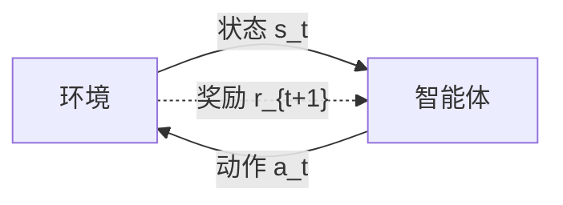

# 强化学习

强化学习问题可以描述为一个智能体从与环境的交互中不断学习以完成特定目标（比如取得最大奖励值）

强化学习就是智能体不断与环境进行交互，并根据经验调整其策略来最大化其长远的所有奖励的累积值

## 智能体与环境

- 智能体
  - 感知外界环境的**状态**（State）和**奖励反馈**（Reward），并进行学习和决策。智能体的**决策**功能是指根据外界环境的状态来做出不同的**动作**（Action），而**学习**功能是指根据外界环境的奖励来调整策略。
- 环境
  - 智能体外部的所有事物，并受智能体动作的影响而改变其状态，并反馈给智能体相应的奖励。

## 马尔可夫过程

假设马尔可夫决策过程的一个轨迹为

$$
\tau = (s_0, a_0, r_1, s_1, a_1, r_2, \ldots, s_{T-1}, a_{T-1},s_T,r_T)
$$

那么

$$
p(s_{t+1}|s_t,a_t,\ldots,s_0,a_0)=p(s_{t+1}|s_t,a_t)
$$

$$
p(\tau)=p(s_0)\prod_{t=0}^{T-1}\pi(a_t|s_t)p(s_{t+1}|s_t,a_t)
$$

## 强化学习的目标

### 总回报

给定策略 $\pi(a|s)$, 智能体和环境一次交互过程的轨迹 $\tau$ 所受到的累积奖励为 **总回报**

$$
G(\tau)=\sum_{t=0}^{T-1}\gamma^t r_{t+1}
$$

其中 $\gamma$ 是折扣率，越接近 $1$ 越注重长期回报

### 目标函数

强化学习的目标是学习到一个策略 $\pi_{\theta}(a|s)$ 使得总回报最大化

$$
J(\theta)=\mathbb{E}_ {\tau \sim p_ {\theta}(\tau)}[G(\tau)]=\mathbb{E}_ {\tau \sim p_ {\theta}(\tau)}\left[\sum_ {t=0}^{T-1}\gamma^t r_ {t+1}\right]
$$

## 贝尔曼方程结果

### 状态 - 值函数

值函数：从状态 $s$ 开始，执行策略 $\pi$ 得到的期望总回报

$$
V^{\pi}(s)=\mathbb{E}_ {\tau \sim p(\tau)}\left[\sum_ {t=0}^{T-1}\gamma^t r_ {t+1}|\tau_{s_ 0}=s\right]
$$

### 状态 - 动作值函数（Q-函数）

动作值函数：从状态 $s$ 开始，做出动作 $a$ 并且执行策略 $\pi$ 得到的期望回报

$$
Q^{\pi}(s,a)=\mathbb{E}_ {s^\prime \sim p(s^\prime | s,a)}[r(s,a,s^\prime)+\gamma V^{\pi}(s^\prime)]
$$

## 策略梯度算法

最优的策略是使得在每个状态的总回报最大的策略，因此策略搜索的目标函数为

$$
\begin{aligned}
  J(\theta)
  &=\mathbb{E}_ {\tau \sim p_ \theta(\tau)}[G(\tau)] \\
  &=\mathbb{E}_ {\tau \sim p_ \theta(\tau)}\left[\sum_{t=0}^{T-1} \gamma^t r_ {t+1} \right]
\end{aligned}
$$

策略搜索是通过寻找参数 $\theta$ 使得目标函数 $J(\theta)$ 最大

$$
\begin{aligned}
  \frac{\partial J(\theta)}{\partial \theta}
  &=\frac{\partial}{\partial\theta}\int p_ \theta (\tau)G(\tau) \mathrm{d}\tau \\
  &=\int \left(\frac{\partial}{\partial\theta} p_ \theta (\tau)\right) G(\tau) \mathrm{d}\tau \\
  &=\int p_ \theta (\tau)\left(\frac{1}{p_ \theta (\tau)} \frac{\partial}{\partial\theta} p_ \theta (\tau)\right) G(\tau) \mathrm{d}\tau \\
  &=\mathbb{E}_ {\tau \sim p_ \theta (\tau)}\left[G(\tau) \frac{\partial}{\partial \theta}\log p_ \theta(\tau) \right]
\end{aligned}
$$

由于

$$
\begin{aligned}
  \frac{\partial}{\partial \theta}\log p_ \theta(\tau)
  &=\frac{\partial}{\partial \theta}\log\left(p(s_ 0)\prod_ {t=0}^{T-1}\pi(a_t|s_t)p(s_{t+1}|s_t,a_t) \right) \\
  &=\frac{\partial}{\partial \theta}\left(\log p(s_ 0)+\sum_ {t=0}^{T-1}\left( \log\pi(a_t|s_t) + \log p(s_{t+1}|s_t,a_t)\right) \right) \\
  &=\sum_ {t=0}^{T-1} \frac{\partial}{\partial \theta}\log \pi_ \theta(a_t|s_t)
\end{aligned}
$$

故

$$
\begin{aligned}
  \frac{\partial J(\theta)}{\partial \theta}
  &=\mathbb{E}_ {\tau \sim p_ \theta (\tau)}\left[G(\tau) \sum_ {t=0}^{T-1} \frac{\partial}{\partial \theta}\log \pi_ \theta(a_t|s_t) \right] \\
  &=\mathbb{E}_ {\tau \sim p_ \theta (\tau)}\left[\left( G(\tau_ {1:t-1}) + \gamma^t G(\tau_ {t:T}) \right) \sum_ {t=0}^{T-1} \frac{\partial}{\partial \theta}\log \pi_ \theta(a_t|s_t) \right] \\
  &=\mathbb{E}_ {\tau \sim p_ \theta (\tau)}\left[\sum_ {t=0}^{T-1} \gamma^t G(\tau_ {t:T}) \frac{\partial}{\partial \theta}\log \pi_ \theta(a_t|s_t) \right] \\
\end{aligned}
$$

其中 $G(\tau_ {t:T})$ 为从时刻 $t$ 为起始时刻收到的总回报
