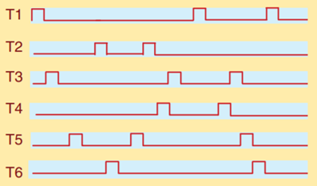
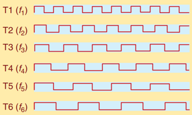
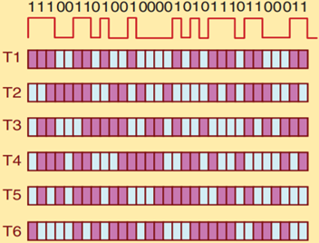

# 简答题

1. 脑电图（EEG）相较于脑磁图（MEG）有什么优缺点？请简要分析。  
参考答案：  
（1）MEG 相对于 EEG 最大的劣势在于大脑磁场的变化相较于周围环境的磁场变化（如地磁场的波动）非常小。因此，仅在磁屏蔽室中才能测量到大脑产生的微弱磁场。  
（2）由于磁屏蔽室构建的必要性以及其他的技术限制。MEG 的测量点一般位于头皮上方 1-2cm，导致测量的空间分辨率较低。  
（3）MEG 相对于 EEG 的主要优势在于 MEG 可以提供某个特殊点的真实场测量值，而 EEG 仅能侧两个点的电势差。因此，MEG 不需要选择参考传感器。  
  
2. 请列举几个脑机接口中常用的分类模型，并简要说明其原理。  
参考答案：  
（1）线性最小二乘判别函数：以最小二乘法为基础，先用最小二乘法拟合预测类的分布（拟合函数），后用判别函数对类别进行预测（判别函数垂直于拟合函数）。  
（2）贝叶斯分类器：贝叶斯方法使用最大似然的概念来结合先验知识和新获取的知识，并产生一个后验概率。它基于所获得的数据产生最可能正确的参数模型。  
（3）支持向量机：支持向量机通过一系列的迭代优化来最小化目标函数，该目标函数包含两部分：一部分由每个类别内的观察值和分割超平面之间的欧氏距离组成，另一部分表示边界间的欧氏距离，模型中的一个参数允许这两个部分之间的相对影响调整到数据类型。  
（4）人工神经网络：人工神经网络是生物神经网络的简化模型。其主要目的不是模拟或复制生物神经网络或脑活动，而是获得像生物神经网络一样强大的决策能力，进而应用于多分类问题。  
  
3. 请简要描述电极信号调理的概念，并简要给出有效的电极信号调理方案。  
参考答案：电极信号调理是消除记录信号中噪声的过程。最有效的调理方法为在尽可能离电极近的地方调节信号，首先通过前级放大器在离电极非常近的地方放大信号，再进一步滤波和放大。  
  
4. 请给出脑机接口的 5 类应用，并讨论脑机接口未来可应用的领域及其为该领域带来的改变和突破。  
参考答案：替代、恢复、增强、补充、改善。医疗康复领域：为神经疾病特别是脑卒中患者带来一种新型脑控康复的形式，实现更多样、更有效、更便捷的康复。游戏娱乐领域：可以为游戏者带来不单单局限在视觉感官的虚拟现实体验，机器通过编码反馈给大脑，直接在脑中形成触觉认知，更好地感知游戏环境。教育领域：利用“颅内芯片”来帮助人提升学习能力、逻辑运算、注意力和记忆力。但从目前的技术来看，不管是侵入式系统带给用户的损伤，亦或是复杂大脑信号的解码技术，脑机接口走入到我们的日常生活中还有很长的路要走。  
  
5. 请简述两种代谢神经功能成像方法功能近红外光谱技术（fNIRS）和功能磁共振成像（fMRI）的原理及优缺点。  
参考答案：fNIRS 测量含氧血红蛋白变成脱氧血红蛋白时对近红外光吸收的改变；fMRI 测量含氧血红蛋白变成脱氧血红蛋白时磁特性的改变。fNIRS——优势：设备相对轻便、低廉，时间分辨率较好。劣势：空间分辨率较差（cm 级别）；fMRI——优势：无损伤，与大脑皮层电活动密切相关。劣势：费用昂贵，相比电信号反馈相对缓慢。  
  
6. 请概述脑磁图相对于脑电图的优势和劣势。  
参考答案：在一些特定源识别特别重要的应用中，如癫痫灶位于脑沟时，MEG 对脑沟源相对敏感的特点是其主要优势，这是脑电图所无法完成的。  
但脑磁图（MEG）在使用时，必须在磁屏蔽室中进行，且它的线圈必须用液态氦过度冷却，大大制约了其在 BCI 中的发展。  
  
7. 解释脑机接口中"异步控制"与"同步控制"的设计差异。  
参考答案：同步控制依赖固定时间窗口（如每 4 秒执行一次指令），系统与用户严格同步，适用于 P300 等诱发范式；异步控制持续监测脑信号，用户可随时发起操作（如运动想象触发机械臂移动），需解决连续解码与误触发抑制问题，更符合自然交互需求。  
  
8. 电极阻抗的测量方式分为哪几种？影响电极阻抗的因素有哪些？  
参考答案：  
电极阻抗的测量方式分为单极模式和双极模式。  
电极阻抗的影响因素有：1）采样电极的表面积；2）皮肤状态和准备情况；3）导电膏的特性；4）放置电极后的使用时间。  
  
9. 我们在设计脑 - 机接口系统时要选择合适的放大器，这样才能保证采集到的信号被有效地识别，在选择放大器的时候，需要从哪几个方面考虑？  
参考答案：  
(1) 阻抗条件：  
放大器的输入阻抗要大于电极阻抗。EEG 或 ECoG 电极阻抗通常为 0.10~20kΩ(在 1kHz 处)，放大器的输入阻抗至少比该值大 100 倍 (至少几兆欧姆)，电极阻抗越高，对应的放大器输入阻抗越高，如用于记录单神经元的微电极，在这种情况下通常使用具有很高输入阻抗的前置放大器。  
(2) 通道数量：  
通道数量由采集和处理的信号类型决定，例如慢波或者 P300 电位等，8 个或者更少的同道就可以满足要求；ECoG 和神经元记录通常使用到上百个通道。  
(3) ADC 复制分辨率和动态范围：  
16 位分辨率的 ADC 通常不具有足够的精度记录 DC 电势。具有 24 位分辨率的 ADC 具有足够的范围来避免 DC 电势值过大时出现的饱和。与此同时保持对小且快的电势变化的足够的分辨率，结果是大多数 16 位 ADC 在数字化之前使用高通滤波器消除 DC 偏置电势。  
  
10. BCI 应用的功能是完成用户的意图 (目标)，在为特定应用开发 BCI 时，必须要确保 BCI 与应用兼容，仅有在考虑 BCI 能力特性 (如操作协议和输出类型、系统速度、精度、可靠性) 和应用的能力特性 (如自动化的程度、产生动作的本质) 之后，才能把特定的 BCI 与应用进行匹配，请简要阐述应用操作的三要素。  
参考答案：  
（1）BCI 提供给应用的指令。这是 BCI 的输出和应用的输入，既可以是目标选择指令，也可以是过程控制指令。  
（2）BCI 命令到应用动作的变换。可以是直接的，也可以间接。  
（3）应用产生的作用。这里的应用输出，完成用户的目标，可以使离散的，也可以是连续的。  
  
11. 试简单介绍 SMR（感觉运动节律）的 ERD/ERS 的现象，并解释β反弹。  
参考答案：在实际运动和运动想象都伴随着在感觉运动皮层记录的节律活动的变化。这些感觉运动节律的减少和增加分别被称为事件相关去同步和事件相关同步。  
与μ节律相似，β节律也表现出与躯体感觉刺激和运动行为相关的事件相关去同步（ERD）除此 ERD 之外，β节律也显示运动后一个短暂的 ERS，称为β反弹。  
  
12. BCI 系统中的两个自适应控制器指的是什么，具有什么特点？  
参考答案：中枢神经系统、BCI 本身基于 SCP 的 BCI 的基本问题/基于慢皮层电位的脑 - 机接口  
特点：一、速度很慢；二、很容易出错；三、不能提供良好的多维控制；四、需要大量的训练。  
许多认知活动可以调节慢皮层电位活动，如移动或执行算术。在基于 SCP 的 BCI 中，用户学习完成心理任务以生产 BCI 能够检测到的 SCP 变化并用于控制。  
  
13. 请简述皮层内脑 - 机接口所面临的长期性能问题，以及可以解决这些问题的办法。  
参考答案：由于异物植入手术总是存在着一定的风险，对于有创 BCI 设备，无论是植入在大脑本身或颅骨内，必须持续多年而不需要更换或修理。此外，长期植入本身不能带来显著的风险感染或组织损伤。通过精心选择植入材料的类型和几何形状，并采用适当的手术插入技术，确保植入物的稳定性，以及持续监测组织反应和可能的感染，可以最小化这些风险。  
  
14. 试简述皮层脑电的局限性。  
参考答案：局限一：用于 BCI 研究的 ECoG 信号的采集会有很多现实障碍；局限二：与单个神经元记录相比，ECoG 的低空间分辨率；局限三：放置 ECoG 记录电极需要侵入性（外科）手术。  
  
15. 皮层脑电是从头骨下面的位置记录脑电信号的技术，请简述与脑电 (EEG) 相比，皮层脑电具有哪些优势？  
参考答案：  
（1）更高的空间分辨率：  
ECoG 电极直接贴附于大脑皮层表面，避免了颅骨和头皮对信号的衰减和空间弥散，空间分辨率可达毫米级（1~10mm），能够精准定位神经活动的起源。例如，在运动皮层解码中，ECoG 可区分相邻手指的独立控制信号，而 EEG 因容积传导效应（信号经颅骨扩散）仅能提供厘米级的模糊定位。  
（2）更大的信号幅度：  
ECoG 记录的神经电活动幅度通常在微伏至毫伏级（μV~mV），比 EEG（μV 级）高出一个数量级。这是因为 EEG 信号需穿过高阻抗的颅骨和软组织，导致大幅衰减，而 ECoG 直接采集皮层表面电位，保留原始信号强度。例如，ECoG 可清晰捕捉单次事件相关电位（如 P300），而 EEG 通常需多次叠加平均以提高信噪比。  
（3）不易受伪迹影响：  
ECoG 受肌电（如眨眼、皱眉）、心电或环境噪声的干扰极小，因其电极位于颅骨内，屏蔽了大部分体表伪迹。相比之下，EEG 极易受头皮肌肉活动、出汗或电极移动的影响，需依赖复杂的算法（如独立成分分析）去除伪迹。这一特性使 ECoG 在实时脑机接口中更可靠。  
（4）更宽的带宽：  
ECoG 可记录从直流（0Hz）至数百赫兹（如高频γ波段，30~200Hz）的全频段神经活动，尤其擅长捕捉与认知和运动相关的高频振荡（HFOs）。而 EEG 因颅骨的低通滤波效应，通常仅能分析小于 80Hz 的信号，高频信息严重丢失。例如，ECoG 在语言解码中可利用高频γ活动区分不同词汇，而 EEG 难以实现。  
（5）更长期的功能稳定性：  
ECoG 电极（如硬膜下栅状电极）与皮层相对固定，信号特性可保持数月甚至数年不变，适合长期植入式应用（如瘫痪患者的脑机接口控制）。而 EEG 电极易因头皮油脂、头发或位移导致阻抗变化，需频繁重新校准。临床研究表明，ECoG 在癫痫患者的连续监测中可稳定工作数年，而 EEG 需每日调整电极位置。  
  
16. 下图是几种不同的视觉诱发电位刺激范式，请分别简述它们的名称及特点。  
      
参考答案：  
(1) 时间调制的视觉诱发电位：不同的刺激相互独立、互不重叠；  
(2) 频率调制的视觉诱发电位：每一个重复的刺激发生在一个特定的频率；  
(3) 伪随机码调制的视觉诱发电位：每个刺激发生在一个伪随机模式中。  
  
17. 请简要叙述下：到达任务的过程，并结合顶区及运动前区各部分功能对结果进行分析  
参考答案：  
(1)、到达任务的流程：猴子首先注视并触摸中央固定的灯：即通常的发光二极管 (LED) 然后在屏幕边缘八个可能的位置之一，一个绿色的目标提示灯短暂地闪烁约 300ms。绿色目标闪烁表示到达；告知猴子任务的类型。猴子必须再等待 1s 左右直到中央注视的灯熄灭；然后可以移动手臂至要求到达的方向，同时继续注视中央灯光。  
(2)、结果分析：在扫视任务中目标提示期间、延时期间以及执行扫视期间 LIP 神经元显示其活动升高，到达任务中，在提示、延迟以及执行期间 PRR 活跃强烈。这与 LIP 包含眼动神经元，PRR 编码手臂到达运动相一致。  
LIP 和 PRR 的神经元分别在扫视和手臂的动作中特别活跃，尤其在在干预的延迟期间 它们在记忆目标的位置和规划运动中发挥了作用  
  
18. 请简单谈一下两种测量大脑代谢活动方法（功能近红外光谱/功能核磁共振成像）的基本原理及各自的优缺点  
参考答案：  
（1）功能近红外光谱是一项依赖血氧水平响应的技术，主要测量在大脑活动期间的含氧血红蛋白和脱氧血红蛋白的相对含量的变化，然后可以计算出与神经元活动变化相关的 BLOD 响应。  
（2）功能核磁共振成像具有测量与脑生理功能相关的参数（血流量、血容量和血液氧合等）的能力。最常用的是测量基于血红蛋白磁化率的 BLOD 对比度，来推断大脑的活动。功能近红外光谱具有无创、安全、非入侵式、便于携带、价廉等优点；功能核磁共振成像具有无创性并提供非常高的空间分辨率、实现全脑覆盖、以及解剖的特异性。但两者有共同的缺点：缓慢的响应时间和低的时间分辨率。  
  
19. 列举一下 BCI 中的三大主流范式并分别阐述其原理。  
参考答案：  
（1）基于事件相关电位（ERP）的范式，代表技术：P300 拼写器  
原理：用户注视闪烁的字符矩阵，当目标字符闪烁时，大脑会自然产生 P300 电位（一种约 300ms 后出现的正波）。机制：P300 反映注意资源分配，由罕见但相关的刺激（oddball 范式）诱发。  
（2）基于稳态视觉诱发电位（SSVEP）的范式，代表技术：频率编码控制。原理：屏幕显示多个以不同频率（如 5Hz、10Hz）闪烁的刺激块，用户注视某一目标时，大脑枕叶视觉皮层会生成与刺激频率同步的振荡信号（SSVEP）。机制：视觉神经元的节律性响应（锁相振荡）。  
（3）基于运动想象（MI）的范式，代表技术：μ/β节律解码  
原理：用户想象肢体运动（如左手/右手），导致对侧运动皮层的μ节律（8-12Hz）和β节律（13-30Hz）能量衰减（事件相关去同步，ERD）。机制：运动准备和想象激活皮层神经元，打破静息态振荡同步性。  
  
20. 简述侵入式与非侵入式脑机接口的优缺点。  
参考答案：  
（1）侵入式脑机接口（Invasive BCI）  
定义：通过手术将电极植入大脑皮层（如 ECoG、Utah 阵列）或深部脑区（如 DBS）。  
优点：高时空分辨率：直接记录神经元放电（spikes）或局部场电位（LFP），信号质量极佳。抗干扰能力强：不受头皮、颅骨等组织对信号的衰减影响。长期稳定性（部分技术）：如 Utah 阵列可长期植入用于瘫痪患者控制机械臂。  
缺点：手术风险：感染、出血、免疫排斥反应等。生物相容性问题：长期植入可能导致胶质瘢痕包裹电极，信号衰减。高成本：需神经外科手术和精密设备维护。  
（2）非侵入式脑机接口（Non-invasive BCI）  
定义：通过外部设备（如 EEG、fNIRS、MEG）采集脑信号，无需手术。  
优点：安全性高：无创，适合健康人或短期应用。便携性：设备轻便（如 EEG 帽），可快速部署。低成本：无需手术，用户接受度高。  
缺点：低信噪比：信号受头皮、颅骨衰减，易受肌电（EMG）、眼电（EOG）干扰。空间分辨率有限：如 EEG 的“容积导体问题”导致信号模糊。用户训练需求高：如运动想象 BCI 需长期训练才能达到可用精度。  
  
21. 结合神经可塑性的理论，阐述闭环脑机接口系统如何促进神经功能恢复。  
参考答案：神经可塑性指神经系统对外界刺激和学习经历的适应性改变。闭环脑机接口通过实时解码大脑信号并提供反馈，形成感知 - 动作 - 反馈的循环，强化相应神经通路的活动，促进突触重组和功能性连接增强。尤其在神经损伤后，闭环系统能通过意图驱动的运动训练刺激受损脑区和相关神经网络，促进功能补偿和恢复。  
  
22. 解释脑机接口中“解码器”泛化能力不足的原因及常用的解决策略。  
参考答案：解码器泛化能力不足主要由神经信号的高变异性（如脑电信号噪声、用户状态改变）、训练数据有限以及模型过拟合等因素引起。常用解决策略包括：  
（1）数据增强和多样化训练集构建；  
（2）使用正则化方法防止过拟合；  
（3）在线学习和自适应算法动态调整模型参数；  
（4）融合多模态信号提升解码鲁棒性；  
（5）利用深度学习模型自动提取鲁棒特征以提高泛化能力。  
  
23. BCIs 的传播中，研发新的医疗器械的趋势是积极和消极因素相混合的迅速发展。请简述两方面因素内容，并谈论研究者应如何面对。  
参考答案：  
【消极】在监管像 BCIs 这样的新技术的学术研究和商业化的过程中存在着大量的障碍  
【积极】成功的产品已经催生了一个先进的医疗器械行业。  
研究者首先要仔细地、客观地分析任何建议的开发努力的风险和回报。从科学研究已经熟悉资料的系统收集、趋势的预测和分析以及逻辑推理，并将这些分析能力应用到与商业有关的应考虑的因素：市场的规模、商品的成本、监管和偿付的风险、销售和支持的成本以及投资的回报率。如果学术研究人员没有相关知识或工具来评估这些因素，那么引入一个商业知识渊博的合作伙伴变得更加重要。  
  
24. 基于脑机接口的运动康复未来研究中的关键问题有哪些？  
参考答案：  
（1）设置和训练所需的时间量应尽量减少，使用最少数量的通道 (即电极) 并能为应用提供足够的脑信号。  
（2）医院环境下，电屏蔽室可帮助 EEG-BCI 免于电噪声信号干扰。  
（3）在患者的筛查、决策、BCI 的设置以及 BCI 的训练协议中，运动康复人员需要培训。  
（4）EEG-BCI 运动辅助系统可被用于家庭治疗，BCI 必须是无创的、电极易穿戴以及软件界面友好。  
（5）应获得 BCI 辅助运动康复的医疗保险报销审批。  
  
25. BCI 研究中的伦理问题方面，在应用 1978 年 Belmont 报告中阐述的三项原则时，把 BCI 研究划分为哪两种不同的类型，请分别简述两种类型的 BCI 研究内容。  
参考答案：第一类为帮助残疾患者获得等同健全人的功能状态的 BCI 研究；这一类包括的研究旨在恢复或替代自然中枢神经系统输出通路，或改善自然的输出使其等同于没有残疾的人。第二类为针对一般人群的研究。这一类包括的研究旨在增强或补充自然中枢神经系统输出或提高自然的输出以达到超常的水平。  
  
26. 脑机接口输出命令一般可分为目标选择或过程控制两种，请举例简述两者的区别，并指出最理想最有效的 BCI 输出命令形式。  
参考答案：  
（1）目标选择：BCI 将用户的控制意图传递给应用设备，然后完全由应用设备实现这一意图，如由 BCI 传递给轮椅一个目标位置，然后由轮椅自身的导航系统到达该目的地；  
（2）过程控制：用户和 BCI 控制实现用户意图的所有过程，同时用户还可以根据并发的反馈调整 BCI 指令，如由 BCI 控制轮椅各个方向的运动，逐步到达目标位置；  
（3）最理想最有效的 BCI 是具有正常中枢神经系统功能的分布式控制的 BCI，结合目标选择和过程控制，保真度更高。  
  
27. 何为"脑控闭环系统"？举例说明其在神经康复中的优势。  
参考答案：脑控闭环系统实时解码脑信号并给予反馈（如机械外骨骼运动、电刺激），形成"意图 - 执行 - 感知"环路。例如，中风患者通过运动想象触发功能性电刺激（FES），同步肌电反馈增强神经可塑性，较开环系统更符合 Hebbian 学习原则，加速运动功能重建。  
  
28. 简述侵入式与非侵入式脑机接口在信号质量与应用场景上的核心差异。  
参考答案：侵入式 BCI（如 ECoG、微电极阵列）直接接触皮层，可捕获高频（>200Hz）局部场电位和单神经元放电，时空分辨率高，但存在手术风险，适用于重度瘫痪患者或精细控制场景（如机械臂操控）。非侵入式 BCI（如 EEG、fNIRS）依赖头皮信号，主要获取低频（<100Hz）宏观脑活动，易受肌电伪迹干扰，但安全性高，适用于康复训练、神经反馈等场景。  
  
29. 解释运动想象范式中事件相关去同步化（ERD）与同步化（ERS）的神经机制。  
参考答案：ERD 表现为μ（8-12Hz）和β（13-30Hz）频段功率下降，与运动皮层激活相关，在运动想象初期出现；ERS 则指动作结束后β频段功率反弹增强，反映运动抑制状态。二者动态变化与运动准备 - 执行 - 恢复的神经节律调控密切相关，是运动想象 BCI 的核心特征。  
