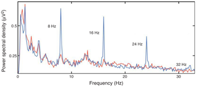
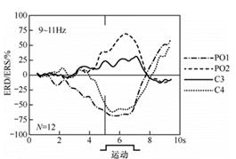

# 选择题

> [!NOTE]
> 由于 GitHub 不允许渲染自定义的 CSS，为获得最佳效果，请下载此文件并使用 markdown 阅读器阅读

1. 如下图所示，请问图中蓝色曲线表示的下列哪种电位？  
  
A. P300 电位     B. SSVEP 电位  
C. mVEP 电位   D. SCP 电位  
参考答案：B  
2. 以下哪种不属于频率分析方法？( )  
A. 傅里叶变换    B. 连续小波变换  
C. 共平均参考    D. 自回归模型  
参考答案：C  
3. 以下哪个不属于基于 SSVEP 的脑 - 机接口的优势？  
A. 涉及简单的用户任务    B. 不需要大量的训练  
C. 信息传输速率高        D. 没有注视依赖性  
参考答案：D  
4. 以下哪个不属于基于 SCPs 的脑 - 机接口的问题？  
A. 不适用于患有严重 ALS 的用户   B. 速度很慢  
C. 需要大量训练                  D. 多维控制效果差  
参考答案：A  
5. 在脑机接口产品设计方面，在风险管理环节中，下列选项中不属于必要环节的是  
A. 风险分析       B.风险控制        C.需求分析            D.产后信息  
参考答案：C  
6. BCI 的非医疗用途可分为以下三类：  
①用于改善、稳定或其它优化常规神经肌肉性能的 BCI 应用;  
②用于提高常规神经肌肉性能使其超出它们正常能力的 BCI 技术应用;  
③用于拓展或丰富生活体验的 BCI 应用；  
④治疗注意力缺陷症并改进认知加工。  
A. ①③④        B.①②④        C.②③④            D.①②③  
参考答案：D
7. 评估任何事业的行善的先决条件是  
A. 明确定义行善       B. 明确行善方式      C. 明确事业影响    D. 明确行善对象  
参考答案：A  
8. 在 BCIs 研究中，不属于这项工作涉及的风险为  
A. 身体风险  
B. 有害的中枢神经系统可塑性的风险  
C. 设备操作不熟练的风险  
D. 不适当的输出的风险  
参考答案：C  
9. 在脑机接口研究中，有关伦理审查和知情同意的说法，以下哪项是不正确的？  
A. 脑机接口研究必须获得被试者的知情同意，确保其充分了解研究风险与利益。  
B. 对于无行为能力或认知障碍被试，通常需要其法定监护人或家庭成员代为签署知情同意书。  
C. 护理人员在参与脑机接口研究时无需签署任何形式的知情同意，只需遵守一般护理规范。  
D. 侵入式脑机接口研究因涉及较高风险，伦理审查和知情同意的要求更为严格，且需明确告知潜在风险。  
参考答案：C  
10. （多选）下列选项中，属于脑电伪迹信号的是：  
A. 肌电信号  B. 心电信号  C. 眼电信号  D. 电力线干扰  
参考答案：ABCD   
11. 脑电电极分为干电极和湿电极两类，下列关于脑电电极的说法中错误的是：  
A. 湿电极主要包含导电膏电极系统和海绵 - 盐水电极系统两类。  
B. 湿电极相比于干电极穿戴更加便捷。  
C. 湿电极的电极材料主要有锡、银、铂等组成，干电极以惰性金属或绝缘体为主。  
D. 干电极的性能不如湿电极稳定。  
参考答案：B  
12. 下列不属于参考电极选择方法的是：  
A. 公共平均参考     B. 基于表面拉普拉斯的参考  
C. 基于模型的参考    D. 耳垂（乳突）相连参考  
参考答案：B  
13. 下列哪一项不属于脑电信号的空间滤波特征提取方法：  
A. 主成分分析（PCA）B. 独立成分分析（ICA）
C. 线性判别分析（LDA）D. 共空间模式（CSP）  
参考答案：C  
14. 下列不属于相似性特征的是：  
A. 快速傅里叶变换    B. 相干性  
C. 锁相值      D. 马氏距离  
参考答案：A  
15. 下列各个区域与其负责的功能不一致的是？  
A. 背侧运动前区 PMD. 手臂到达  B. 腹侧运动前皮层 F5  抓握  
C. 外侧顶内区域 LIP    眼动   D. 中部顶内区域 MIP   抓握  
参考答案：D  
16. 下列关于局部场电位说法错误的是？  
A. 局部场电位 Local field potential（LFP）是由来自记录位点附近的大量神经元的兴奋性和抑制性树突电位的总和  
B. LFP 是解码运动意图的一种合适的信号  
C. 用 LFP 信号解码的错误率一般高于用神经元脉冲活动 SPK 解码的错误率  
D. LFP 会在频谱图中反映运动方向 (注意偏好和非偏好方向) 之间的高频差异  
参考答案：C  
17. 以下哪一个不是功能近红外光谱 - 脑机接口用到的设备或技术？  
A. 发射器 B. 光电倍增管 C. 回波平面成像  D. 光电探测器  
参考答案：C  
18. 当用 fNIRS 测量大脑代谢活动时，大脑神经活动增加，会有以下哪个反应？  
A. 含氧血红蛋白浓度降低  B. 局部脑氧代谢率增加
C. 脱氧血红蛋白浓度增加  D. 局部脑血流降低  
参考答案：B  
19. 下列说法不正确的是？  
A. 运动前区直接地、相互地连接到顶叶皮层区中对应的眼、手臂和手区，从而产生高级别的运动计划  
B. 顶叶到达区 PRR 编码了位置和即将到来的眼部运动的轨迹  
C. fMRI 是通过检测磁共振信号的变化来推断大脑活动  
D. fNIRs 是基于对近红外光（波长 700-1000nm）穿透生物活体组织的观察  
参考答案：B  
20. 下面哪一个选项不是 BCI 系统的初始化操作协议？  
A. 同步协议      B. 异步协议      C. 混合协议      D. 自参数化协议  
参考答案：D  
21. 下面哪一个不是在选择滤波器时需要考虑的因素？与 45 题重复了  
A. 阶数      B. 信号幅值      C. 转角频率      D. 相位  
参考答案：B  
22. 下面哪一个说法不正确。  
A. 相对于 EEG 传感器，ECoG 采样电极距离脑信号源位置更近  
B. ECoG 信号具有比 EEG 信号更低的幅值  
C. ECoG 的空间分辨率是毫米尺度，而 EEG 是厘米尺度  
D. ECoG 信号的频率带高达 250Hz，而 EEG 的最高频带只有 70Hz  
参考答案：B  
23. 下面哪一项不是用来描述独立的脑 - 机接口/辅助技术系统  
A. 在重要的性能方面具有优势（便捷性、速度或精度）  
B. 控制命令语句灵活  
C. 适用于特殊环境下  
D. 这种 BCI 需要进行简单配置来满足不同 AT 设备的需求  
参考答案：D  
24. 大脑中涉及运动平衡的区域为  
A. 基底核  B. 脑干  C. 小脑  D. 丘脑  
参考答案：C  
25. 下列记录的电位中空间分辨率最高的是  
A. 局部场电位  B. 动作电位  C. 脑电图  D. 皮层脑电  
参考答案：B  
26. 脑电图的主要脑源为  
A. 皮层脑沟壁的切向源  B. 皮层脑回冠的同步源  C. 皮层折叠源   D. 以上都是  
参考答案：B  
27. 下列属于自发脑电的是  
A. 事件相关电位  B. 感觉运动节律  C. 稳态视觉诱发电位  D. 以上都不是  
参考答案：B  
28. 下列说法错误的是  
A. 因为电极不刺入大脑，皮层脑电比局部场电位记录具有较少的创伤，并提供了介于局部场电位和脑电图之间的空间分辨率。  
B. 颅内电势的幅度、空间依赖性和时间依赖性主要依赖于电极尺度。  
C. 与头皮记录相比，颅内记录会得到更多更好的信息。  
D. 皮层突触源是头皮记录脑电图主要来源。  
参考答案：C  
29. 下列哪一项不属于非独立 BCI 所使用的脑电信号  
A. P300 电位  
B. 事件相关去同步/事件相关同步  
C. 稳态视觉诱发电位  
D. 以上都不属于  
参考答案：B  
30. 皮层下区域中主要涉及运动的平衡以及运动的学习和适应的是  
A. 丘脑  
B. 脑干  
C. 基底核  
D. 小脑  
参考答案：D  
31. 半侧空间忽视症的障碍主要由（）部分的病变引起  
A. 初级运动皮层（M1）  
B. 运动前区皮层（PM）  
C. 初级躯体感觉皮层（S1）  
D. 后顶叶皮层（PPC）  
参考答案：D  
32. 下列脑电场信号中空间分辨率最高的是  
A. P300 电位  
B. 局部场电位  
C. 头皮脑电图  
D. 皮层脑电图  
参考答案：B  
33. 下列大脑活动测量技术中空间分辨率最高的是  
A. 头皮脑电图  
B. 功能近红外光谱成像  
C. 微电极  
D. 功能核磁共振成像  
参考答案：C  
34. 电极表面的生物电势是电极记录点周围的神经信号源通过脑组织作用到电极表面的结果, 微电极记录点的生物电势通过（）转化为导线上的电流信号  
A. 电磁感应  
B. 微机处理  
C. 电化学反应  
D. 红外传感技术  
参考答案：C  
35. 下列关于脑电电极的分析中，不正确的是  
A. 干电极的电极材料一般由惰性金属或绝缘体构成。  
B. 湿电极信号采集系统佩戴时间长，佩戴过程繁琐。  
C. 干电极信号采集系统穿戴便捷，且性能较湿电极稳定。  
D. 湿电极的电极材料一般为锡、银/氯化银、铂等金属材料。  
参考答案：C  
36. （多选）脑机接口系统中常用的特征提取方法有  
A. 快速傅里叶变换  
B. 短时傅里叶变换  
C. 小波分析  
D. 自回归模型  
参考答案：ABCD   
37. 数据无关空间滤波器的是  
A. 主成分分析 (PCA)  
B. 公共平均参考 (CAR)  
C. 共空间模式 (CSP)  
D. 独立成分分析 (ICA)  
参考答案：B  
38. (多选) 下列哪些信息可以作为 EEG 信号的特征类型  
A. 诱发电位幅值  
B. 频带功率  
C. 支持向量机参数  
D. 单神经元发射功率  
参考答案：ABD  
39. （多选）实际脑机接口应用中，在特征维度大而样本量小的情况，可考虑  
A. 采用深度神经网络模型  
B. 进行特征选择  
C. 利用支持向量机模型  
D. 采用小波分析  
参考答案：BC  
40. 下列采样设备中，不能记录生理电信号的是  
A. EEG 电极  
B. ECoG 电极  
C. 功能性近红外光谱  
D. 针电极  
参考答案：C  
41. 下列材料中，哪一种不是 EEG 电极常用的材料  
A. 金  
B. 锡  
C. 铂  
D. 银  
参考答案：B  
42. 下面哪一个说法不正确。  
A. 相对于 EEG 传感器，ECoG 采样电极距离脑信号源位置更近  
B. ECoG 信号具有比 EEG 信号更低的幅值  
C. ECoG 的空间分辨率是毫米尺度，而 EEG 是厘米尺度  
D. ECoG 信号的频率带高达 250Hz，而 EEG 的最高频带只有 70Hz  
参考答案：B  
43. 下面哪一个不是在选择滤波器时需要考虑的因素？  
A. 阶数  
B. 信号幅值  
C. 转角频率  
D. 相位  
参考答案：B  
44. 下面关于信号的滤波相关的说法中，错误的是  
A. EEG 信号通常使用 256Hz 的采样频率获得，通常，使用 0.5~100Hz 的模拟滤波器。  
B. 记录慢波要求使用具有很低拐角频率（如 0.1Hz）的高通滤波器  
C. 基于 P300 的系统使用 40~250Hz 的带通滤波器  
D. ECoG 记录采用 0.5~500Hz 的带通滤波器进行滤波  
参考答案：C  
45. 下列说法中错误的是  
A. 成功使用任何 AT 都依赖于用户认可。  
B. BCI 技术的本质要求对用户进行训练是显而易见的。  
C. BCI 技术对护理者进行重要训练是必须的。  
D. AT 使用的必要支持可以延伸到启动和设备维护等物理任务之外。  
参考答案：C  
46. 基于 P300 的 BCI 系统具有许多优势，下列不是其优势的是  
A. 非侵入性。  
B. 使用便携。  
C. 性能可靠。  
D. 自发性。  
参考答案：D  
47. 皮层脑电（ECoG）和脑磁（MEG）的相关范围达到至少  
A. 150Hz  
B. 180Hz  
C. 200Hz  
D. 300Hz  
参考答案：C  
48. 在观察左右手运动想象的 ERD 现象时，最优先考虑图中哪条通道的信号  
  
A. PO1  
B. PO2  
C. C3  
D. C4  
参考答案：D  
49. 不同 SSVEP 范式的性能比较从高到低的顺序是 (  )  
A. c-VEP、f-VEP、t-VEP  
B. c-VEP、t-VEP、f-VEP  
C. f-VEP、c-VEP、t-VEP  
D. f-VEP、t-VEP、c-VEP  
参考答案：A  
50. 以下说法错误的是 (  )  
A. 慢变皮层电位之后通常是一个单相波，称为运动相关电位。  
B. SCP 通常包括负电位变化。  
C. Bereitschaft 电位（或准备电位）是一种负的慢皮层电位（SCP），通常开始于自我发起的运动之前 500~1000ms。  
D. 与 SMRs 类似，感觉运动区的 SCPs 及相关电位与运动想象以及实际运动相关。  
参考答案：A  
51. 在 SSVEP 中，用户会看到位于视野中不同地方的并发的重复刺激显示。每个刺激以 (  ) 的频率呈现。  
A. 8-12Hz  
B. 13-30Hz  
C. 相同的频率  
D. 不同的频率  
参考答案：D  
52. 以下不属于皮层脑电（ECoG）信号的采集需要注意是 (  )  
A. 选择适当的材料  
B. 低通滤波器频率应大于数字化速率  
C. 具有足够的时间分辨率  
D. 足够的电压范围和分辨率  
参考答案：B  
53. 以下不属于 iBCI 研发的目标的是 (  )  
A. 确定 eBCIs 优于 iBCIs 的优势和益处  
B. 恢复瘫痪患者的功能上有益的动作范围  
C. 可靠和稳定发挥作用  
D. 长期安全使用  
参考答案：A  
54. 以下不属于可以纳入未来 BCI 家庭用户的基本标准的人群是 (  )。  
A. 很少或没有任何有用的自动的肌肉控制的人群  
B. 有可靠的护理者拥有或能够获得基本的计算机技能并致力于支持被试的 BCI 使用  
C. 无法与外界交流的人群  
D. 稳定的生活环境  
参考答案：C  
55. 评估任何事业的行善的先决条件是  
①识别可参考已批准第二类上市设备  
②获取申请书、识别该设备中实质等效于那些新的 BCI 装置的元素  
③制造商递交 510（k）监管意见书  
④获取 FDA 发布许可证  
A. ②③④        B.①②④        C. ①②③            D.①②③④  
参考答案：D  
56. 功能磁共振成像信号对（）的预测构成了这一领域一个可能的研究方向。功能磁共振成像信号多变量（多元）模式分类的最新进展使得利用功能磁共振成像的高空间分辨率、全脑覆盖和无创性成为可能。  
A. 认知、情感（情绪）、知觉和运动状态。  
B. 认知、情感（情绪）。  
C. 知觉和运动状态。  
D. 情感（情绪）、知觉。  
参考答案：A  
57. 以下哪种信号采集技术具有最高时空分辨率？（ ）  
A. EEG  
B. fMRI  
C. 皮层内电极  
D. fNIRS  
参考答案：C  
58. P300 电位属于以下哪种脑电特征？  
A. 自发振荡  
B. 事件相关电位  
C. 稳态诱发电位  
D. 局部场电位  
参考答案：B  
59. 以下哪项不属于 BCI 的应用领域？  
A. 瘫痪患者通讯  
B. 虚拟现实控制  
C. 基因编辑  
D. 神经反馈治疗  
参考答案：C  
60. 以下哪种解码方法能有效处理神经信号的非线性动力学？  
A. 线性判别分析  
B. 递归神经网络  
C. 主成分分析  
D. 匹配滤波  
参考答案：B  
61. EEG 信号中伪迹眼电干扰（EOG）通常产生于哪个频段？  
A. 高频伽马波段  
B. 低频δ和θ波段  
C. 中频α波段  
D. β波段  
参考答案：B  

